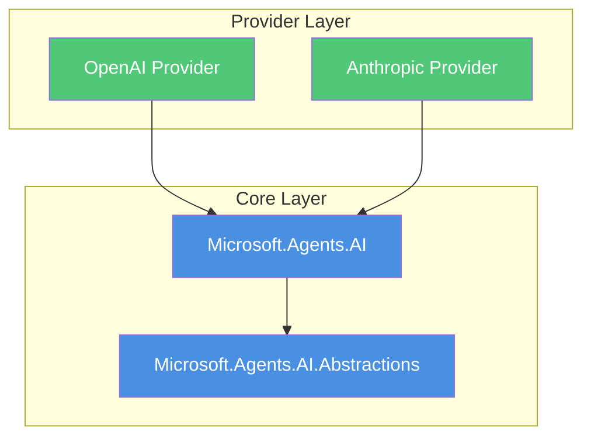

# .NET Architecture Documentation Instructions

## Objective
Create comprehensive architecture documentation enabling developers to understand, extend, and maintain the .NET Agent Framework without extensive source code reading. Documentation should capture **patterns**, **design decisions**, **extension points**, and **architectural principles** - not just enumerate features.

## Core Principles

### 1. Depth Over Breadth
Analyze thoroughly rather than catalog superficially. For each component:
- **Why does it exist?** (purpose, problem it solves)
- **How does it work?** (key mechanisms, patterns)
- **How do I extend it?** (extension points, examples)
- **What are the trade-offs?** (design decisions, alternatives)

### 2. Pattern Recognition Over Enumeration
Identify and document **patterns** used throughout the codebase, not just specific instances.

**Example**: Don't list "LoggingAgent, OpenTelemetryAgent, FunctionInvocationDelegatingAgent are decorators."
Instead: "The framework uses the Decorator pattern extensively for composable agent pipelines. Any class inheriting from `DelegatingAIAgent` wraps an inner agent, enabling middleware-style interception. Examples: LoggingAgent (observability), OpenTelemetryAgent (tracing), FunctionInvocationDelegatingAgent (tool interception)."

### 3. Progressive Disclosure
Structure documentation from high-level concepts to implementation details:
- **Overview** → architectural layers and their relationships
- **Concepts** → core abstractions and patterns
- **Details** → specific implementations and APIs
- **Extension** → how to add new capabilities

### 4. Executable Understanding
Every major concept should have:
- A diagram showing structure/flow
- A minimal working example
- Common extension scenarios
- Links to comprehensive samples

---

## Documentation Structure

Create files under `docs/architecture/dotnet/`:

```
overview.md              # Entry point: system map, navigation
core-abstractions.md     # Foundational types (AIAgent, AgentThread, etc.)
core-framework.md        # Framework services (AIAgentBuilder, middleware)
providers.md             # AI service integrations pattern
protocols.md             # Communication patterns (A2A, AGUI)
workflows.md             # Orchestration patterns and executors
hosting.md               # Runtime integration (DI, ASP.NET Core, Azure Functions)
cross-cutting.md         # Shared infrastructure (memory, telemetry, compliance)
design-patterns.md       # Architectural patterns used throughout
extension-guide.md       # How to extend each layer
build-test.md            # Build, test, CI/CD
```

**Always update overview.md when adding new files.**

---

## Documentation Process

### Phase 1: Understand the Architecture (Deep Analysis)

**Goal**: Build a mental model of the system's design philosophy and patterns.

**Actions**:

1. **Map Dependencies** (bottom-up analysis):
   ```bash
   # Find all projects
   find dotnet/src -name "*.csproj"

   # Analyze dependency graph
   # - Which projects have zero dependencies on other framework projects? (abstractions)
   # - Which projects depend only on abstractions? (core framework)
   # - Which projects depend on core framework? (providers, hosting, etc.)
   ```

   **Capture**: Create a layered dependency diagram showing how components build on each other.

2. **Identify Design Patterns** (pattern recognition):

   **Approach**: Look for recurring structural patterns, not just specific classes.

   **Example Analysis**:
   - Find all classes inheriting from a common base → likely Decorator or Template Method pattern
   - Find extension methods named `Create*` or `Add*` → likely Factory or Builder pattern
   - Find classes with `Use()` methods → likely Builder or Middleware pattern
   - Find interfaces named `I*Store` or `I*Provider` → likely Repository or Strategy pattern

   **For each pattern identified**:
   - What problem does it solve?
   - What are the key participants (base classes, interfaces)?
   - How is it applied across the codebase (show 2-3 examples)?
   - How would a developer use/extend it?

3. **Understand Extension Points** (architectural flexibility):

   **What to identify**:
   - Abstract classes with virtual/abstract methods → Template Method pattern
   - Interfaces intended for implementation → Strategy/Adapter pattern
   - Factory delegates accepting `IServiceProvider` → DI-based extensibility
   - Builder patterns with `Use()` methods → Middleware/decorator registration

   **Document**: Not just "these are the extension points" but **why each exists** and **what customizations it enables**.

4. **Review Architectural Decisions**:

   Read `/docs/decisions/*.md` to understand:
   - Why certain approaches were chosen
   - What alternatives were considered
   - What trade-offs were made

   **Link decisions to code**: For each ADR, identify which components implement it and reference the ADR in those component docs.

5. **Analyze Integration Patterns**:

   **Key questions**:
   - How does this framework integrate with Microsoft.Extensions.AI?
   - How does DI work (keyed services, factory patterns)?
   - How does hosting work (ASP.NET Core, Azure Functions)?
   - How are providers abstracted (IChatClient, ChatClientAgent)?

   **Document the strategy**, not just the mechanics.

**Output**: Mental model + notes on patterns, extension points, and design philosophy.

---

### Phase 2: Document Core Abstractions

**Goal**: Explain the foundational types all other code depends on.

**File**: `core-abstractions.md`

**Structure Pattern** (apply to each abstraction):

1. **Purpose** (1-2 sentences): What problem does this abstraction solve?

2. **Architecture** (diagram + explanation):
   ```mermaid
   classDiagram
       AIAgent <|-- DelegatingAIAgent
       AIAgent <|-- ChatClientAgent
       DelegatingAIAgent <|-- LoggingAgent
       DelegatingAIAgent <|-- OpenTelemetryAgent
   ```
   "The `AIAgent` base class defines the contract for all agents. `DelegatingAIAgent` enables the decorator pattern for composable middleware. `ChatClientAgent` bridges to Microsoft.Extensions.AI."

3. **Key Members** (focus on public API, extension points):
   - Properties: What they represent, when to override
   - Methods: Core operations, lifecycle, extensibility	 
   - **File Reference**: [AIAgent.cs:24](../../dotnet/src/Microsoft.Agents.AI.Abstractions/AIAgent.cs#L24)

4. **Extension Points**:
   - Override `IdCore` for custom ID logic
   - Implement `RunAsync` for custom execution
   - **Why**: Explain what scenarios require extending each point

5. **Design Decisions**:
   > **Design Decision**: Agent response types (`AgentRunResponse`) are separate from `ChatResponse` to allow independent evolution and agent-specific metadata.
   > See [ADR-0001: Agent Run Response](../../docs/decisions/0001-agent-run-response.md)

6. **Minimal Example**:
   ```csharp
   public class MyAgent : AIAgent
   {
       protected override async Task<AgentRunResponse> RunAsyncCore(...)
       {
           // Custom logic
       }
   }
   ```

7. **See Also**: Links to related patterns, samples, other docs

**Apply this pattern to**:
- AIAgent & DelegatingAIAgent
- AgentRunResponse & AgentRunResponseUpdate
- AgentThread
- ChatMessageStore & AIContextProvider
- AgentRunOptions

---

### Phase 3: Document Design Patterns

**Goal**: Explain the architectural patterns used throughout the framework so developers can recognize and apply them.

**File**: `design-patterns.md`

**Pattern Documentation Template**:

```markdown
## [Pattern Name] (e.g., Decorator Pattern)

### Intent
[Why this pattern is used in the framework - the problem it solves]

### Structure
[Mermaid diagram showing the pattern's key participants]

### How It's Used in the Framework
[Explain the specific application with 2-3 concrete examples]

Example: "The Decorator pattern enables composable agent middleware. `DelegatingAIAgent` serves as the base decorator, wrapping an `InnerAgent`. Concrete decorators override `RunAsync` to add behavior before/after delegating to the inner agent."

### Key Participants
[Base classes, interfaces, and their roles]

- **DelegatingAIAgent**: Base decorator class
- **LoggingAgent**: Concrete decorator for observability
- **AIAgentBuilder.Use()**: Registration mechanism

### Creating Custom Implementations
[Step-by-step guide with working example]

```csharp
public class RateLimitingAgent : DelegatingAIAgent
{
    public override async Task<AgentRunResponse> RunAsync(...)
    {
        await _rateLimiter.WaitAsync();
        try
        {
            return await base.RunAsync(...);
        }
        finally
        {
            _rateLimiter.Release();
        }
    }
}

// Register via builder
var agent = baseAgent.AsBuilder()
    .Use(inner => new RateLimitingAgent(inner))
    .Build();
```

### Extension Points
[Where/how developers extend this pattern]

### Design Considerations
[Trade-offs, when to use, when not to use]

### Related Patterns
[Links to related patterns in the framework]
```

**Discover Patterns Thoroughly**:
Don't limit to a predefined list. Analyze the codebase for:
- Structural patterns (how classes relate)
- Creational patterns (how objects are built)
- Behavioral patterns (how components interact)

**Example Discovery Process**:
```bash
# Find decorator candidates
grep -r "class.*:.*DelegatingAIAgent" dotnet/src/

# Find builder candidates
grep -r "class.*Builder" dotnet/src/

# Find factory methods
grep -r "Create.*Agent\|Add.*Agent" dotnet/src/
```

---

### Phase 4: Document Each Layer

**Principle**: For each architectural layer (providers, protocols, workflows, hosting, cross-cutting), document **the pattern/strategy** first, **then specific implementations**.

**Example - Providers**:

**File**: `providers.md`

**Structure**:

1. **Provider Integration Pattern** (the general strategy):
   ```markdown
   ## Provider Integration Strategy

   The framework integrates AI services through a **consistent pattern**:

   1. Provider-specific client (e.g., `AzureOpenAIClient`, `AnthropicClient`)
   2. Adapter to `Microsoft.Extensions.AI.IChatClient`
   3. Extension method `CreateAIAgent()` that wraps in `ChatClientAgent`
   4. Optional provider-specific options/configuration

   This pattern enables:
   - Consistent API across all providers
   - Shared middleware (logging, telemetry)
   - Easy provider switching
   - Provider-specific features exposed through options
   ```

2. **For Each Provider** (follow pattern, highlight differences):
   ```markdown
   ### OpenAI Provider

   **Package**: `Microsoft.Agents.AI.OpenAI`

   **Integration Points**:
   - Converts OpenAI's `ChatClient` to `IChatClient`
   - Supports both Chat Completion and Responses API

   **Provider-Specific Features**:
   - Structured outputs via generic `RunAsync<T>()`
   - Function calling with auto-execution
   - Streaming with `RunStreamingAsync()`

   **Example**:
   [Show minimal usage]

   **Configuration Options**:
   [Table of options with defaults]

   **Tool Support**:
   [What tools are supported and how to use them]

   **Design Considerations**:
   [Provider-specific quirks, limitations, best practices]

   **See Also**: [Samples](../../dotnet/samples/GettingStarted/AgentWithOpenAI)
   ```

**Apply this layered approach to**:
- Protocols (A2A, AGUI)
- Workflows (executor pattern, workflow patterns)
- Hosting (DI pattern, ASP.NET Core pattern, Azure Functions pattern)
- Cross-cutting (observability strategy, memory strategy, etc.)

---

### Phase 5: Create Extension Guides

**Goal**: Step-by-step guides for extending the framework with working examples.

**File**: `extension-guide.md`

**Guide Template**:

```markdown
## Creating a [Component Type]

### When to Create One
[Scenarios where you'd need this extension]

### Prerequisites
- Understanding of [related concept doc]
- [Required knowledge/dependencies]

### Step-by-Step Guide

**Step 1: [Action]**
[Detailed explanation with code]

**Step 2: [Action]**
[Detailed explanation with code]

...

### Complete Working Example
[Link to or include complete, runnable code]

### Testing Your Implementation
[How to verify it works]

### Common Pitfalls
[What to avoid, typical mistakes]

### Advanced Scenarios
[Optional: more complex use cases]

### See Also
[Related docs, samples]
```

**Extension Guides to Create**:
- Creating a Custom Provider (integrate new AI service)
- Creating Custom Middleware (add cross-cutting behavior)
- Creating Custom Tools (extend agent capabilities)
- Creating Custom Thread Storage (integrate new storage backend)
- Creating Custom Executors (build workflow components)
- Creating Custom Protocol Adapters (new communication patterns)

**Principle**: Each guide should have a **working example** that can be copy-pasted and run.

---

### Phase 6: Diagrams and Visual Architecture

**Diagram Principles**:

1. **Purpose Over Completeness**: Show relationships/patterns, not every class
2. **Placement**: Always near top of section, before detailed text
3. **Walkthrough**: Always follow with one-paragraph explanation
4. **Types**:
   - **System Context**: High-level component relationships
   - **Class Diagrams**: Inheritance hierarchies, pattern structures
   - **Sequence Diagrams**: Request/response flows
   - **Flowcharts**: Process flows, decision trees

**Mermaid Conventions**:



**Walkthrough Example**:
"The diagram shows the framework's layered architecture. The **Core Layer** (blue) provides abstractions and framework services. The **Provider Layer** (green) integrates specific AI services. Dependencies flow downward - providers depend on core, core depends on abstractions."

---

### Phase 7: Build and Test Documentation

**File**: `build-test.md`

**Required Content**:

1. **Prerequisites**:
   - .NET SDK version (from `dotnet/global.json`)
   - Optional dependencies (emulators, API keys)

2. **Build Commands** (with explanation):
   ```bash
   # Build entire solution (all TFMs)
   dotnet build dotnet/agent-framework-dotnet.slnx

   # Build for specific framework
   dotnet build dotnet/agent-framework-dotnet.slnx --framework net10.0
   ```

3. **Test Commands**:
   ```bash
   # Unit tests (no external dependencies)
   dotnet test dotnet/agent-framework-dotnet.slnx --filter "FullyQualifiedName~UnitTests"

   # Integration tests (requires configuration)
   dotnet test dotnet/agent-framework-dotnet.slnx --filter "FullyQualifiedName~IntegrationTests"
   ```

4. **Environment Setup** (for integration tests):
   | Variable | Purpose | Example |
   |----------|---------|---------|
   | `AZURE_OPENAI_ENDPOINT` | Azure OpenAI service | `https://....openai.azure.com` |
   | ... | ... | ... |

5. **CI/CD Overview**:
   - Workflow location: `.github/workflows/dotnet-build-and-test.yml`
   - What it tests (TFMs, test categories)
   - Known issues/workarounds

6. **Troubleshooting**:
   - Common build issues
   - Test failures and solutions
   - Platform-specific quirks

---

### Phase 8: Create Overview (Navigation Hub)

**File**: `overview.md`

**Required Elements**:

1. **One-Paragraph Summary** (elevator pitch for the framework)

2. **Quick Start** (5-10 lines of code showing the simplest usage)

3. **High-Level Architecture Diagram** (all major layers and their relationships)

4. **Solution Map** (table showing directory structure and purpose)

5. **Navigation** (categorized links to all documentation):
   ```markdown
   ## Documentation

   ### Core Concepts
   - [Core Abstractions](../../docs/architecture/dotnet/core-abstractions.md) - AIAgent, threads, responses
   - [Design Patterns](../../docs/architecture/dotnet/design-patterns.md) - Patterns used throughout

   ### Integration
   - [Providers](../../docs/architecture/dotnet/providers.md) - AI service integrations
   - [Protocols](../../docs/architecture/dotnet/protocols.md) - A2A, AGUI
   - [Hosting](../../docs/architecture/dotnet/hosting.md) - ASP.NET Core, Azure Functions

   ### Advanced
   - [Workflows](../../docs/architecture/dotnet/workflows.md) - Orchestration patterns
   - [Cross-Cutting](../../docs/architecture/dotnet/cross-cutting.md) - Memory, telemetry, compliance

   ### Development
   - [Extension Guide](../../docs/architecture/dotnet/extension-guide.md) - How to extend
   - [Build & Test](../../docs/architecture/dotnet/build-test.md) - Development workflow
   ```

6. **Key Extension Points** (summary table):
   | To Extend | Implement | See Guide |
   |-----------|-----------|-----------|
   | Add AI Provider | `IChatClient` adapter + extension method | [Guide](../../docs/architecture/dotnet/extension-guide.md#custom-provider) |
   | ... | ... | ... |

7. **Last Updated**: Date stamp

---

## Style and Quality Guidelines

### Writing Style

**Do**:
- "Use AIAgentBuilder to compose middleware pipelines"
- "The decorator pattern enables..."
- "Override RunAsync to customize execution"

**Don't**:
- "You can use AIAgentBuilder if you want to..."
- "This might be useful for..."
- "Simply just add..."

### Code Examples

**Principles**:
- Prefer **links to samples** over inline code for complete examples
- Inline code should be **minimal** (≤15 lines) and **runnable**
- Always include **using statements**
- Add **comments** only for non-obvious logic
- Show **common patterns**, not edge cases

**Example**:
```csharp
using Microsoft.Agents.AI;
using Azure.AI.OpenAI;

// Create agent from OpenAI client
var agent = new AzureOpenAIClient(endpoint, credential)
    .GetOpenAIResponseClient(deploymentName)
    .CreateAIAgent("MyAgent", "Be helpful");

// Run the agent
var response = await agent.RunAsync("Hello!");
Console.WriteLine(response.Text);
```

### File References

**Format**: `[ClassName.cs:line](path/to/file.cs#Lline)`

**Examples**:
- `[AIAgent.cs:24](../../dotnet/src/Microsoft.Agents.AI.Abstractions/AIAgent.cs#L24)`
- `[AIAgentBuilder.cs](../../dotnet/src/Microsoft.Agents.AI/AIAgentBuilder.cs)`

**Use relative paths** from repository root.

### Cross-References

**Format**: `See [Topic](file.md#section) for [context]`

**Examples**:
- `See [Core Abstractions](core-abstractions.md#aiagent) for details on AIAgent`
- `For implementation examples, see [Extension Guide](extension-guide.md#custom-middleware)`

### Diagrams

**Always**:
- Place diagram **before** detailed explanation
- Follow with **one-paragraph walkthrough**
- Use **concise labels** (≤5 words per node)
- Use **subgraphs** for layers/groupings
- Use **colors** to distinguish categories (via `classDef`)

**Never**:
- Use ASCII art (always use Mermaid)
- Create diagrams showing every class (focus on patterns)
- Place diagrams at the bottom of sections
- Create diagrams without explanatory text

---

## Validation and Quality Checks

Before considering documentation complete:

**Technical Accuracy**:
- [ ] All build commands execute successfully
- [ ] All code examples compile (copy-paste test)
- [ ] All file paths resolve correctly
- [ ] All internal links work

**Completeness**:
- [ ] Every major component has documentation
- [ ] Every design pattern is explained with examples
- [ ] Every extension point has a guide
- [ ] All ADRs are linked to implementations

**Quality**:
- [ ] Each page has at least one diagram
- [ ] Diagrams have walkthrough paragraphs
- [ ] No secrets or credentials in examples
- [ ] Consistent terminology throughout
- [ ] Navigation flows logically (max 2 clicks to any topic)

**Usability**:
- [ ] A new developer can extend the framework using only the docs
- [ ] Common questions are answered without reading source code
- [ ] Examples are runnable and realistic

---

## Decision Framework (When Ambiguous)

**Q**: How much detail should I include?
**A**: Document **contracts and patterns**, not **implementations**. Focus on:
- What developers need to **use** the component
- What developers need to **extend** the component
- Why design decisions were made (link to ADRs)
Skip: private methods, internal helpers, implementation minutiae

**Q**: Should I create a new documentation page?
**A**: Create a new page if:
- The topic represents a **distinct architectural layer** (provider, protocol, hosting)
- The topic has **multiple extension points** or **complex patterns**
- The topic would make an existing page exceed **~500 lines**

Otherwise, add as a section to an existing page.

**Q**: How many examples should I include?
**A**: For each major concept:
- **1 minimal example** showing basic usage (inline, ≤15 lines)
- **1-2 realistic examples** showing common scenarios (inline or linked)
- **1 comprehensive example** showing advanced usage (link to samples)

**Q**: How detailed should diagrams be?
**A**: Show **relationships and patterns**, not **complete APIs**. A good diagram:
- Helps understand **structure** (inheritance, composition, dependencies)
- Helps understand **flow** (request/response, lifecycle)
- Can be understood **without reading source code**

---

## Success Criteria

Documentation is **excellent** when:

1. **Self-Sufficient**: New team members can extend the framework (new provider, middleware, tool) without asking experts
2. **Pattern-Rich**: Architectural patterns are clearly identified and explained with multiple examples
3. **Navigable**: Any topic is discoverable within 2 clicks from overview
4. **Accurate**: All examples work, all commands execute, all links resolve
5. **Current**: Reflects actual codebase, updated when architecture changes
6. **Decision-Traced**: Design decisions are linked to their implementations and ADRs

**Test**: Hand the docs to a developer unfamiliar with the codebase. Can they:
- Understand the architecture in 30 minutes?
- Implement a custom provider in 2 hours (using the guide)?
- Explain a design pattern and why it's used?

---

**Note**: These instructions evolve with the framework. Update as architectural patterns emerge or change.
