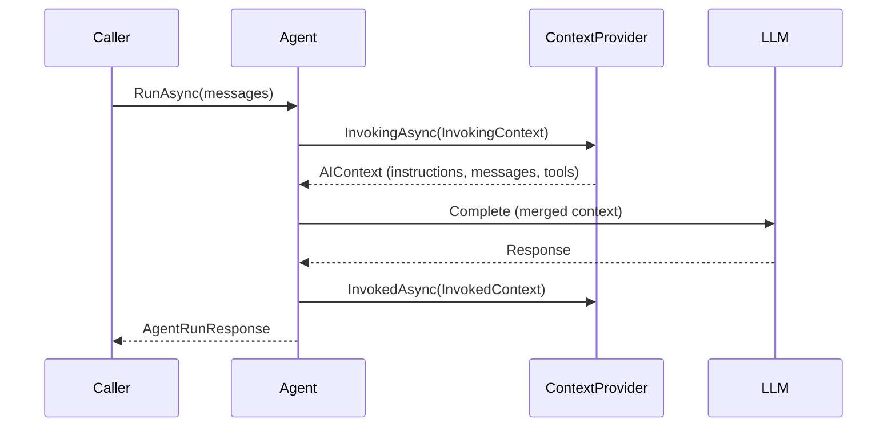

# Core Abstractions

> **Purpose**: This document explains the foundational types in `Microsoft.Agents.AI.Abstractions` that all other framework code depends on. These are the provider-agnostic building blocks for agents, conversations, responses, and context management.

## Overview

The `Microsoft.Agents.AI.Abstractions` package defines the foundational contracts and base abstractions that enable provider-agnostic AI agent development. This layer establishes a clear separation of concerns: **agents** handle execution logic, **threads** manage conversation state, **responses** carry results, and **context providers** enable dynamic augmentation. The design emphasizes extensibility through abstract base classes rather than interfaces, allowing default implementations while preserving override flexibility. A pervasive service locator pattern (`GetService<T>()`) enables runtime capability discovery without breaking changes. Two distinct thread models—`InMemoryAgentThread` for client-managed state and `ServiceIdAgentThread` for server-managed state—accommodate both local LLM scenarios and cloud-hosted agent services like Azure AI Foundry.

## Architecture Diagram

```mermaid
flowchart TB
    subgraph Agents["🔷 Agent Abstractions"]
        AIAgent["<b>AIAgent</b><br/><i>abstract</i>"]
        DelegatingAIAgent["<b>DelegatingAIAgent</b><br/><i>abstract</i>"]
        AIAgent ==> DelegatingAIAgent
    end

    subgraph Responses["📤 Response Types"]
        AgentRunResponse["<b>AgentRunResponse</b>"]
        AgentRunResponseT["<b>AgentRunResponse‹T›</b>"]
        AgentRunResponseUpdate["<b>AgentRunResponseUpdate</b>"]
        AgentRunResponse ==> AgentRunResponseT
        AgentRunResponse -. converts to .-> AgentRunResponseUpdate
    end

    subgraph Threads["💬 Thread & State"]
        AgentThread["<b>AgentThread</b><br/><i>abstract</i>"]
        InMemoryAgentThread["<b>InMemoryAgentThread</b>"]
        ServiceIdAgentThread["<b>ServiceIdAgentThread</b>"]
        AgentThread ==> InMemoryAgentThread
        AgentThread ==> ServiceIdAgentThread
    end

    subgraph Storage["💾 Message Storage"]
        ChatMessageStore["<b>ChatMessageStore</b><br/><i>abstract</i>"]
        InMemoryChatMessageStore["<b>InMemoryChatMessageStore</b>"]
        ChatMessageStore ==> InMemoryChatMessageStore
        InMemoryAgentThread -. uses .-> InMemoryChatMessageStore
    end

    subgraph Context["⚙️ Context & Configuration"]
        AIContextProvider["<b>AIContextProvider</b><br/><i>abstract</i>"]
        AIContext["<b>AIContext</b>"]
        AgentRunOptions["<b>AgentRunOptions</b>"]
        AIContextProvider -. produces .-> AIContext
    end

    subgraph Metadata["🏷️ Metadata"]
        AIAgentMetadata["<b>AIAgentMetadata</b>"]
        AgentThreadMetadata["<b>AgentThreadMetadata</b>"]
    end

    %% Cross-subgraph relationships (links 7-11)
    AIAgent -. creates .-> AgentRunResponse
    AIAgent -. creates .-> AgentThread
    AIAgent -. uses .-> AIContextProvider
    AIAgent -. provides .-> AIAgentMetadata
    AgentThread -. provides .-> AgentThreadMetadata

    %% Styling - high contrast colors with white text
    classDef abstractStyle fill:#1565C0,stroke:#0D47A1,stroke-width:3px,color:#FFFFFF
    classDef concreteStyle fill:#2E7D32,stroke:#1B5E20,stroke-width:3px,color:#FFFFFF
    classDef dataStyle fill:#E65100,stroke:#BF360C,stroke-width:3px,color:#FFFFFF

    class AIAgent,DelegatingAIAgent,AgentThread,ChatMessageStore,AIContextProvider abstractStyle
    class InMemoryAgentThread,ServiceIdAgentThread,InMemoryChatMessageStore concreteStyle
    class AgentRunResponse,AgentRunResponseT,AgentRunResponseUpdate,AIContext,AgentRunOptions,AIAgentMetadata,AgentThreadMetadata dataStyle

    %% Link styles - inheritance (solid, thick)
    linkStyle 0,2,3,4,5,6 stroke:#9C27B0,stroke-width:3px
    %% Link styles - composition/usage within subgraphs (dotted)
    linkStyle 1,7 stroke:#FF9800,stroke-width:2px
    %% Link styles - cross-subgraph relationships (bright, dashed)
    linkStyle 8,9,10,11,12 stroke:#00BCD4,stroke-width:3px
```



The diagram shows the type hierarchy organized into six functional groups. **Agent Abstractions** (blue) form the root, with `AIAgent` as the base class extended by `DelegatingAIAgent` for the decorator pattern. Agents produce **Response Types** (orange) and create **Threads** (green) for conversation state. The **Thread & State** group splits into two concrete implementations: `InMemoryAgentThread` for client-managed state (which composes `InMemoryChatMessageStore` from **Message Storage**) and `ServiceIdAgentThread` for server-managed state. **Context & Configuration** (orange) provides the `AIContextProvider` abstraction that produces `AIContext` to dynamically augment agent invocations. **Metadata** types enable runtime introspection via the service locator pattern. Purple arrows indicate inheritance, cyan arrows show cross-group relationships.

---

## 1. Agent Abstractions

### AIAgent Base Class

**Purpose**: The foundational abstract class defining the contract for all AI agents. `AIAgent` encapsulates agent identity, execution (both synchronous and streaming), conversation thread management, and service discovery. It serves as the root of the agent type hierarchy and the primary abstraction that consuming code interacts with.

**File**: [AIAgent.cs](../../../dotnet/src/Microsoft.Agents.AI.Abstractions/AIAgent.cs)

#### Key Members

| Member | Type | Description |
|--------|------|-------------|
| `Id` | `string` | Unique identifier for the agent instance. Returns `IdCore` if overridden, otherwise generates a GUID-based default. Used for telemetry, logging, and multi-agent correlation. |
| `IdCore` | `virtual string?` | Override point for custom ID generation. Returns `null` by default, causing `Id` to generate an identifier. |
| `Name` | `virtual string?` | Human-readable name for the agent. Used in logging, UI display, and debugging. |
| `Description` | `virtual string?` | Description of the agent's purpose and capabilities. Useful for agent discovery and documentation. |
| `RunAsync()` | `Task<AgentRunResponse>` | Executes the agent with provided messages. Multiple overloads accept text strings, message collections, or empty input. Returns complete response when finished. |
| `RunStreamingAsync()` | `IAsyncEnumerable<AgentRunResponseUpdate>` | Executes the agent with streaming output. Yields response chunks as they become available for real-time UI updates. |
| `GetNewThread()` | `AgentThread` | Creates a new conversation thread appropriate for this agent type. The thread type depends on the agent implementation. |
| `DeserializeThread()` | `AgentThread` | Restores a previously serialized thread from JSON. Enables conversation persistence across sessions. |
| `GetService<T>()` | `T?` | Service locator pattern for runtime capability discovery. Returns metadata, wrapped services, or custom extensions. |

#### Extension Points

- **`IdCore`**: Override to provide a deterministic or externally-assigned agent identifier instead of the auto-generated GUID.
- **`Name` / `Description`**: Override to provide dynamic metadata that may change based on configuration or state.
- **`RunAsync` / `RunStreamingAsync`**: Abstract methods that derived classes must implement to define agent execution behavior.
- **`GetNewThread`**: Override to return a custom thread type appropriate for your agent's state management needs.
- **`GetService<T>`**: Override to expose additional services or capabilities that consumers can discover at runtime.

#### Design Decisions

> **Why abstract class instead of interface?** An abstract class allows default implementations (like `Id` generation, `GetService<T>` base behavior) while still requiring derived classes to implement core execution logic. This reduces boilerplate in implementations while preserving the flexibility to override any behavior.

> **Why separate from `IChatClient`?** Agents are higher-level than chat clients. An agent manages conversation threads, context providers, and multi-turn state. A chat client is a single-turn completion API. Agents often *use* chat clients internally but provide additional capabilities.

> **Why agent-specific response types?** `AgentRunResponse` extends beyond `ChatResponse` to include agent-specific metadata like `AgentId`, continuation tokens for background operations, and user input requests. This enables agent-specific patterns without polluting the lower-level MEAI types.

#### Example

```csharp
// Minimal custom agent wrapping an IChatClient
public class SimpleChatAgent : AIAgent
{
    private readonly IChatClient _chatClient;

    public SimpleChatAgent(IChatClient chatClient) => _chatClient = chatClient;

    public override async Task<AgentRunResponse> RunAsync(
        IEnumerable<ChatMessage> messages,
        AgentThread? thread = null,
        AgentRunOptions? options = null,
        CancellationToken cancellationToken = default)
    {
        var response = await _chatClient.GetResponseAsync(messages.ToList(), cancellationToken: cancellationToken);
        return new AgentRunResponse(response);
    }

    public override IAsyncEnumerable<AgentRunResponseUpdate> RunStreamingAsync(
        IEnumerable<ChatMessage> messages,
        AgentThread? thread = null,
        AgentRunOptions? options = null,
        CancellationToken cancellationToken = default)
    {
        // Streaming implementation
        throw new NotImplementedException();
    }

    public override AgentThread GetNewThread() => new SimpleInMemoryThread();
}
```

**See Also**: [DelegatingAIAgent](#delegatingaiagent), [Core Framework - ChatClientAgent](core-framework.md#chatclientagent)

---

### DelegatingAIAgent

**Purpose**: Abstract base class implementing the **Decorator pattern** for composable agent pipelines. `DelegatingAIAgent` wraps an inner agent and delegates all operations to it by default, allowing derived classes to intercept, modify, or augment specific behaviors while passing others through unchanged. This is the foundation for middleware-style agent composition.

**File**: [DelegatingAIAgent.cs](../../../dotnet/src/Microsoft.Agents.AI.Abstractions/DelegatingAIAgent.cs)

#### Key Members

| Member | Type | Description |
|--------|------|-------------|
| `InnerAgent` | `AIAgent` | The wrapped agent instance that receives delegated operations. All non-overridden methods forward to this agent. |

#### How It Works

1. **Constructor requires inner agent**: The protected constructor takes an `AIAgent` that will handle delegated operations.
2. **All methods delegate by default**: Every `AIAgent` method (`RunAsync`, `RunStreamingAsync`, `GetNewThread`, etc.) forwards to `InnerAgent`.
3. **Override to intercept**: Derived classes override specific methods to add pre/post processing, logging, caching, or transformation logic.
4. **Composable via `AIAgentBuilder.Use()`**: The builder pattern stacks multiple decorators, creating a pipeline where each layer can process requests and responses.

```
┌─────────────────────────────────────────┐
│         DelegatingAIAgent               │
│  ┌───────────────────────────────────┐  │
│  │      DelegatingAIAgent            │  │
│  │  ┌─────────────────────────────┐  │  │
│  │  │     Core AIAgent            │  │  │
│  │  │   (ChatClientAgent, etc.)   │  │  │
│  │  └─────────────────────────────┘  │  │
│  │   (e.g., OpenTelemetryAgent)      │  │
│  └───────────────────────────────────┘  │
│  (e.g., LoggingAgent)                   │
└─────────────────────────────────────────┘
```

#### Example

```csharp
// Logging decorator that wraps any agent
public class LoggingAgent : DelegatingAIAgent
{
    private readonly ILogger _logger;

    public LoggingAgent(AIAgent innerAgent, ILogger<LoggingAgent> logger)
        : base(innerAgent)
    {
        _logger = logger;
    }

    public override async Task<AgentRunResponse> RunAsync(
        IEnumerable<ChatMessage> messages,
        AgentThread? thread = null,
        AgentRunOptions? options = null,
        CancellationToken cancellationToken = default)
    {
        _logger.LogInformation("Agent {AgentId} invocation starting", InnerAgent.Id);
        var stopwatch = Stopwatch.StartNew();

        try
        {
            var response = await base.RunAsync(messages, thread, options, cancellationToken);
            _logger.LogInformation("Agent {AgentId} completed in {Elapsed}ms",
                InnerAgent.Id, stopwatch.ElapsedMilliseconds);
            return response;
        }
        catch (Exception ex)
        {
            _logger.LogError(ex, "Agent {AgentId} failed after {Elapsed}ms",
                InnerAgent.Id, stopwatch.ElapsedMilliseconds);
            throw;
        }
    }
}
```

**See Also**: [Design Patterns - Decorator Pattern](design-patterns.md#decorator-pattern), [Core Framework - Built-in Middleware](core-framework.md#built-in-middleware)

---

### AIAgentMetadata

**Purpose**: Provides metadata about an `AIAgent` instance, primarily for observability and telemetry. Contains the provider name that maps to OpenTelemetry semantic conventions for generative AI systems, enabling standardized monitoring across different AI backends.

**File**: [AIAgentMetadata.cs](../../../dotnet/src/Microsoft.Agents.AI.Abstractions/AIAgentMetadata.cs)

#### Key Members

| Member | Type | Description |
|--------|------|-------------|
| `ProviderName` | `string?` | Identifies the underlying AI service (e.g., "openai", "azure_ai_inference", "anthropic"). Maps to the `gen_ai.system` attribute in [OpenTelemetry Semantic Conventions](https://opentelemetry.io/docs/specs/semconv/gen-ai/). |

#### Usage

```csharp
// Retrieve metadata via service locator pattern
var metadata = agent.GetService<AIAgentMetadata>();
if (metadata?.ProviderName is { } provider)
{
    // Use for telemetry tagging
    Activity.Current?.SetTag("gen_ai.system", provider);

    // Or for conditional logic based on provider
    if (provider == "openai")
    {
        // OpenAI-specific handling
    }
}
```

#### Common Provider Names

| Provider | `ProviderName` Value |
|----------|---------------------|
| OpenAI | `"openai"` |
| Azure OpenAI | `"azure_openai"` |
| Azure AI Inference | `"azure_ai_inference"` |
| Anthropic | `"anthropic"` |
| Copilot Studio | `"microsoft_copilot_studio"` |

**See Also**: [Core Framework - OpenTelemetryAgent](core-framework.md#opentelemetryagent)

---

## 2. Response Types

### AgentRunResponse

**Purpose**: Represents the complete response from a non-streaming agent invocation. Contains one or more response messages, metadata about the interaction, usage statistics, and continuation tokens for long-running background operations. While a typical response contains a single assistant message, complex agent behaviors (tool calls, RAG retrievals, multi-step reasoning) may produce multiple messages showing intermediate progress.

**File**: [AgentRunResponse.cs](../../../dotnet/src/Microsoft.Agents.AI.Abstractions/AgentRunResponse.cs)

#### Key Members

| Member | Type | Description |
|--------|------|-------------|
| `Messages` | `IList<ChatMessage>` | Collection of response messages. Usually contains one assistant message, but may include multiple for complex agent flows. |
| `Text` | `string` | Convenience property: concatenated text from all `TextContent` items across all messages. Use this for simple text extraction. |
| `UserInputRequests` | `IEnumerable<UserInputRequestContent>` | All user input requests in the response. Indicates the agent needs additional information from the user before continuing. |
| `AgentId` | `string?` | Identifier of the agent that generated this response. Useful in multi-agent scenarios for tracking which agent produced what. |
| `ResponseId` | `string?` | Unique identifier for this specific response. Provider-assigned, used for logging and debugging. |
| `ContinuationToken` | `ResponseContinuationToken?` | Token for resuming background operations. Non-null when response is still processing; pass to `AgentRunOptions.ContinuationToken` to poll for completion. |
| `CreatedAt` | `DateTimeOffset?` | Timestamp when the response was generated. Useful for auditing and chronological ordering. |
| `Usage` | `UsageDetails?` | Token counts and resource usage metrics (input tokens, output tokens, total tokens). |
| `RawRepresentation` | `object?` | The underlying provider response object (e.g., `ChatResponse`). Enables access to provider-specific details not exposed through the abstraction. |
| `AdditionalProperties` | `AdditionalPropertiesDictionary?` | Extensible metadata dictionary for provider-specific or custom properties. |

#### Methods

| Method | Description |
|--------|-------------|
| `Deserialize<T>(JsonSerializerOptions)` | Deserializes `Text` to a strongly-typed object. Throws `InvalidOperationException` if deserialization fails. |
| `TryDeserialize<T>(JsonSerializerOptions, out T?)` | Non-throwing variant of `Deserialize<T>`. Returns `false` if deserialization fails. |
| `ToAgentRunResponseUpdates()` | Converts this complete response into an array of `AgentRunResponseUpdate` chunks. Useful for unified streaming/non-streaming handling. |
| `ToString()` | Returns `Text` property value. |

#### Constructors

| Constructor | Description |
|-------------|-------------|
| `AgentRunResponse()` | Empty response. |
| `AgentRunResponse(ChatMessage)` | Response with a single message. |
| `AgentRunResponse(IList<ChatMessage>?)` | Response with message collection. |
| `AgentRunResponse(ChatResponse)` | Wraps a `ChatResponse` from Microsoft.Extensions.AI, preserving all metadata. |

#### Design Decisions

> **Why separate from `ChatResponse`?** `AgentRunResponse` includes agent-specific concepts: `AgentId` for multi-agent tracking, `ContinuationToken` for background operations, and `UserInputRequests` for human-in-the-loop patterns. These don't belong in the lower-level MEAI types, but agents need them.

**See Also**: [AgentRunResponse\<T\>](#agentrunresponset), [AgentRunResponseUpdate](#agentrunresponseupdate)

---

### AgentRunResponse\<T\>

**Purpose**: Generic typed response for structured output scenarios. Extends `AgentRunResponse` with a strongly-typed `Result` property that automatically deserializes the response text to the specified type. Enables type-safe extraction of structured data from AI responses.

**File**: [AgentRunResponse{T}.cs](../../../dotnet/src/Microsoft.Agents.AI.Abstractions/AgentRunResponse{T}.cs)

#### Key Members

| Member | Type | Description |
|--------|------|-------------|
| `Result` | `T` | The deserialized structured result. Lazily parsed from `Text` on first access. |

#### Usage

```csharp
// Define a structured output type
public record WeatherInfo(string Location, int TemperatureF, string Conditions);

// Request structured output from the agent
var response = await agent.RunAsync<WeatherInfo>(
    "What's the weather in Seattle?",
    thread,
    options);

// Access the strongly-typed result
WeatherInfo weather = response.Result;
Console.WriteLine($"{weather.Location}: {weather.TemperatureF}°F, {weather.Conditions}");
```

#### How It Works

1. The agent is configured to return JSON matching the schema of `T` (via JSON mode or structured outputs)
2. When `Result` is accessed, the `Text` property is deserialized to `T`
3. If deserialization fails, an `InvalidOperationException` is thrown

**See Also**: [Providers - Structured Outputs](providers.md#structured-outputs)

---

### AgentRunResponseUpdate

**Purpose**: Represents a single streaming response chunk from an agent. Named "update" because chunks layer on each other to form a complete response. Conceptually combines the roles of `AgentRunResponse` (response metadata) and `ChatMessage` (content) in streaming output. Each update contains partial content and streaming-specific metadata like continuation tokens for stream resumption.

**File**: [AgentRunResponseUpdate.cs](../../../dotnet/src/Microsoft.Agents.AI.Abstractions/AgentRunResponseUpdate.cs)

#### Key Members

| Member | Type | Description |
|--------|------|-------------|
| `AuthorName` | `string?` | Name of the response author, if specified. |
| `Role` | `ChatRole?` | Role of the author (typically `ChatRole.Assistant`). |
| `Text` | `string` | Concatenated text from all `TextContent` items in `Contents`. Convenience property for simple text extraction. |
| `Contents` | `IList<AIContent>` | The content items in this update chunk. May include `TextContent`, `FunctionCallContent`, `UsageContent`, etc. |
| `UserInputRequests` | `IEnumerable<UserInputRequestContent>` | Any user input requests in this update chunk. |
| `AgentId` | `string?` | Identifier of the agent producing this response stream. |
| `ResponseId` | `string?` | Identifier for the overall response this update is part of. |
| `MessageId` | `string?` | Identifier for the message this update belongs to. Used to group updates into messages when a streaming response contains multiple logical messages. |
| `CreatedAt` | `DateTimeOffset?` | Timestamp for this update chunk. |
| `ContinuationToken` | `ResponseContinuationToken?` | Token for resuming the stream if interrupted. Present on all updates except the final one; `null` on the last update indicates stream completion. |
| `RawRepresentation` | `object?` | The underlying provider update object (e.g., `ChatResponseUpdate`). |
| `AdditionalProperties` | `AdditionalPropertiesDictionary?` | Extensible metadata dictionary. |

#### Streaming Pattern

```csharp
// Basic streaming consumption - display text as it arrives
await foreach (var update in agent.RunStreamingAsync(messages, thread))
{
    Console.Write(update.Text); // Incremental text chunks
}

// With stream resumption support
ResponseContinuationToken? lastToken = null;
try
{
    await foreach (var update in agent.RunStreamingAsync(messages, thread, options))
    {
        Console.Write(update.Text);
        lastToken = update.ContinuationToken; // Save for potential resumption
    }
}
catch (OperationCanceledException) when (lastToken is not null)
{
    // Stream was interrupted - resume later with lastToken
    var resumeOptions = new AgentRunOptions { ContinuationToken = lastToken };
    await foreach (var update in agent.RunStreamingAsync([], thread, resumeOptions))
    {
        Console.Write(update.Text);
    }
}
```

#### Converting Between Response Types

Updates can be collected into a complete response, and responses can be converted back to updates:

```csharp
// Collect streaming updates into a complete response
AgentRunResponse response = await agent.RunStreamingAsync(messages, thread)
    .ToAgentRunResponseAsync();

// Convert a complete response back to update format
AgentRunResponseUpdate[] updates = response.ToAgentRunResponseUpdates();
```

**See Also**: [AgentRunResponse](#agentrunresponse), [AgentRunResponseExtensions](#agentrunresponseextensions)

---

### AgentRunResponseExtensions

**Purpose**: Static extension methods for converting between agent response types and Microsoft.Extensions.AI types. Enables interoperability with the broader MEAI ecosystem, allowing agent responses to be used with MEAI-based tooling, middleware, and consumers.

**File**: [AgentRunResponseExtensions.cs](../../../dotnet/src/Microsoft.Agents.AI.Abstractions/AgentRunResponseExtensions.cs)

#### Key Methods

| Method | Description |
|--------|-------------|
| `AsChatResponse()` | Converts `AgentRunResponse` to `ChatResponse`. Preserves messages, usage, and metadata. |
| `AsChatResponseUpdate()` | Converts `AgentRunResponseUpdate` to `ChatResponseUpdate`. |
| `AsChatResponseUpdatesAsync()` | Converts `IAsyncEnumerable<AgentRunResponseUpdate>` to `IAsyncEnumerable<ChatResponseUpdate>`. |
| `ToAgentRunResponse()` | Combines a collection of `AgentRunResponseUpdate` into a single `AgentRunResponse`. Groups updates by `MessageId`. |
| `ToAgentRunResponseAsync()` | Async variant that consumes an `IAsyncEnumerable<AgentRunResponseUpdate>` and produces an `AgentRunResponse`. |

#### Usage

```csharp
// Convert agent response to MEAI type for use with MEAI middleware
AgentRunResponse agentResponse = await agent.RunAsync(messages, thread);
ChatResponse chatResponse = agentResponse.AsChatResponse();

// Use with MEAI-based analysis tools
var tokenCount = chatResponse.Usage?.TotalTokenCount;

// Convert streaming agent response to MEAI streaming format
await foreach (var update in agent.RunStreamingAsync(messages, thread).AsChatResponseUpdatesAsync())
{
    // 'update' is now a ChatResponseUpdate
    ProcessMeaiUpdate(update);
}

// Collect streaming updates into a complete response
AgentRunResponse collected = await agent.RunStreamingAsync(messages, thread)
    .ToAgentRunResponseAsync();
```

#### Conversion Notes

- **Lossy in some cases**: When converting multiple updates to a single response, only one `RawRepresentation` slot is available, so some underlying objects may be lost.
- **Bidirectional**: Responses can be converted to updates (`ToAgentRunResponseUpdates()`) and updates can be collected back to responses (`ToAgentRunResponseAsync()`).

**See Also**: [Core Framework - Microsoft.Extensions.AI Bridge](core-framework.md#microsoftextensionsai-bridge)

---

## 3. Thread & Conversation State

### AgentThread (Abstract)

**Purpose**: Base abstraction for conversation threads. An `AgentThread` contains the state of a specific conversation with an agent, which may include conversation history, memories, or references to externally stored state. Threads support serialization for persistence across application restarts and service discovery for extensibility.

**File**: [AgentThread.cs](../../../dotnet/src/Microsoft.Agents.AI.Abstractions/AgentThread.cs)

#### Key Concepts

- **Created by agents**: Threads are always constructed by an `AIAgent` via `GetNewThread()` or `DeserializeThread()`. This allows agents to attach necessary behaviors (reducers, storage backends).
- **Not reusable across agents**: Each agent may add different behaviors to threads it creates, so threads from one agent may not work correctly with another.
- **Serializable**: Threads can be serialized to JSON for persistence and restored later using `AIAgent.DeserializeThread()`.

#### Key Members

| Member | Type | Description |
|--------|------|-------------|
| `Serialize()` | `JsonElement` | Serializes thread state to JSON for persistence. Contents depend on thread type (full messages for in-memory, just ID for service-backed). |
| `GetService<T>()` | `T?` | Service locator for runtime capability discovery. Returns metadata, message stores, or custom extensions. |

#### Thread Type Selection

| Scenario | Thread Type | Rationale |
|----------|-------------|-----------|
| OpenAI, Anthropic, local LLMs | `InMemoryAgentThread` | Client manages message history; send all messages with each request. |
| Azure AI Foundry Agents | `ServiceIdAgentThread` | Azure stores conversation state; thread just holds the service-assigned ID. |
| Copilot Studio | `ServiceIdAgentThread` | Copilot Studio manages state remotely; thread holds conversation reference. |
| Custom database storage | Custom `AgentThread` | Implement custom serialization and state management for your storage backend. |

**See Also**: [InMemoryAgentThread](#inmemoryagentthread), [ServiceIdAgentThread](#serviceidagentthread), [Design Patterns - Dual Thread Pattern](design-patterns.md#dual-thread-pattern)

---

### InMemoryAgentThread

**Purpose**: Abstract base class for agent threads that maintain all conversation state in local memory. Uses `InMemoryChatMessageStore` for message persistence. Designed for scenarios where the client controls message history—typical for stateless LLM APIs like OpenAI Chat Completions or Anthropic Messages.

**File**: [InMemoryAgentThread.cs](../../../dotnet/src/Microsoft.Agents.AI.Abstractions/InMemoryAgentThread.cs)

#### Key Characteristics

- **High performance**: All state in memory—no network calls to retrieve history.
- **Full message access**: Direct access to `MessageStore` for reading, modifying, or clearing messages.
- **Serialization includes messages**: `Serialize()` captures the entire conversation history, which may be large.
- **No persistence by default**: Messages are lost on application restart unless explicitly serialized and saved.

#### Key Members

| Member | Type | Description |
|--------|------|-------------|
| `MessageStore` | `InMemoryChatMessageStore` | The underlying message storage. Provides direct access to conversation history as an `IList<ChatMessage>`. |

#### Constructors

| Constructor | Description |
|-------------|-------------|
| `InMemoryAgentThread()` | Creates an empty thread with a new message store. |
| `InMemoryAgentThread(InMemoryChatMessageStore?)` | Creates a thread with a provided (or new) message store. Allows sharing or pre-configured stores. |
| `InMemoryAgentThread(IEnumerable<ChatMessage>)` | Creates a thread pre-populated with messages. Useful for migrating existing conversations. |
| `InMemoryAgentThread(JsonElement, ...)` | Restores a thread from serialized state. Optional factory for custom store creation. |

#### Example

```csharp
// Create a thread and have a conversation
var thread = agent.GetNewThread(); // Returns an InMemoryAgentThread for ChatClientAgent
var response1 = await agent.RunAsync("Hello! My name is Alice.", thread);
var response2 = await agent.RunAsync("What's my name?", thread);
// response2.Text will contain "Alice" - the thread maintains context

// Access message history directly
var messages = await thread.MessageStore.GetMessagesAsync();
foreach (var msg in messages)
{
    Console.WriteLine($"[{msg.Role}]: {msg.Text}");
}

// Serialize for persistence
var serialized = thread.Serialize();
await File.WriteAllTextAsync("conversation.json", serialized.ToString());

// Later: restore the thread
var json = JsonDocument.Parse(await File.ReadAllTextAsync("conversation.json"));
var restored = agent.DeserializeThread(json.RootElement);
```

**See Also**: [InMemoryChatMessageStore](#inmemorychatmessagestore), [ChatMessageStore](#chatmessagestore-abstract)

---

### ServiceIdAgentThread

**Purpose**: Abstract base class for agent threads that store conversation state remotely in a service, maintaining only an identifier reference locally. Designed for service-backed agents like Azure AI Foundry or Copilot Studio, where the service manages conversation history and the client just needs to reference it.

**File**: [ServiceIdAgentThread.cs](../../../dotnet/src/Microsoft.Agents.AI.Abstractions/ServiceIdAgentThread.cs)

#### Key Characteristics

- **Lightweight local state**: Only stores a string ID locally—serialization is minimal.
- **Service-managed history**: Conversation messages live in the remote service; no local message access.
- **Automatic ID assignment**: When first used with a new conversation, the service assigns the `ServiceThreadId`.
- **Easy resumption**: Store the `ServiceThreadId` to resume conversations later.

#### Key Members

| Member | Type | Description |
|--------|------|-------------|
| `ServiceThreadId` | `string?` | The unique identifier referencing the conversation in the remote service. `null` initially; set by the service on first interaction. |

#### Constructors

| Constructor | Description |
|-------------|-------------|
| `ServiceIdAgentThread()` | Creates a new thread without an ID. The service will assign one on first use. |
| `ServiceIdAgentThread(string)` | Creates a thread with an existing service ID to resume a previous conversation. |
| `ServiceIdAgentThread(JsonElement, ...)` | Restores a thread from serialized state (which contains just the ID). |

#### Example

```csharp
// Start a new conversation with Azure AI Foundry
var thread = azureAgent.GetNewThread(); // Returns a ServiceIdAgentThread
var response = await azureAgent.RunAsync("Hello! Tell me about quantum computing.", thread);

// The service has now assigned a thread ID
string? conversationId = (thread as ServiceIdAgentThread)?.ServiceThreadId;
Console.WriteLine($"Conversation ID: {conversationId}");
// Example output: "thread_abc123xyz"

// Store the ID for later (e.g., in a database or session)
await SaveConversationId(userId, conversationId);

// Later: resume the conversation
var savedId = await GetConversationId(userId);
var resumedThread = azureAgent.DeserializeThread(
    JsonSerializer.SerializeToElement(new { ServiceThreadId = savedId }));
var response2 = await azureAgent.RunAsync("What did we discuss earlier?", resumedThread);
// The service has the full history - it remembers the quantum computing topic
```

#### Comparison with InMemoryAgentThread

| Aspect | ServiceIdAgentThread | InMemoryAgentThread |
|--------|---------------------|---------------------|
| State location | Remote service | Local memory |
| Message access | Not available locally | Full access via `MessageStore` |
| Serialization size | Minimal (just ID) | Large (all messages) |
| Persistence | Service handles | Caller must serialize |
| Typical use | Azure AI, Copilot Studio | OpenAI, Anthropic, local LLMs |

**See Also**: [Providers - Azure AI Foundry](providers.md#azure-ai-foundry)

---

### AgentThreadMetadata

**Purpose**: Provides metadata about an `AgentThread` instance, primarily the conversation identifier for tracking, logging, and correlation. Retrieved via the service locator pattern (`GetService<AgentThreadMetadata>()`).

**File**: [AgentThreadMetadata.cs](../../../dotnet/src/Microsoft.Agents.AI.Abstractions/AgentThreadMetadata.cs)

#### Key Members

| Member | Type | Description |
|--------|------|-------------|
| `ConversationId` | `string?` | Unique identifier for the conversation. The meaning varies by thread type—may be a GUID for in-memory threads or a service-assigned ID for service-backed threads. |

#### Usage

```csharp
// Retrieve conversation ID for logging or correlation
var metadata = thread.GetService<AgentThreadMetadata>();
if (metadata?.ConversationId is { } conversationId)
{
    logger.LogInformation("Processing request for conversation {ConversationId}", conversationId);

    // Use for distributed tracing
    Activity.Current?.SetTag("conversation.id", conversationId);
}
```

---

## 4. Message Storage

### ChatMessageStore (Abstract)

**Purpose**: Abstract base class defining the repository pattern for message persistence. Encapsulates how messages are stored, retrieved, and serialized, enabling custom storage backends (databases, cloud storage, distributed caches) while maintaining a consistent interface for agent threads.

**File**: [ChatMessageStore.cs](../../../dotnet/src/Microsoft.Agents.AI.Abstractions/ChatMessageStore.cs)

#### Key Responsibilities

- **Store messages** with proper ordering and metadata preservation
- **Retrieve messages** in chronological order for agent context
- **Manage storage limits** through truncation, summarization, or archival
- **Support serialization** for thread persistence and migration

#### Key Members

| Member | Type | Description |
|--------|------|-------------|
| `GetMessagesAsync()` | `Task<IEnumerable<ChatMessage>>` | Retrieves all messages for agent invocation. Returns messages in chronological order (oldest first). |
| `AddMessagesAsync()` | `Task` | Adds new messages to the store. Maintains ordering; may trigger reduction if configured. |
| `Serialize()` | `JsonElement` | Serializes store state for thread persistence. |
| `GetService<T>()` | `T?` | Service locator for capability discovery. |

#### Extension Points

- **`GetMessagesAsync`**: Override to implement custom retrieval (e.g., from database, with filtering, with lazy loading).
- **`AddMessagesAsync`**: Override to implement custom persistence (e.g., to database, with validation, with indexing).
- **`Serialize`**: Override to customize serialization format for your storage backend.
- **`GetService<T>`**: Override to expose store-specific services or metadata.

#### Example: Custom Database Implementation

```csharp
public class SqlChatMessageStore : ChatMessageStore
{
    private readonly string _conversationId;
    private readonly IDbConnection _db;

    public SqlChatMessageStore(string conversationId, IDbConnection db)
    {
        _conversationId = conversationId;
        _db = db;
    }

    public override async Task<IEnumerable<ChatMessage>> GetMessagesAsync(CancellationToken ct)
    {
        return await _db.QueryAsync<ChatMessage>(
            "SELECT * FROM Messages WHERE ConversationId = @Id ORDER BY CreatedAt",
            new { Id = _conversationId });
    }

    public override async Task AddMessagesAsync(IEnumerable<ChatMessage> messages, CancellationToken ct)
    {
        foreach (var msg in messages)
        {
            await _db.ExecuteAsync(
                "INSERT INTO Messages (ConversationId, Role, Content, CreatedAt) VALUES (@ConvId, @Role, @Content, @Created)",
                new { ConvId = _conversationId, Role = msg.Role.Value, Content = msg.Text, Created = DateTime.UtcNow });
        }
    }

    public override JsonElement Serialize(JsonSerializerOptions? options = null)
    {
        // Just serialize the conversation ID - messages are in the database
        return JsonSerializer.SerializeToElement(new { ConversationId = _conversationId }, options);
    }
}
```

**See Also**: [InMemoryChatMessageStore](#inmemorychatmessagestore), [Extension Guide - Custom Memory](extension-guide.md#creating-custom-memory)

---

### InMemoryChatMessageStore

**Purpose**: Concrete in-memory implementation of `ChatMessageStore`. Maintains messages in a list with optional chat reduction (summarization/trimming) support. Implements `IList<ChatMessage>` for direct collection manipulation—add, remove, insert, and access messages by index.

**File**: [InMemoryChatMessageStore.cs](../../../dotnet/src/Microsoft.Agents.AI.Abstractions/InMemoryChatMessageStore.cs)

#### Key Features

- **Fast access**: All messages in memory—no I/O latency.
- **Direct manipulation**: Implements `IList<ChatMessage>` for full collection semantics.
- **Optional reduction**: Integrates with `IChatReducer` from Microsoft.Extensions.AI to manage context window limits.
- **Configurable trigger**: Reduction can occur after adding messages or before retrieving them.

#### Key Members

| Member | Type | Description |
|--------|------|-------------|
| `ChatReducer` | `IChatReducer?` | Optional reducer for managing message count/token limits. When set, automatically processes messages according to `ReducerTriggerEvent`. |
| `ReducerTriggerEvent` | `ChatReducerTriggerEvent` | Controls when reduction occurs: after adding or before retrieving messages. |
| `Count` | `int` | Number of messages in the store. (From `IList<ChatMessage>`) |
| `this[int]` | `ChatMessage` | Gets or sets the message at the specified index. (From `IList<ChatMessage>`) |

#### ChatReducerTriggerEvent Enum

| Value | Description |
|-------|-------------|
| `AfterMessageAdded` | Reducer runs after `AddMessagesAsync` completes. Use when you want to keep the store trimmed as messages arrive. |
| `BeforeMessagesRetrieval` | Reducer runs when `GetMessagesAsync` is called. Use when you want to reduce only when needed for agent invocation. |

#### Chat Reduction Integration

The `IChatReducer` interface from Microsoft.Extensions.AI enables automatic context window management. Common reducer implementations include:

- **Token-based truncation**: Keep only the most recent N tokens
- **Message-based truncation**: Keep only the most recent N messages
- **Summarization**: Summarize older messages to compress history

```csharp
// Create a store with token-based reduction
var chatClient = new OpenAIChatClient("gpt-4o-mini");
var reducer = new ChatMessageTrimmer(targetTokenCount: 4000, tokenCounter: chatClient);

var store = new InMemoryChatMessageStore(reducer, ChatReducerTriggerEvent.BeforeMessagesRetrieval);

// As conversation grows, older messages are automatically trimmed
// when GetMessagesAsync is called for agent invocation
```

#### Direct Collection Access

Since `InMemoryChatMessageStore` implements `IList<ChatMessage>`, you can manipulate messages directly:

```csharp
var store = new InMemoryChatMessageStore();

// Add messages
store.Add(new ChatMessage(ChatRole.User, "Hello"));
store.Add(new ChatMessage(ChatRole.Assistant, "Hi there!"));

// Access by index
var firstMessage = store[0];

// Remove messages
store.RemoveAt(0);

// Clear all
store.Clear();

// Iterate
foreach (var message in store)
{
    Console.WriteLine($"[{message.Role}]: {message.Text}");
}
```

**See Also**: [ChatMessageStore](#chatmessagestore-abstract), [Microsoft.Extensions.AI - IChatReducer](https://learn.microsoft.com/dotnet/api/microsoft.extensions.ai.ichatreducer)

---

## 5. Context & Configuration

### AIContext

**Purpose**: Container for contextual information that `AIContextProvider` instances supply to enhance AI model interactions during agent invocations. Holds transient instructions, additional messages, and tools that augment the agent's capabilities for a specific invocation.

**File**: [AIContext.cs](../../../dotnet/src/Microsoft.Agents.AI.Abstractions/AIContext.cs)

#### Key Members

| Member | Type | Description |
|--------|------|-------------|
| `Instructions` | `string?` | Additional instructions merged with agent's system prompt. **Transient**: applies only to current invocation, not persisted. |
| `Messages` | `IList<ChatMessage>?` | Messages to add to the conversation. **May be persisted** depending on agent implementation (e.g., RAG-retrieved context). |
| `Tools` | `IList<AITool>?` | Tools/functions available for this invocation. **Transient**: merged with agent's configured tools, not persisted. |

#### Transient vs. Persistent Context

| Property | Transient? | Persistence Behavior |
|----------|------------|---------------------|
| `Instructions` | Yes | Added to system prompt for this call only. Not stored in thread. |
| `Messages` | Depends | May be persisted to thread's message store (implementation-specific). |
| `Tools` | Yes | Available for this call only. Not stored in thread. |

#### Common Use Cases

| Use Case | What to Populate |
|----------|-----------------|
| RAG (Retrieval-Augmented Generation) | `Messages` with retrieved document context |
| Dynamic persona switching | `Instructions` with persona-specific guidelines |
| Conditional tool availability | `Tools` based on user permissions or conversation state |
| Compliance injection | `Instructions` with regulatory requirements |

#### Example

```csharp
// RAG context provider returns context with retrieved documents
return new AIContext
{
    // Transient: format instructions for this query
    Instructions = "Format your response as a bulleted list. Cite sources.",

    // May be persisted: retrieved documents become part of conversation
    Messages =
    [
        new ChatMessage(ChatRole.System, "Retrieved document 1: ..."),
        new ChatMessage(ChatRole.System, "Retrieved document 2: ...")
    ],

    // Transient: specialized tools for this query type
    Tools = [searchTool, citationTool]
};
```

**See Also**: [AIContextProvider](#aicontextprovider)

---

### AIContextProvider

**Purpose**: Abstract base class for components that dynamically enhance AI context during agent invocations. Provides lifecycle hooks for injecting context before invocation (`InvokingAsync`) and processing results after invocation (`InvokedAsync`). This is the key pattern for RAG, memory injection, dynamic tool registration, compliance enforcement, and learning from conversations.

**File**: [AIContextProvider.cs](../../../dotnet/src/Microsoft.Agents.AI.Abstractions/AIContextProvider.cs)

#### Key Members

| Member | Type | Description |
|--------|------|-------------|
| `InvokingAsync()` | `ValueTask<AIContext>` | Called **before** agent invocation. Returns `AIContext` to merge with the request. |
| `InvokedAsync()` | `ValueTask` | Called **after** agent invocation. Receives results for post-processing, learning, or cleanup. |
| `Serialize()` | `JsonElement` | Serializes provider state for thread persistence. Override if provider maintains state. |
| `GetService<T>()` | `T?` | Service locator for capability discovery. |

#### Lifecycle Hooks



**Lifecycle walkthrough:**

1. **Caller invokes agent** with user messages
2. **Agent calls `InvokingAsync`** with an `InvokingContext` containing the request messages
3. **Provider returns `AIContext`** with instructions, messages, and/or tools to add
4. **Agent merges context** and calls the LLM
5. **LLM returns response**
6. **Agent calls `InvokedAsync`** with an `InvokedContext` containing request, provider-added, and response messages
7. **Provider can learn** from the conversation (extract memories, log, update state)
8. **Agent returns response** to caller

#### Nested Types

##### InvokingContext

Provided to `InvokingAsync` with information about the pending invocation.

| Member | Type | Description |
|--------|------|-------------|
| `RequestMessages` | `IEnumerable<ChatMessage>` | Caller-provided messages for this invocation (typically the new user message). |

##### InvokedContext

Provided to `InvokedAsync` with information about the completed invocation.

| Member | Type | Description |
|--------|------|-------------|
| `RequestMessages` | `IEnumerable<ChatMessage>` | Original caller-provided messages. |
| `AIContextProviderMessages` | `IEnumerable<ChatMessage>?` | Messages that **this provider** added via `AIContext.Messages`. |
| `ResponseMessages` | `IEnumerable<ChatMessage>?` | Response messages from the LLM. `null` if invocation failed. |
| `InvokeException` | `Exception?` | Exception if invocation failed. `null` if successful. |

#### Example: RAG Context Provider

```csharp
public class RagContextProvider : AIContextProvider
{
    private readonly IVectorStore _vectorStore;
    private readonly ILogger _logger;

    public RagContextProvider(IVectorStore vectorStore, ILogger<RagContextProvider> logger)
    {
        _vectorStore = vectorStore;
        _logger = logger;
    }

    public override async ValueTask<AIContext> InvokingAsync(
        InvokingContext context,
        CancellationToken cancellationToken = default)
    {
        // Extract query from the last user message
        var userMessage = context.RequestMessages.LastOrDefault(m => m.Role == ChatRole.User);
        if (userMessage?.Text is not { Length: > 0 } query)
        {
            return new AIContext(); // No query to search
        }

        // Retrieve relevant documents
        var results = await _vectorStore.SearchAsync(query, maxResults: 5, cancellationToken);

        _logger.LogInformation("Retrieved {Count} documents for query", results.Count);

        // Return as context messages
        return new AIContext
        {
            Instructions = "Use the following context to answer the user's question. Cite sources.",
            Messages = results.Select(r =>
                new ChatMessage(ChatRole.System, $"[Source: {r.Source}]\n{r.Content}")
            ).ToList()
        };
    }

    public override async ValueTask InvokedAsync(
        InvokedContext context,
        CancellationToken cancellationToken = default)
    {
        // Log whether retrieval was helpful
        if (context.InvokeException is null)
        {
            _logger.LogInformation("RAG invocation succeeded with {ContextCount} context messages",
                context.AIContextProviderMessages?.Count() ?? 0);
        }
    }
}
```

#### Example: Memory Extraction Provider

```csharp
public class MemoryExtractionProvider : AIContextProvider
{
    private readonly IMemoryStore _memoryStore;

    public override async ValueTask InvokedAsync(
        InvokedContext context,
        CancellationToken cancellationToken = default)
    {
        if (context.InvokeException is not null) return;

        // Extract and store memories from the conversation
        foreach (var msg in context.ResponseMessages ?? [])
        {
            var memories = ExtractMemories(msg.Text);
            foreach (var memory in memories)
            {
                await _memoryStore.StoreAsync(memory, cancellationToken);
            }
        }
    }

    public override ValueTask<AIContext> InvokingAsync(
        InvokingContext context,
        CancellationToken cancellationToken = default)
    {
        // Could inject relevant memories here
        return ValueTask.FromResult(new AIContext());
    }
}
```

**See Also**: [AIContext](#aicontext), [Design Patterns - Context Provider Pattern](design-patterns.md#context-provider-pattern), [Core Framework - ChatClientAgentOptions](core-framework.md#chatclientagentoptions)

---

### AgentRunOptions

**Purpose**: Provides optional parameters for controlling agent run behavior. Supports continuation tokens for long-running background operations, background response mode for async processing, and extensible additional properties for provider-specific configuration.

**File**: [AgentRunOptions.cs](../../../dotnet/src/Microsoft.Agents.AI.Abstractions/AgentRunOptions.cs)

#### Key Members

| Member | Type | Description |
|--------|------|-------------|
| `ContinuationToken` | `ResponseContinuationToken?` | Token for resuming or polling background responses. Obtained from previous `AgentRunResponse.ContinuationToken`. |
| `AllowBackgroundResponses` | `bool?` | When `true`, enables background/async operation mode. Non-streaming calls may return immediately with a continuation token; streaming calls support resumption. |
| `AdditionalProperties` | `AdditionalPropertiesDictionary?` | Extensible dictionary for provider-specific options (e.g., temperature, max tokens). |

#### Constructors

| Constructor | Description |
|-------------|-------------|
| `AgentRunOptions()` | Creates empty options. |
| `AgentRunOptions(AgentRunOptions)` | Copy constructor. Clones all properties including `AdditionalProperties`. |

#### Background Response Pattern

Some agent operations (like Azure AI Foundry file processing or long-running tool calls) may take longer than a typical HTTP request timeout. Background responses allow these to run asynchronously:

**Non-streaming (polling):**
```csharp
// Enable background responses
var options = new AgentRunOptions { AllowBackgroundResponses = true };
var response = await agent.RunAsync(messages, thread, options);

// If still processing, poll until complete
while (response.ContinuationToken is not null)
{
    await Task.Delay(TimeSpan.FromSeconds(2));

    response = await agent.RunAsync(
        [],  // Empty messages - just polling
        thread,
        new AgentRunOptions { ContinuationToken = response.ContinuationToken });
}

// Now response is complete
Console.WriteLine(response.Text);
```

**Streaming (resumption):**
```csharp
var options = new AgentRunOptions { AllowBackgroundResponses = true };
ResponseContinuationToken? lastToken = null;

try
{
    await foreach (var update in agent.RunStreamingAsync(messages, thread, options))
    {
        Console.Write(update.Text);
        lastToken = update.ContinuationToken; // Save in case of interruption
    }
}
catch (Exception) when (lastToken is not null)
{
    // Connection lost - resume from where we left off
    var resumeOptions = new AgentRunOptions { ContinuationToken = lastToken };
    await foreach (var update in agent.RunStreamingAsync([], thread, resumeOptions))
    {
        Console.Write(update.Text);
    }
}
```

#### Provider-Specific Options

Use `AdditionalProperties` for provider-specific configuration:

```csharp
var options = new AgentRunOptions
{
    AdditionalProperties = new AdditionalPropertiesDictionary
    {
        ["temperature"] = 0.7,
        ["max_tokens"] = 2000,
        ["response_format"] = "json"
    }
};
```

**See Also**: [Design Patterns - Continuation Pattern](design-patterns.md#continuation-pattern)

---

## 6. Serialization & Utilities

### AgentAbstractionsJsonUtilities

**Purpose**: Provides consistent JSON serialization configuration for all agent framework types. Uses source-generated serialization for Native AOT compatibility and trimming safety. Configures sensible defaults for web scenarios while ensuring all agent abstraction types are properly serializable.

**File**: [AgentAbstractionsJsonUtilities.cs](../../../dotnet/src/Microsoft.Agents.AI.Abstractions/AgentAbstractionsJsonUtilities.cs)

#### Key Members

| Member | Type | Description |
|--------|------|-------------|
| `DefaultOptions` | `JsonSerializerOptions` | Pre-configured, read-only options instance. Thread-safe singleton for consistent serialization. |

#### Default Configuration

The `DefaultOptions` instance is configured with:

| Setting | Value | Purpose |
|---------|-------|---------|
| Base defaults | `JsonSerializerDefaults.Web` | camelCase property names, case-insensitive reads |
| Null handling | `JsonIgnoreCondition.WhenWritingNull` | Omit null properties to reduce payload size |
| Number handling | `JsonNumberHandling.AllowReadingFromString` | Parse numbers from strings (common in JSON APIs) |
| Encoding | `JavaScriptEncoder.UnsafeRelaxedJsonEscaping` | Minimal escaping for readability (ensure proper HTML escaping if embedding) |
| Enums | `JsonStringEnumConverter` | Serialize enums as strings, not integers |

#### Source-Generated Serialization

The class includes a private `JsonContext` class with `[JsonSerializable]` attributes for all agent abstraction types:

- `AgentRunOptions`
- `AgentRunResponse` / `AgentRunResponse[]`
- `AgentRunResponseUpdate` / `AgentRunResponseUpdate[]`
- `ServiceIdAgentThread.ServiceIdAgentThreadState`
- `InMemoryAgentThread.InMemoryAgentThreadState`
- `InMemoryChatMessageStore.StoreState`

**Why source generation?**
- **Native AOT**: Required for ahead-of-time compilation scenarios
- **Trimming**: Prevents IL linker from removing necessary metadata
- **Performance**: Avoids reflection-based serialization overhead

#### Usage

```csharp
// Serialize an agent response
var response = await agent.RunAsync(messages, thread);
string json = JsonSerializer.Serialize(response, AgentAbstractionsJsonUtilities.DefaultOptions);

// Deserialize
var restored = JsonSerializer.Deserialize<AgentRunResponse>(
    json,
    AgentAbstractionsJsonUtilities.DefaultOptions);

// Thread serialization
var threadJson = thread.Serialize(AgentAbstractionsJsonUtilities.DefaultOptions);
// Later...
var restoredThread = agent.DeserializeThread(threadJson, AgentAbstractionsJsonUtilities.DefaultOptions);
```

#### Type Resolver Chain

The options chain type info resolvers in order:
1. **AIJsonUtilities.DefaultOptions.TypeInfoResolver** - Microsoft.Extensions.AI types
2. **JsonContext.Default.Options.TypeInfoResolver** - Agent abstraction types
3. **Default reflection resolver** (if `JsonSerializer.IsReflectionEnabledByDefault`)

This ensures proper serialization of both MEAI types (`ChatMessage`, `AIContent`, etc.) and agent framework types.

**See Also**: [.NET JSON Source Generation](https://learn.microsoft.com/dotnet/standard/serialization/system-text-json/source-generation)

---

## Cross-Cutting Patterns

### Service Locator Pattern

The abstractions layer uses a consistent service locator pattern across all major types. `AIAgent`, `AgentThread`, `ChatMessageStore`, and `AIContextProvider` all implement `GetService<T>()`, enabling runtime capability discovery without requiring interface changes for new features.

#### Why Service Locator?

| Benefit | Explanation |
|---------|-------------|
| **Metadata retrieval** | Access `AIAgentMetadata`, `AgentThreadMetadata` without dedicated properties |
| **Optional capabilities** | Detect if an agent supports specific features at runtime |
| **Extension without breaking changes** | Add new services without modifying base class signatures |
| **Decorator transparency** | `DelegatingAIAgent` can expose inner agent services through the chain |
| **DI integration** | Implementations can delegate to `IServiceProvider` for full container support |

#### Usage Examples

```csharp
// Get agent metadata for telemetry
var agentMeta = agent.GetService<AIAgentMetadata>();
if (agentMeta?.ProviderName is { } provider)
{
    Activity.Current?.SetTag("gen_ai.system", provider);
}

// Get thread metadata for logging
var threadMeta = thread.GetService<AgentThreadMetadata>();
logger.LogInformation("Conversation {Id}", threadMeta?.ConversationId);

// Access wrapped services through decorator chain
var innerClient = agent.GetService<IChatClient>(); // May return underlying client

// Custom service detection
if (agent.GetService<ISupportsStreaming>() is not null)
{
    // Use streaming path
}
```

#### Implementation Pattern

The base implementation returns `this` if the requested type matches, otherwise `null`. Derived classes can extend:

```csharp
public override object? GetService(Type serviceType, object? serviceKey = null)
{
    // Return self if type matches
    if (serviceKey is null && serviceType.IsInstanceOfType(this))
        return this;

    // Return custom services
    if (serviceType == typeof(IMyCustomService))
        return _myCustomService;

    // Delegate to inner components
    return _innerStore?.GetService(serviceType, serviceKey);
}
```

**See Also**: [Design Patterns - Service Locator Pattern](design-patterns.md#service-locator-pattern)

---

### Dual Thread Pattern

The framework provides two thread models to accommodate different AI service architectures:

| Aspect | InMemoryAgentThread | ServiceIdAgentThread |
|--------|---------------------|----------------------|
| **State Location** | Client (local memory) | Server (remote service) |
| **Message Access** | Direct via `MessageStore` | Not available locally |
| **Persistence** | Caller must serialize | Service handles automatically |
| **Serialization Size** | Large (full history) | Minimal (just ID string) |
| **Typical Providers** | OpenAI, Anthropic, local LLMs | Azure AI Foundry, Copilot Studio |

#### When to Use Each

**InMemoryAgentThread** is appropriate when:
- The LLM API is stateless (send all messages each request)
- You need direct access to message history
- You want to implement custom message reduction
- You're building client-side applications

**ServiceIdAgentThread** is appropriate when:
- The service maintains conversation state
- You want the service to handle persistence
- You're integrating with managed agent platforms
- Minimizing client-side state is important

#### How Agents Choose Thread Types

Agents determine which thread type to create in their `GetNewThread()` implementation:

```csharp
// ChatClientAgent creates InMemoryAgentThread by default
public override AgentThread GetNewThread() => new ChatClientAgentThread();

// Azure AI Foundry agent creates ServiceIdAgentThread
public override AgentThread GetNewThread() => new AzureAIAgentThread();
```

When you call `agent.GetNewThread()`, you get the appropriate thread type for that agent. The agent knows how to work with its thread type during `RunAsync()`.

#### Mixing Thread Types

Generally, threads are not interchangeable between agents. An `InMemoryAgentThread` created by a `ChatClientAgent` contains message history that won't be automatically uploaded if you try to use it with an Azure AI agent. Always use `agent.GetNewThread()` to create threads for a specific agent.

**See Also**: [Design Patterns - Dual Thread Pattern](design-patterns.md#dual-thread-pattern)

---

## Dependencies

This package depends only on:
- `Microsoft.Extensions.AI.Abstractions` - Core AI types (ChatMessage, ChatRole, AIContent, IChatClient, etc.)

All other framework packages depend on this package.

---

## Related Documentation

- [Core Framework](core-framework.md) - AIAgentBuilder, ChatClientAgent, middleware
- [Design Patterns](design-patterns.md) - Detailed pattern explanations
- [Extension Guide](extension-guide.md) - Step-by-step extension tutorials
- [Providers](providers.md) - Concrete provider implementations

---

*Last updated: 2025-12-25*
