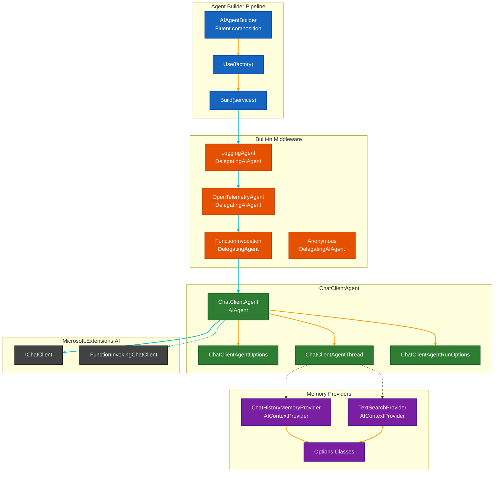

# Core Framework

> **Purpose**: This document explains the framework services, middleware, and agent builder in `Microsoft.Agents.AI`. This package builds on the abstractions layer to provide concrete implementations, the fluent builder API, built-in middleware, and memory providers that accelerate agent development.

## Overview

The `Microsoft.Agents.AI` package is the primary implementation layer of the Agent Framework. It provides `ChatClientAgent` as the bridge between `AIAgent` abstractions and Microsoft.Extensions.AI's `IChatClient`, enabling any MEAI-compatible chat client to become an agent. The `AIAgentBuilder` offers a fluent API for composing middleware pipelines. Built-in middleware includes logging, OpenTelemetry tracing, and function invocation callbacks. Memory providers like `ChatHistoryMemoryProvider` and `TextSearchProvider` implement the `AIContextProvider` pattern for RAG and semantic memory scenarios.

## Architecture Diagram



The diagram shows the layered architecture. The **AIAgentBuilder** (blue) composes middleware factories that wrap around the core **ChatClientAgent** (green). Built-in **Middleware** (orange) like `LoggingAgent` and `OpenTelemetryAgent` intercept calls. **Memory Providers** (purple) attach to threads for dynamic context. The entire pipeline delegates to **Microsoft.Extensions.AI** (gray) for actual LLM communication.

---

## 1. AIAgentBuilder

**Purpose**: Fluent builder for composing agent pipelines. Registers middleware factories that wrap the inner agent, creating a decorator chain where each layer can intercept, modify, or augment agent behavior.

**File**: [AIAgentBuilder.cs](../../../dotnet/src/Microsoft.Agents.AI/AIAgentBuilder.cs)

### Key Members

| Member | Signature | Description |
|--------|-----------|-------------|
| Constructor | `AIAgentBuilder(AIAgent innerAgent)` | Creates builder from an existing agent instance. |
| Constructor | `AIAgentBuilder(Func<IServiceProvider, AIAgent> factory)` | Creates builder from a factory delegate for DI integration. |
| `Use` | `Use(Func<AIAgent, AIAgent>)` | Adds a simple middleware factory. |
| `Use` | `Use(Func<AIAgent, IServiceProvider, AIAgent>)` | Adds a DI-aware middleware factory. |
| `Use` | `Use(sharedFunc)` | Adds anonymous middleware for pre/post processing. |
| `Use` | `Use(runFunc, runStreamingFunc)` | Adds anonymous middleware with separate streaming/non-streaming handlers. |
| `Build` | `Build(IServiceProvider? services = null)` | Constructs the final agent pipeline. |

### Pipeline Construction Order

Factories are applied in **reverse order** to match intuitive expectations. The first `Use()` call produces the outermost layer:

```csharp
var agent = new AIAgentBuilder(innerAgent)
    .Use(inner => new LoggingAgent(inner, logger))      // Outermost: logs all calls
    .Use(inner => new OpenTelemetryAgent(inner))        // Middle: adds tracing
    .Use(inner => new RateLimitingAgent(inner))         // Innermost: rate limits
    .Build();

// Call flow: LoggingAgent -> OpenTelemetryAgent -> RateLimitingAgent -> innerAgent
```

### Reverse Order Application

```
Registration order:     [0] LoggingAgent, [1] OpenTelemetryAgent, [2] RateLimitingAgent
Application order:      [2] RateLimitingAgent(inner), [1] OpenTelemetry([2]), [0] Logging([1])
Final structure:        LoggingAgent wraps OpenTelemetryAgent wraps RateLimitingAgent wraps inner
```

### DI-Aware Middleware

For middleware requiring services:

```csharp
var agent = new AIAgentBuilder(innerAgent)
    .Use((inner, services) => new CachingAgent(
        inner,
        services.GetRequiredService<IDistributedCache>(),
        services.GetRequiredService<ILogger<CachingAgent>>()))
    .Build(serviceProvider);
```

### Anonymous Middleware

For quick interceptors without creating a class:

```csharp
// Shared handler for both streaming and non-streaming
var agent = new AIAgentBuilder(innerAgent)
    .Use(async (messages, thread, options, next, ct) =>
    {
        Console.WriteLine($"Processing {messages.Count()} messages");
        await next(messages, thread, options, ct);
        Console.WriteLine("Completed");
    })
    .Build();

// Separate handlers for different paths
var agent = new AIAgentBuilder(innerAgent)
    .Use(
        runFunc: async (messages, thread, options, inner, ct) =>
        {
            var response = await inner.RunAsync(messages, thread, options, ct);
            // Post-process response
            return response;
        },
        runStreamingFunc: null)  // Falls back to runFunc with collected updates
    .Build();
```

### Extension Methods

The framework provides extension methods for common middleware:

| Extension | Package | Description |
|-----------|---------|-------------|
| `UseLogging(loggerFactory?)` | `Microsoft.Agents.AI` | Adds `LoggingAgent` with optional factory |
| `UseOpenTelemetry(sourceName?)` | `Microsoft.Agents.AI` | Adds `OpenTelemetryAgent` |
| `Use(FunctionInvocationCallback)` | `Microsoft.Agents.AI` | Adds function invocation callbacks |

```csharp
var agent = chatClient.CreateAIAgent(instructions: "You are helpful.")
    .AsBuilder()
    .UseLogging(loggerFactory)
    .UseOpenTelemetry()
    .Build(services);
```

---

## 2. ChatClientAgent

**Purpose**: The primary `AIAgent` implementation that bridges to Microsoft.Extensions.AI's `IChatClient`. Wraps any MEAI-compatible chat client to provide agent semantics including thread management, context injection, and options merging.

**File**: [ChatClientAgent.cs](../../../dotnet/src/Microsoft.Agents.AI/ChatClient/ChatClientAgent.cs)

### Key Members

| Member | Type | Description |
|--------|------|-------------|
| `ChatClient` | `IChatClient` | The underlying chat client (may be decorated with middleware). |
| `Instructions` | `string?` | System instructions passed with each invocation. |
| `Name` | `string?` | Human-readable agent name for logging and identification. |
| `Description` | `string?` | Agent description for documentation and discovery. |

### Constructors

| Constructor | Description |
|-------------|-------------|
| `ChatClientAgent(IChatClient, string? instructions, string? name, ...)` | Simple constructor with inline parameters. |
| `ChatClientAgent(IChatClient, ChatClientAgentOptions?, ...)` | Full options-based constructor for advanced configuration. |

### Thread Management

`ChatClientAgent` supports two thread models and auto-detects which to use:

**Client-Managed (MessageStore)**:
- Messages stored locally in `ChatMessageStore`
- All messages sent with each request
- Used when the LLM API is stateless (OpenAI, Anthropic, local LLMs)

**Server-Managed (ConversationId)**:
- Only conversation ID stored locally
- Server maintains message history
- Used when the service tracks state (Azure AI Foundry, some Assistants APIs)

```csharp
// Auto-detect on first run
var thread = agent.GetNewThread();
await agent.RunAsync("Hello", thread);
// After first run, thread knows if it's client or server-managed

// Explicit client-managed
var store = new InMemoryChatMessageStore();
var thread = agent.GetNewThread(store);

// Explicit server-managed (resume existing conversation)
var thread = agent.GetNewThread(conversationId: "existing-conv-123");
```

### Thread Creation Methods

| Method | Returns | Description |
|--------|---------|-------------|
| `GetNewThread()` | `ChatClientAgentThread` | Creates thread using configured factories (or defaults). |
| `GetNewThread(string conversationId)` | `ChatClientAgentThread` | Creates server-managed thread for existing conversation. |
| `GetNewThread(ChatMessageStore store)` | `ChatClientAgentThread` | Creates client-managed thread with custom store. |
| `DeserializeThread(JsonElement, ...)` | `ChatClientAgentThread` | Restores thread from serialized state. |

### Options Merging

`ChatClientAgent` merges options from multiple sources with specific precedence:

```
Priority (highest wins):
1. AIContextProvider injected options (instructions, tools)
2. ChatClientAgentRunOptions (per-request overrides)
3. ChatClientAgentOptions.ChatOptions (agent defaults)
```

**Merging Rules**:
- **Scalar values** (Temperature, MaxTokens): Higher priority wins
- **Instructions**: Concatenated with newlines (agent first, then request, then context)
- **Tools**: Concatenated (agent + request + context)
- **StopSequences**: Concatenated
- **AdditionalProperties**: Request fills gaps with agent defaults

### AIContextProvider Integration

When a thread has an `AIContextProvider`, `ChatClientAgent` calls it during execution:

```
1. PrepareThreadAndMessagesAsync()
   +-- Collect messages from MessageStore (if client-managed)
   +-- Call AIContextProvider.InvokingAsync(InvokingContext)
   +-- Merge AIContext.Instructions, Messages, Tools into request
   +-- Append user input messages

2. Execute chat client

3. Post-processing
   +-- Update thread with conversation ID or message store
   +-- Add all messages to MessageStore (if client-managed)
   +-- Call AIContextProvider.InvokedAsync(InvokedContext)
```

### GetService Implementation

`ChatClientAgent` exposes services through the service locator:

```csharp
agent.GetService<AIAgentMetadata>();      // Provider metadata
agent.GetService<IChatClient>();          // Underlying chat client
agent.GetService<ChatOptions>();          // Agent default options
agent.GetService<ChatClientAgentOptions>(); // Full agent options
// Also delegates to ChatClient.GetService for provider-specific services
```

### Example

```csharp
// Create agent with full configuration
var agent = new ChatClientAgent(
    chatClient,
    new ChatClientAgentOptions
    {
        Name = "ResearchAssistant",
        Description = "Helps with research tasks",
        ChatOptions = new ChatOptions
        {
            Instructions = "You are a helpful research assistant.",
            Temperature = 0.7f,
            Tools = [searchTool, citeTool]
        },
        ChatMessageStoreFactory = ctx => new InMemoryChatMessageStore(
            chatReducer,
            ChatReducerTriggerEvent.BeforeMessagesRetrieval),
        AIContextProviderFactory = ctx => new RagContextProvider(vectorStore)
    },
    loggerFactory);

// Use the agent
var thread = agent.GetNewThread();
var response = await agent.RunAsync("What is quantum entanglement?", thread);
Console.WriteLine(response.Text);

// Continue conversation
var response2 = await agent.RunAsync("Can you explain that more simply?", thread);
```

---

## 3. ChatClientAgentOptions

**Purpose**: Configuration object controlling all aspects of `ChatClientAgent` behavior. Supports factories for per-thread customization of message stores and context providers.

**File**: [ChatClientAgentOptions.cs](../../../dotnet/src/Microsoft.Agents.AI/ChatClient/ChatClientAgentOptions.cs)

### Key Members

| Member | Type | Description |
|--------|------|-------------|
| `Id` | `string?` | Custom agent identifier (overrides auto-generated). |
| `Name` | `string?` | Human-readable agent name. |
| `Description` | `string?` | Agent description for documentation. |
| `ChatOptions` | `ChatOptions?` | Default chat options (instructions, tools, temperature, etc.). |
| `ChatMessageStoreFactory` | `Func<ChatMessageStoreFactoryContext, ChatMessageStore>?` | Factory for creating message stores per thread. |
| `AIContextProviderFactory` | `Func<AIContextProviderFactoryContext, AIContextProvider>?` | Factory for creating context providers per thread. |
| `UseProvidedChatClientAsIs` | `bool` | If `true`, skips default middleware (FunctionInvokingChatClient). |

### Factory Contexts

**ChatMessageStoreFactoryContext**:
```csharp
public record ChatMessageStoreFactoryContext
{
    public JsonElement SerializedState { get; init; }  // For deserialization
    public JsonSerializerOptions? JsonSerializerOptions { get; init; }
}
```

**AIContextProviderFactoryContext**:
```csharp
public record AIContextProviderFactoryContext
{
    public JsonElement SerializedState { get; init; }  // For deserialization
    public JsonSerializerOptions? JsonSerializerOptions { get; init; }
}
```

### Example with Custom Factories

```csharp
var options = new ChatClientAgentOptions
{
    Name = "MemoryAgent",
    ChatOptions = new ChatOptions
    {
        Instructions = "You remember conversations with users.",
        Tools = [reminderTool]
    },

    // Custom message store with reduction
    ChatMessageStoreFactory = ctx =>
    {
        if (ctx.SerializedState.ValueKind != JsonValueKind.Undefined)
        {
            return new InMemoryChatMessageStore(ctx.SerializedState, ctx.JsonSerializerOptions);
        }
        return new InMemoryChatMessageStore(
            new ChatMessageTrimmer(targetTokenCount: 4000),
            ChatReducerTriggerEvent.BeforeMessagesRetrieval);
    },

    // Custom context provider for RAG
    AIContextProviderFactory = ctx =>
    {
        if (ctx.SerializedState.ValueKind != JsonValueKind.Undefined)
        {
            return new RagProvider(ctx.SerializedState, ctx.JsonSerializerOptions, vectorStore);
        }
        return new RagProvider(vectorStore);
    }
};
```

---

## 4. ChatClientAgentRunOptions

**Purpose**: Per-invocation options that override agent defaults for a specific `RunAsync` or `RunStreamingAsync` call.

**File**: [ChatClientAgentRunOptions.cs](../../../dotnet/src/Microsoft.Agents.AI/ChatClient/ChatClientAgentRunOptions.cs)

### Key Members

| Member | Type | Description |
|--------|------|-------------|
| `ChatOptions` | `ChatOptions?` | Overrides for this specific run. |
| `ChatClientFactory` | `Func<IChatClient, IChatClient>?` | Factory to customize the chat client for this run. |

### Usage

```csharp
// Override temperature for a creative request
var creativeOptions = new ChatClientAgentRunOptions
{
    ChatOptions = new ChatOptions { Temperature = 1.0f }
};
var response = await agent.RunAsync("Write a poem", thread, creativeOptions);

// Use a different model for a specific request
var gpt4Options = new ChatClientAgentRunOptions
{
    ChatOptions = new ChatOptions { ModelId = "gpt-4" }
};
var response = await agent.RunAsync("Complex analysis", thread, gpt4Options);

// Add request-specific tools
var searchOptions = new ChatClientAgentRunOptions
{
    ChatOptions = new ChatOptions { Tools = [webSearchTool] }
};
var response = await agent.RunAsync("Search for recent news", thread, searchOptions);
```

---

## 5. Built-in Middleware

### LoggingAgent

**Purpose**: Delegating agent that adds structured logging for all agent invocations. Uses source-generated `[LoggerMessage]` for performance.

**File**: [LoggingAgent.cs](../../../dotnet/src/Microsoft.Agents.AI/LoggingAgent.cs)

#### Log Levels

| Level | Content | Use Case |
|-------|---------|----------|
| **Debug** | Method invocation/completion (no payload) | Production monitoring |
| **Trace** | Full messages, options, responses (JSON) | Development debugging |
| **Error** | Exception details with stack trace | Error investigation |

#### Configuration

```csharp
var agent = new AIAgentBuilder(innerAgent)
    .UseLogging(loggerFactory, options =>
    {
        options.JsonSerializerOptions = new JsonSerializerOptions
        {
            WriteIndented = true
        };
    })
    .Build();
```

#### Security Note

**Trace-level logging includes full message payloads** which may contain sensitive data. Ensure trace logging is disabled in production or that logs are properly secured.

---

### OpenTelemetryAgent

**Purpose**: Delegating agent that adds distributed tracing following OpenTelemetry Semantic Conventions for Generative AI (v1.37).

**File**: [OpenTelemetryAgent.cs](../../../dotnet/src/Microsoft.Agents.AI/OpenTelemetryAgent.cs)

#### Span Attributes

| Attribute | Value | Description |
|-----------|-------|-------------|
| `gen_ai.agent.id` | Agent ID | Unique agent identifier |
| `gen_ai.agent.name` | Agent name | Human-readable name |
| `gen_ai.agent.description` | Description | Agent purpose description |
| `gen_ai.operation.name` | `"invoke_agent"` | Operation type |
| `gen_ai.provider.name` | Provider name | From `AIAgentMetadata` |

#### Configuration

```csharp
var agent = new AIAgentBuilder(innerAgent)
    .UseOpenTelemetry(sourceName: "MyApp.Agents")
    .Build();
```

#### Sensitive Data Control

By default, message content is not captured. Enable via:

```csharp
// Property on OpenTelemetryAgent
agent.EnableSensitiveData = true;

// Or via environment variable
// OTEL_INSTRUMENTATION_GENAI_CAPTURE_MESSAGE_CONTENT=true
```

---

### FunctionInvocationDelegatingAgent

**Purpose**: Internal middleware for intercepting function/tool calls. Exposed through builder extension method.

**File**: [FunctionInvocationDelegatingAgent.cs](../../../dotnet/src/Microsoft.Agents.AI/FunctionInvocationDelegatingAgent.cs)

#### Usage via Extension

```csharp
var agent = new AIAgentBuilder(innerAgent)
    .Use(async (context, next) =>
    {
        Console.WriteLine($"Calling function: {context.Function.Name}");
        var result = await next(context);
        Console.WriteLine($"Function returned: {result}");
        return result;
    })
    .Build();
```

**Requirement**: The underlying `IChatClient` must contain a `FunctionInvokingChatClient` in its pipeline for this middleware to work.

---

### AnonymousDelegatingAIAgent

**Purpose**: Delegate-based middleware for inline interception without creating a custom class.

**File**: [AnonymousDelegatingAIAgent.cs](../../../dotnet/src/Microsoft.Agents.AI/AnonymousDelegatingAIAgent.cs)

Created automatically when using `AIAgentBuilder.Use()` with delegate parameters.

---

## 6. Memory Providers

### ChatHistoryMemoryProvider

**Purpose**: Vector store-based semantic memory for chat history. Retrieves relevant past conversations to provide context for current interactions.

**File**: [ChatHistoryMemoryProvider.cs](../../../dotnet/src/Microsoft.Agents.AI/Memory/ChatHistoryMemoryProvider.cs)

#### Search Behaviors

| Behavior | When Search Runs | Use Case |
|----------|-----------------|----------|
| `BeforeAIInvoke` | Automatically before each invocation | Seamless memory integration |
| `OnDemandFunctionCalling` | Model calls a "recall" function | Explicit memory queries |

#### Configuration

```csharp
var options = new ChatHistoryMemoryProviderOptions
{
    MaxResults = 5,
    SearchBehavior = ChatHistoryMemoryProviderOptions.MemorySearchBehavior.BeforeAIInvoke,
    ContextPrompt = "Use the following conversation history for context:\n{0}",
    Scope = new ChatHistoryMemoryProviderScope
    {
        ApplicationId = "my-app",
        UserId = currentUserId
    }
};

var memoryProvider = new ChatHistoryMemoryProvider(vectorStore, chatClient, options);

var agentOptions = new ChatClientAgentOptions
{
    AIContextProviderFactory = _ => memoryProvider
};
```

#### Scope Filtering

Memory can be scoped by multiple dimensions:

| Scope | Description |
|-------|-------------|
| `ApplicationId` | Isolate by application |
| `AgentId` | Isolate by agent type |
| `ThreadId` | Isolate by conversation |
| `UserId` | Isolate by user |

---

### TextSearchProvider

**Purpose**: RAG implementation using external text search (ITextSearch) to inject relevant knowledge into agent context.

**File**: [TextSearchProvider.cs](../../../dotnet/src/Microsoft.Agents.AI/TextSearchProvider.cs)

#### Search Behaviors

| Behavior | Description |
|----------|-------------|
| `BeforeAIInvoke` | Search runs automatically before each invocation |
| `OnDemandFunctionCalling` | Model calls a search function when needed |

#### Configuration

```csharp
var options = new TextSearchProviderOptions
{
    SearchBehavior = TextSearchProviderOptions.TextSearchBehavior.BeforeAIInvoke,
    MaxResults = 5,
    ContextFormatter = results =>
        string.Join("\n\n", results.Select(r => $"[{r.Source}]: {r.Content}")),
    RecentMessageMemory = 3  // Include last 3 messages for context
};

var ragProvider = new TextSearchProvider(textSearch, options);
```

---

## 7. Extension Methods

### ChatClient Extensions

| Method | Description |
|--------|-------------|
| `CreateAIAgent(instructions?, name?, ...)` | Creates `ChatClientAgent` from `IChatClient` |
| `CreateAIAgent(options, ...)` | Creates with full options |

```csharp
var agent = chatClient.CreateAIAgent(
    instructions: "You are helpful.",
    name: "Assistant",
    tools: [calculatorTool]);
```

### ChatClientBuilder Extensions

| Method | Description |
|--------|-------------|
| `BuildAIAgent(instructions?, ...)` | Builds agent from `ChatClientBuilder` |

```csharp
var agent = new ChatClientBuilder(innerClient)
    .UseFunctionInvocation()
    .UseDistributedCaching(cache)
    .BuildAIAgent(instructions: "You are helpful.");
```

### Agent Extensions

| Method | Description |
|--------|-------------|
| `AsBuilder()` | Converts agent to `AIAgentBuilder` for further composition |
| `AsAIFunction(name?, description?)` | Wraps agent as callable `AIFunction` |

```csharp
// Compose existing agent
var enhanced = existingAgent.AsBuilder()
    .UseLogging(logger)
    .Build();

// Use agent as a tool for another agent
var agentTool = researchAgent.AsAIFunction(
    name: "research",
    description: "Conducts research on a topic");
```

---

## Dependencies

This package depends on:
- `Microsoft.Agents.AI.Abstractions` - Core abstractions (AIAgent, AgentThread, etc.)
- `Microsoft.Extensions.AI` - Chat client abstractions and implementations
- `Microsoft.Extensions.AI.OpenTelemetry` - Telemetry integration
- `Microsoft.Extensions.Logging.Abstractions` - Logging infrastructure
- `Microsoft.Extensions.DependencyInjection.Abstractions` - DI integration

## Related Documentation

- [Core Abstractions](core-abstractions.md) - AIAgent, AgentThread, AgentRunResponse
- [Design Patterns](design-patterns.md) - Decorator, Builder, Factory patterns
- [Providers](providers.md) - OpenAI, Azure AI, Anthropic implementations
- [Extension Guide](extension-guide.md) - Creating custom middleware

---

*Last updated: 2025-12-25*
