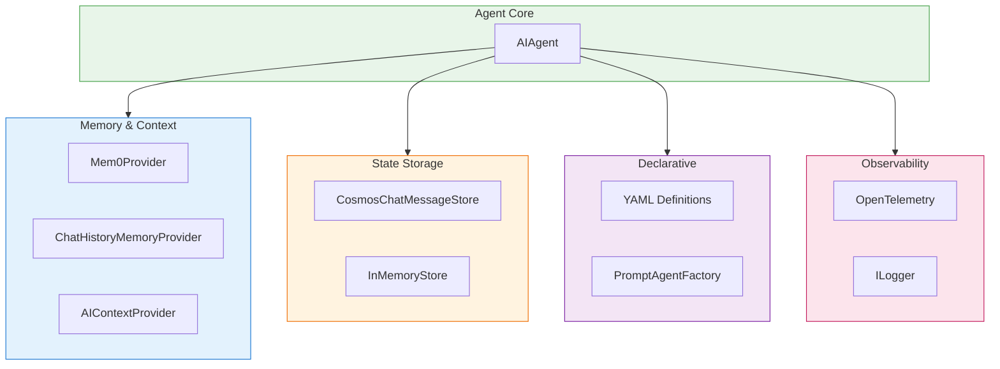
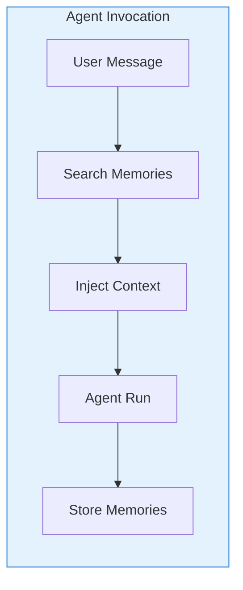

# Cross-Cutting Concerns

> **Purpose**: This document explains shared infrastructure and support services used across the framework.

## Overview

Cross-cutting concerns are features and services that span multiple components in the Agent Framework. They provide:

- **Memory & Context**: Persistent memory and dynamic context injection
- **State Storage**: Conversation and workflow state persistence
- **Declarative Configuration**: YAML/JSON agent definitions
- **Observability**: Telemetry, logging, and diagnostics
- **Legacy Support**: Compatibility with older .NET frameworks



---

## Memory & Context

### Mem0 Integration

**Package**: `Microsoft.Agents.AI.Mem0`

Mem0 is an AI memory layer that enables agents to remember information across conversations and users. The `Mem0Provider` implements `AIContextProvider` to automatically store and retrieve memories.



#### Configuration

```csharp
using var httpClient = new HttpClient();
httpClient.BaseAddress = new Uri("https://api.mem0.ai");
httpClient.DefaultRequestHeaders.Authorization =
    new AuthenticationHeaderValue("Token", "<Your-API-Key>");

// Define scope for memory storage and search
var scope = new Mem0ProviderScope
{
    UserId = "user-123",
    AgentId = "support-agent",
    ApplicationId = "my-app"
};

var memoryProvider = new Mem0Provider(
    httpClient,
    storageScope: scope,
    searchScope: scope,  // Can differ for cross-user memories
    options: new Mem0ProviderOptions
    {
        ContextPrompt = "## Memories\nConsider these memories:",
        EnableSensitiveTelemetryData = false
    });
```

#### Using with Agents

```csharp
// Create agent with Mem0 memory
var agent = chatClient.CreateAIAgent(
    instructions: "You are a helpful assistant with memory.");

// Add Mem0 as context provider
var agentWithMemory = new AIAgentBuilder(agent)
    .UseContextProvider(memoryProvider)
    .Build();

// Messages are automatically stored after each run
var response = await agentWithMemory.RunAsync(
    [new ChatMessage(ChatRole.User, "My name is Alice")],
    thread);

// In future conversations, the agent will remember
var response2 = await agentWithMemory.RunAsync(
    [new ChatMessage(ChatRole.User, "What's my name?")],
    thread);  // Will recall "Alice"
```

#### Scoping

Memories can be scoped at multiple levels:

| Scope | Description | Use Case |
|-------|-------------|----------|
| `UserId` | Per-user memories | User preferences, history |
| `AgentId` | Per-agent memories | Agent-specific knowledge |
| `ThreadId` | Per-conversation | Context within a session |
| `ApplicationId` | Per-application | Shared application state |

### ChatHistoryMemoryProvider

**Package**: `Microsoft.Agents.AI.Abstractions`

A lightweight memory provider that injects recent conversation history:

```csharp
// Use built-in chat history provider
var historyProvider = new ChatHistoryMemoryProvider(
    maxMessages: 10,
    includeSystemMessages: false);

var agentWithHistory = new AIAgentBuilder(agent)
    .UseContextProvider(historyProvider)
    .Build();
```

### AIContextProvider Pattern

Context providers implement a two-phase lifecycle for dynamic context injection:

```csharp
public abstract class AIContextProvider
{
    // Called BEFORE agent invocation
    public virtual ValueTask<AIContext> InvokingAsync(
        InvokingContext context,
        CancellationToken cancellationToken = default);

    // Called AFTER agent invocation
    public virtual ValueTask InvokedAsync(
        InvokedContext context,
        CancellationToken cancellationToken = default);

    // Serialize provider state for persistence
    public abstract JsonElement Serialize(JsonSerializerOptions? options = null);
}
```

#### Custom Context Provider Example

```csharp
public class UserPreferencesProvider : AIContextProvider
{
    private readonly IPreferencesService _preferences;

    public override async ValueTask<AIContext> InvokingAsync(
        InvokingContext context,
        CancellationToken cancellationToken = default)
    {
        var userId = context.Metadata.GetValueOrDefault("userId")?.ToString();
        if (string.IsNullOrEmpty(userId))
        {
            return new AIContext();
        }

        var prefs = await _preferences.GetAsync(userId, cancellationToken);

        return new AIContext
        {
            Messages =
            [
                new ChatMessage(ChatRole.System,
                    $"User preferences: Language={prefs.Language}, Timezone={prefs.Timezone}")
            ]
        };
    }
}
```

---

## State Storage

### CosmosDB Integration

**Package**: `Microsoft.Agents.AI.CosmosNoSql`

Provides durable storage for chat messages and workflow checkpoints using Azure Cosmos DB.

#### CosmosChatMessageStore

Stores chat conversation history with full message serialization:

```csharp
// Using connection string
var store = new CosmosChatMessageStore(
    connectionString: "AccountEndpoint=...",
    databaseId: "agents",
    containerId: "conversations",
    conversationId: "conv-123");

// Using TokenCredential (recommended for production)
var store = new CosmosChatMessageStore(
    accountEndpoint: "https://myaccount.documents.azure.com",
    tokenCredential: new DefaultAzureCredential(),
    databaseId: "agents",
    containerId: "conversations",
    conversationId: "conv-123");

// Configure options
store.MaxMessagesToRetrieve = 50;  // Limit for LLM context window
store.MessageTtlSeconds = 86400;    // 24 hour TTL
```

#### Hierarchical Partitioning

For multi-tenant applications, use hierarchical partition keys:

```csharp
var store = new CosmosChatMessageStore(
    connectionString: connectionString,
    databaseId: "agents",
    containerId: "conversations",
    tenantId: "tenant-abc",
    userId: "user-123",
    sessionId: "session-456");
```

**Container setup** (Azure Portal or IaC):
```json
{
  "partitionKey": {
    "paths": ["/tenantId", "/userId", "/sessionId"],
    "kind": "MultiHash",
    "version": 2
  }
}
```

#### CosmosCheckpointStore

For workflow state persistence:

```csharp
var checkpointStore = new CosmosCheckpointStore(
    cosmosClient,
    databaseId: "agents",
    containerId: "checkpoints");

// Use with workflow
var workflow = builder
    .WithCheckpointStore(checkpointStore)
    .Build();
```

### Custom Storage Implementation

Implement `ChatMessageStore` for custom backends:

```csharp
public class RedisChatMessageStore : ChatMessageStore
{
    private readonly IDatabase _redis;
    private readonly string _key;

    public override async Task<IEnumerable<ChatMessage>> GetMessagesAsync(
        CancellationToken cancellationToken = default)
    {
        var values = await _redis.ListRangeAsync(_key);
        return values.Select(v =>
            JsonSerializer.Deserialize<ChatMessage>(v!));
    }

    public override async Task AddMessagesAsync(
        IEnumerable<ChatMessage> messages,
        CancellationToken cancellationToken = default)
    {
        var values = messages.Select(m =>
            (RedisValue)JsonSerializer.Serialize(m)).ToArray();
        await _redis.ListRightPushAsync(_key, values);
    }

    public override JsonElement Serialize(JsonSerializerOptions? options = null)
    {
        return JsonSerializer.SerializeToElement(new { Key = _key }, options);
    }
}
```

---

## Declarative Agents

**Package**: `Microsoft.Agents.AI.Declarative`

Define agents using YAML configuration files instead of code.

### YAML Format

```yaml
# agent.yaml
$kind: prompt
name: CustomerSupport
description: A customer support agent with tool access
instructions: |
  You are a helpful customer support agent.
  Always be polite and thorough in your responses.
  Use available tools to look up customer information.

model:
  name: gpt-4o
  temperature: 0.7
  maxTokens: 2048

tools:
  - $kind: function
    name: lookupCustomer
    description: Look up customer by ID
    parameters:
      type: object
      properties:
        customerId:
          type: string
          description: The customer ID to look up

  - $kind: codeInterpreter
    enabled: true

  - $kind: fileSearch
    vectorStoreIds:
      - vs_abc123

  - $kind: mcpServer
    uri: http://localhost:3000/mcp
    approvalMode: auto
```

### Loading Agents

```csharp
// Load from YAML string
var yaml = File.ReadAllText("agent.yaml");
var metadata = AgentBotElementYaml.FromYaml(yaml);

// Create agent using factory
var factory = new ChatClientPromptAgentFactory(chatClient);
var agent = await factory.CreateAgentAsync(metadata);
```

### Schema Types

| Kind | Description |
|------|-------------|
| `prompt` | Standard prompt-based agent |
| `function` | Tool with callable function |
| `codeInterpreter` | Code execution capability |
| `fileSearch` | RAG over vector stores |
| `mcpServer` | MCP server tools |
| `webSearch` | Web search capability |

### Environment Variables

Inject configuration at runtime:

```yaml
# agent.yaml
instructions: |
  Environment: ${ENVIRONMENT}
  API Base: ${API_BASE_URL}

model:
  name: ${MODEL_NAME:gpt-4o}  # Default value support
```

```csharp
var config = new ConfigurationBuilder()
    .AddEnvironmentVariables()
    .Build();

var metadata = AgentBotElementYaml.FromYaml(yaml, config);
```

---

## Observability

### OpenTelemetry Integration

The framework emits telemetry via OpenTelemetry for observability:

```csharp
builder.Services.AddOpenTelemetry()
    .WithTracing(tracing =>
    {
        tracing
            .AddSource("Microsoft.Agents.AI")  // Agent activities
            .AddSource("Microsoft.Agents.AI.Workflows")  // Workflow activities
            .AddAspNetCoreInstrumentation()
            .AddOtlpExporter();
    })
    .WithMetrics(metrics =>
    {
        metrics
            .AddMeter("Microsoft.Agents.AI")
            .AddOtlpExporter();
    });
```

### Activity Tracing

Agent invocations create activities for distributed tracing:

```
Agent.Run
├── ContextProvider.Invoking
├── ChatClient.Complete
│   ├── HTTP Request to LLM
│   └── Tool Execution (if any)
├── ContextProvider.Invoked
└── Response Processing
```

### Logging

The framework uses `ILogger` throughout:

```csharp
builder.Services.AddLogging(logging =>
{
    logging.AddFilter("Microsoft.Agents.AI", LogLevel.Debug);
    logging.AddFilter("Microsoft.Agents.AI.Workflows", LogLevel.Information);
});
```

Log categories:
- `Microsoft.Agents.AI` - Core agent operations
- `Microsoft.Agents.AI.Workflows` - Workflow execution
- `Microsoft.Agents.AI.Mem0` - Memory operations
- `Microsoft.Agents.AI.Hosting` - Hosting and DI

### Sensitive Data Protection

Memory providers and other components support data redaction:

```csharp
var memoryProvider = new Mem0Provider(
    httpClient,
    scope,
    options: new Mem0ProviderOptions
    {
        EnableSensitiveTelemetryData = false  // Default: redact PII in logs
    });
```

---

## Developer Tools

### DevUI

**Package**: `Microsoft.Agents.AI.DevUI`

Development utilities for debugging and testing agents:

```csharp
// In development environment
if (app.Environment.IsDevelopment())
{
    app.MapAgentDevUI("/dev/agents");
}
```

Features:
- Agent introspection and configuration viewer
- Message history browser
- Tool invocation testing
- Response streaming visualization

---

## Legacy Support

**Package**: Shared via `LegacySupport.props`

The framework supports .NET Framework 4.7.2 and .NET Standard 2.0 through polyfills.

### Supported Targets

| Target | Support Level |
|--------|---------------|
| .NET 10.0 | Full |
| .NET 9.0 | Full |
| .NET 8.0 | Full |
| .NET Standard 2.0 | Full |
| .NET Framework 4.7.2 | Full (with polyfills) |

### Polyfilled Features

The following modern C# features work on older frameworks:

- `required` modifier
- `init` accessors
- Index and range operators (`^`, `..`)
- `CallerArgumentExpression`
- `SkipLocalsInit`
- Nullable reference types
- `IsExternalInit`

### Configuration

Legacy support is automatically enabled via MSBuild:

```xml
<!-- In your .csproj if manually configuring -->
<Import Project="$(MSBuildThisFileDirectory)LegacySupport.props" />

<!-- Polyfills are injected automatically for netstandard2.0 and net472 -->
```

### Considerations

When targeting legacy frameworks:

1. **Async streams** - Require `System.Linq.Async` package
2. **JSON** - Use `System.Text.Json` (included) or Newtonsoft.Json
3. **HttpClient** - Ensure modern TLS support is configured
4. **Span/Memory** - Limited support, may require `System.Memory` package

---

## Extension Points

### Custom Memory Provider

```csharp
public class VectorMemoryProvider : AIContextProvider
{
    private readonly IVectorStore _vectorStore;
    private readonly IEmbeddingGenerator _embeddings;

    public override async ValueTask<AIContext> InvokingAsync(
        InvokingContext context,
        CancellationToken cancellationToken = default)
    {
        // Get embedding for user query
        var query = context.RequestMessages.LastOrDefault()?.Text;
        if (string.IsNullOrEmpty(query))
            return new AIContext();

        var queryEmbedding = await _embeddings.GenerateAsync(query, cancellationToken);

        // Search vector store
        var results = await _vectorStore.SearchAsync(
            queryEmbedding,
            topK: 5,
            cancellationToken);

        // Format as context
        var contextText = string.Join("\n",
            results.Select(r => $"- {r.Text} (score: {r.Score:F2})"));

        return new AIContext
        {
            Messages =
            [
                new ChatMessage(ChatRole.System,
                    $"## Relevant Context\n{contextText}")
            ]
        };
    }

    public override ValueTask InvokedAsync(
        InvokedContext context,
        CancellationToken cancellationToken = default)
    {
        // Optionally store new information in vector store
        return default;
    }
}
```

### Custom Declarative Agent Factory

```csharp
public class MyPromptAgentFactory : PromptAgentFactory
{
    protected override AIAgent CreateAgent(GptComponentMetadata metadata)
    {
        var agent = base.CreateAgent(metadata);

        // Add custom middleware
        return new AIAgentBuilder(agent)
            .Use<LoggingAgent>()
            .Use<RateLimitingAgent>()
            .Build();
    }
}
```

---

*Last updated: December 2024*
