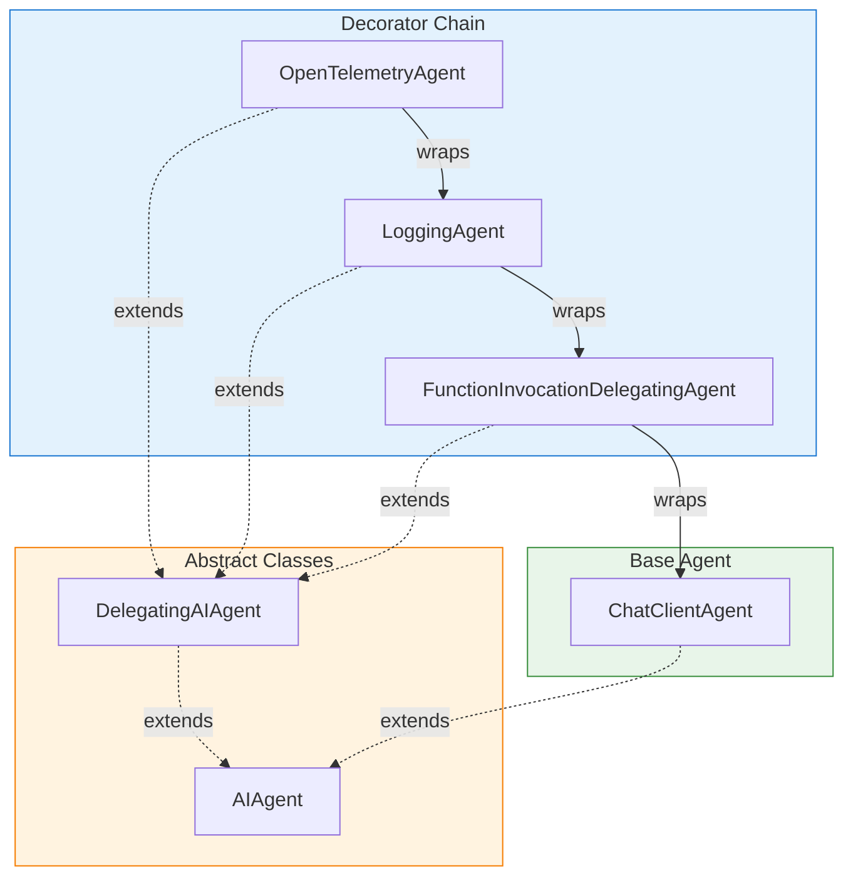
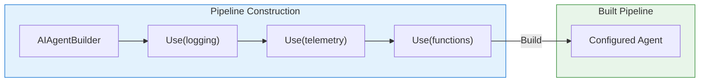
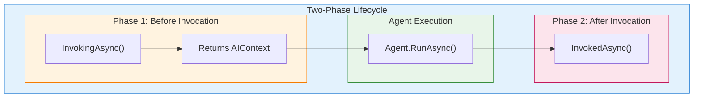
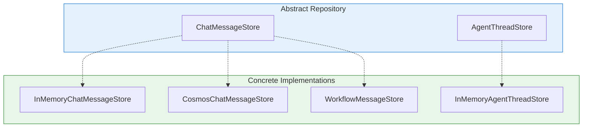
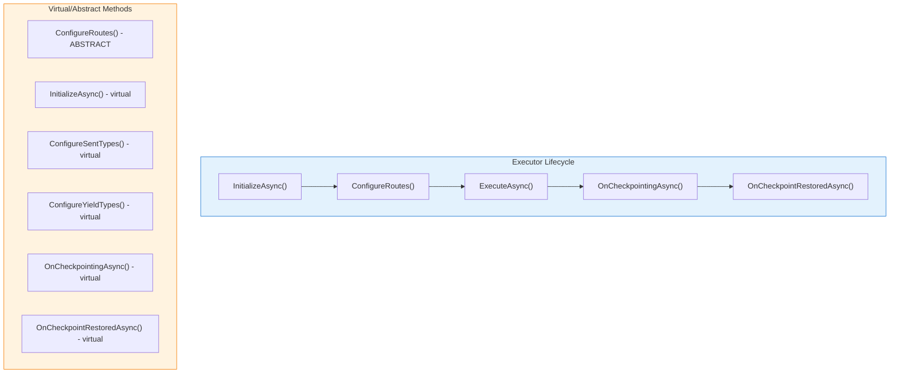
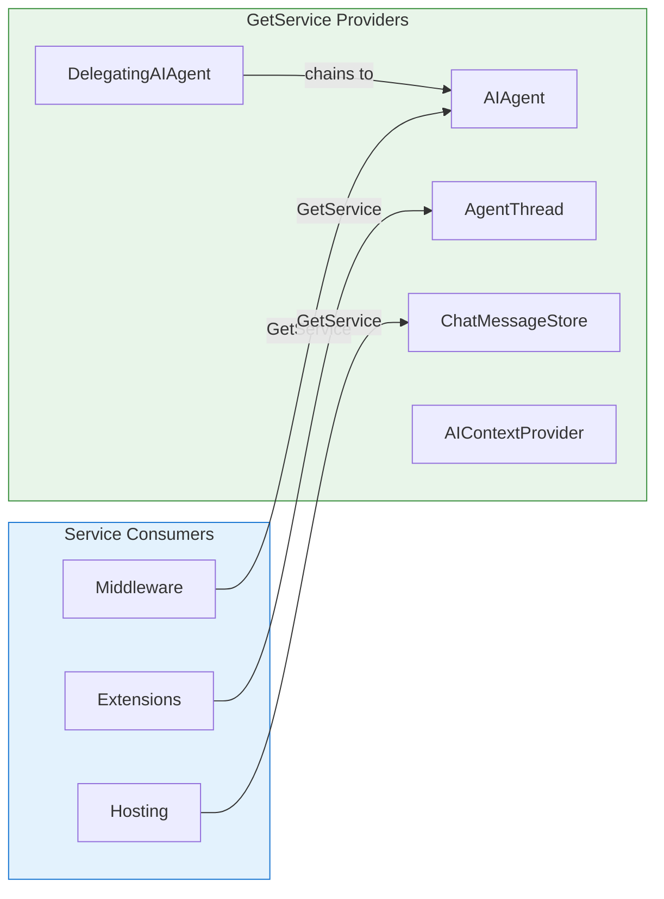
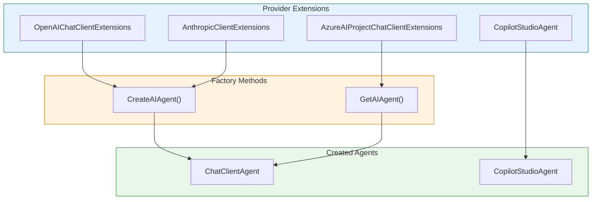
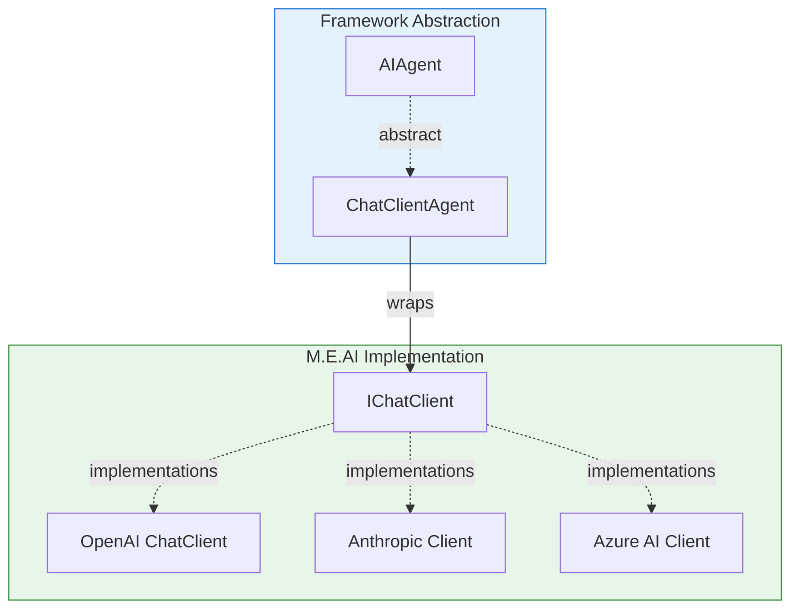
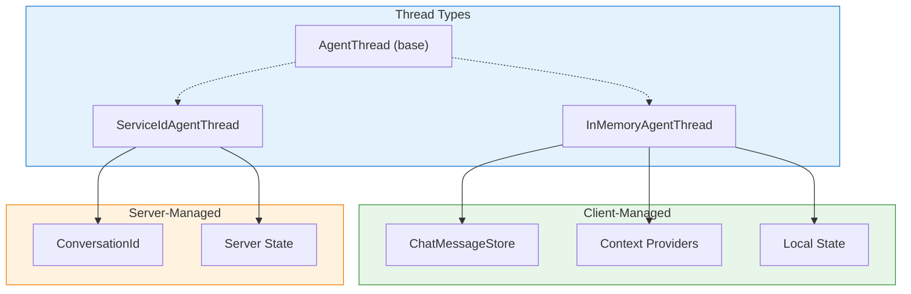

# Design Patterns

> **Purpose**: This document explains the architectural patterns used throughout the Microsoft Agent Framework, showing how they enable composability, extensibility, and separation of concerns.

## Overview

The framework leverages several well-established design patterns to achieve its architectural goals:

| Pattern | Primary Location | Purpose |
|---------|-----------------|---------|
| [Decorator](#decorator-pattern) | `DelegatingAIAgent` | Composable middleware pipelines |
| [Builder](#builder-pattern) | `AIAgentBuilder` | Fluent pipeline construction |
| [Context Provider](#context-provider-pattern) | `AIContextProvider` | Two-phase context augmentation |
| [Repository](#repository-pattern) | `ChatMessageStore` | Storage abstraction |
| [Template Method](#template-method-pattern) | `Executor` | Workflow lifecycle hooks |
| [Service Locator](#service-locator-pattern) | `GetService<T>()` | Dynamic capability discovery |
| [Factory](#factory-pattern) | Provider extensions | Agent creation |
| [Bridge](#bridge-pattern) | `ChatClientAgent` | Microsoft.Extensions.AI integration |
| [Dual Thread](#dual-thread-pattern) | `AgentThread` | Server vs. client state management |

These patterns work together to create a flexible, extensible architecture that supports diverse AI providers while maintaining a consistent programming model.

---

## Decorator Pattern

### Intent

The Decorator pattern enables composable agent pipelines where each layer adds functionality while delegating core operations to an underlying agent. This allows cross-cutting concerns like logging, telemetry, and function invocation to be added without modifying the base agent implementation.

### Structure



### How It's Used in the Framework

**Base Class**: `DelegatingAIAgent` provides transparent pass-through behavior, forwarding all operations to an inner agent:

```csharp
public abstract class DelegatingAIAgent : AIAgent
{
    protected AIAgent InnerAgent { get; }

    protected DelegatingAIAgent(AIAgent innerAgent)
    {
        this.InnerAgent = Throw.IfNull(innerAgent);
    }

    // All operations delegate to InnerAgent by default
    public override Task<AgentRunResponse> RunAsync(
        IEnumerable<ChatMessage> messages,
        AgentThread? thread = null,
        AgentRunOptions? options = null,
        CancellationToken cancellationToken = default)
        => this.InnerAgent.RunAsync(messages, thread, options, cancellationToken);
}
```

**Framework-Provided Decorators**:

| Decorator | Purpose | Key Behavior |
|-----------|---------|--------------|
| `LoggingAgent` | Structured logging | Logs at Debug/Trace levels; Trace includes full payloads |
| `OpenTelemetryAgent` | Distributed tracing | Creates Activity spans with semantic conventions |
| `FunctionInvocationDelegatingAgent` | Tool execution | Handles `FunctionCallContent` in responses |
| `AnonymousDelegatingAIAgent` | Ad-hoc decoration | Wraps delegate functions for quick customization |

### Key Participants

- **`AIAgent`**: Abstract base defining the agent contract
- **`DelegatingAIAgent`**: Abstract decorator base with pass-through behavior
- **`InnerAgent`**: The wrapped agent receiving delegated calls
- **`AIAgentBuilder.Use()`**: Registers decorator factories in the pipeline

### Creating Custom Implementations

```csharp
public sealed class RateLimitingAgent : DelegatingAIAgent
{
    private readonly SemaphoreSlim _semaphore;
    private readonly TimeSpan _delay;

    public RateLimitingAgent(AIAgent innerAgent, int maxConcurrent, TimeSpan delay)
        : base(innerAgent)
    {
        _semaphore = new SemaphoreSlim(maxConcurrent);
        _delay = delay;
    }

    public override async Task<AgentRunResponse> RunAsync(
        IEnumerable<ChatMessage> messages,
        AgentThread? thread = null,
        AgentRunOptions? options = null,
        CancellationToken cancellationToken = default)
    {
        await _semaphore.WaitAsync(cancellationToken);
        try
        {
            var result = await base.RunAsync(messages, thread, options, cancellationToken);
            await Task.Delay(_delay, cancellationToken);
            return result;
        }
        finally
        {
            _semaphore.Release();
        }
    }

    // RunStreamingAsync follows the same pattern
}
```

### Extension Points

- Override `RunAsync()` and/or `RunStreamingAsync()` to intercept execution
- Override `GetService()` to expose additional services
- Override `Name`/`Description` to modify identity (rarely needed)
- Chain multiple decorators for composable behavior

### Design Considerations

**Trade-offs**:
- **Pro**: Decorators are composable and order-independent for most use cases
- **Pro**: Easy to add/remove functionality without modifying base agents
- **Con**: Deep decorator chains can make debugging more complex
- **Con**: Each decorator adds a layer of indirection

**When to Use**:
- Cross-cutting concerns (logging, metrics, rate limiting, caching)
- Conditional behavior modification
- Transparent request/response transformation

**When NOT to Use**:
- Core agent logic (implement `AIAgent` directly instead)
- Per-request configuration (use `AgentRunOptions` or `AIContextProvider`)

### Related Patterns

- [Builder Pattern](#builder-pattern): Constructs decorator chains
- [Service Locator Pattern](#service-locator-pattern): `GetService<T>()` chains through decorators

---

## Builder Pattern

### Intent

The Builder pattern provides a fluent API for constructing agent middleware pipelines. It separates the construction of complex agent configurations from their representation.

### Structure



### How It's Used in the Framework

**`AIAgentBuilder`** provides four overloads of `Use()` for different scenarios:

```csharp
public sealed class AIAgentBuilder
{
    private readonly Func<IServiceProvider, AIAgent> _innerAgentFactory;
    private List<Func<AIAgent, IServiceProvider, AIAgent>>? _agentFactories;

    // Simple factory (no DI needed)
    public AIAgentBuilder Use(Func<AIAgent, AIAgent> agentFactory);

    // DI-aware factory
    public AIAgentBuilder Use(Func<AIAgent, IServiceProvider, AIAgent> agentFactory);

    // Pre/post processing with shared state
    public AIAgentBuilder Use<TSharedFunc>(
        Func<AIAgent, IServiceProvider, TSharedFunc> sharedFunc,
        Func<AIAgent, TSharedFunc, IServiceProvider, AIAgent> factory);

    public AIAgent Build(IServiceProvider? services = null)
    {
        services ??= EmptyServiceProvider.Instance;
        var agent = _innerAgentFactory(services);

        // Apply factories in REVERSE order
        if (_agentFactories is not null)
        {
            for (var i = _agentFactories.Count - 1; i >= 0; i--)
            {
                agent = _agentFactories[i](agent, services);
            }
        }

        return agent;
    }
}
```

**Key Insight**: Factories are applied in reverse order. The first `Use()` call becomes the outermost decorator:

```csharp
// This ordering:
var agent = new AIAgentBuilder(innerAgent)
    .Use(a => new LoggingAgent(a, logger))      // Applied last → Outermost
    .Use(a => new OpenTelemetryAgent(a))        // Applied second
    .Use(a => new FunctionAgent(a))             // Applied first → Innermost
    .Build();

// Produces this chain:
// LoggingAgent → OpenTelemetryAgent → FunctionAgent → innerAgent
```

### Key Participants

- **`AIAgentBuilder`**: The builder class
- **`Use()`**: Registers middleware factories
- **`Build()`**: Constructs the final pipeline
- **`IServiceProvider`**: Optional DI container for factory resolution
- **Extension Methods**: `AddLogging()`, `AddOpenTelemetry()`, etc.

### Creating Custom Implementations

**Extension method pattern for reusable middleware**:

```csharp
public static class CachingAgentBuilderExtensions
{
    public static AIAgentBuilder AddCaching(
        this AIAgentBuilder builder,
        IMemoryCache cache,
        TimeSpan ttl)
    {
        return builder.Use(innerAgent =>
            new CachingAgent(innerAgent, cache, ttl));
    }

    // DI-aware overload
    public static AIAgentBuilder AddCaching(
        this AIAgentBuilder builder,
        TimeSpan ttl)
    {
        return builder.Use((innerAgent, services) =>
        {
            var cache = services.GetRequiredService<IMemoryCache>();
            return new CachingAgent(innerAgent, cache, ttl);
        });
    }
}
```

### Design Considerations

**Trade-offs**:
- **Pro**: Clear, readable pipeline configuration
- **Pro**: Separation of construction from representation
- **Pro**: Easy to reorder or conditionally add middleware
- **Con**: Reverse application order can be initially confusing

**Related Patterns**:
- [Decorator Pattern](#decorator-pattern): Builder constructs decorator chains
- [Factory Pattern](#factory-pattern): Each `Use()` call registers a factory

---

## Context Provider Pattern

### Intent

The Context Provider pattern enables dynamic context augmentation during agent invocations. It implements a two-phase lifecycle where providers inject context before execution and optionally process results after execution.

### Structure



### How It's Used in the Framework

**`AIContextProvider`** defines the contract:

```csharp
public abstract class AIContextProvider
{
    // Called before agent invocation - REQUIRED
    public abstract ValueTask<AIContext> InvokingAsync(
        InvokingContext context,
        CancellationToken cancellationToken = default);

    // Called after agent invocation - OPTIONAL
    public virtual ValueTask InvokedAsync(
        InvokedContext context,
        CancellationToken cancellationToken = default)
        => default;

    // For state persistence
    public virtual JsonElement Serialize(JsonSerializerOptions? jsonSerializerOptions = null)
        => default;

    // Service discovery
    public virtual object? GetService(Type serviceType, object? serviceKey = null);
}
```

**`AIContext`** carries the augmentation:

```csharp
public class AIContext
{
    public string? Instructions { get; set; }           // System prompt additions
    public IEnumerable<ChatMessage>? Messages { get; set; }  // History/context messages
    public IEnumerable<AITool>? Tools { get; set; }    // Dynamic tools
}
```

### Key Participants

- **`AIContextProvider`**: Abstract base for providers
- **`InvokingContext`**: Contains request messages before invocation
- **`InvokedContext`**: Contains request, response, and exception information
- **`AIContext`**: The augmentation returned by providers
- **`ChatClientAgentOptions.AIContextProviderFactory`**: Factory for per-thread providers

### Creating Custom Implementations

**RAG (Retrieval-Augmented Generation) Provider**:

```csharp
public sealed class RagContextProvider : AIContextProvider
{
    private readonly IVectorStore _vectorStore;
    private readonly int _topK;

    public RagContextProvider(IVectorStore vectorStore, int topK = 5)
    {
        _vectorStore = vectorStore;
        _topK = topK;
    }

    public override async ValueTask<AIContext> InvokingAsync(
        InvokingContext context,
        CancellationToken cancellationToken = default)
    {
        // Extract the latest user message for retrieval
        var lastUserMessage = context.RequestMessages
            .LastOrDefault(m => m.Role == ChatRole.User);

        if (lastUserMessage?.Text is not { } query)
            return new AIContext();

        // Retrieve relevant documents
        var documents = await _vectorStore.SearchAsync(query, _topK, cancellationToken);

        // Format as context message
        var contextMessage = new ChatMessage(
            ChatRole.System,
            $"Relevant information:\n{string.Join("\n---\n", documents.Select(d => d.Content))}");

        return new AIContext
        {
            Messages = [contextMessage]
        };
    }

    public override async ValueTask InvokedAsync(
        InvokedContext context,
        CancellationToken cancellationToken = default)
    {
        // Optional: Log retrieval effectiveness, update metrics, etc.
        if (context.InvokeException is null)
        {
            // Track successful retrievals
        }
    }
}
```

**User Memory Provider** (learning from conversations):

```csharp
public sealed class UserMemoryProvider : AIContextProvider
{
    private readonly Dictionary<string, string> _userFacts = new();

    public override ValueTask<AIContext> InvokingAsync(
        InvokingContext context,
        CancellationToken cancellationToken = default)
    {
        if (_userFacts.Count == 0)
            return ValueTask.FromResult(new AIContext());

        var instructions = "Known information about the user:\n" +
            string.Join("\n", _userFacts.Select(kv => $"- {kv.Key}: {kv.Value}"));

        return ValueTask.FromResult(new AIContext { Instructions = instructions });
    }

    public override ValueTask InvokedAsync(
        InvokedContext context,
        CancellationToken cancellationToken = default)
    {
        // Extract and store user facts from the conversation
        foreach (var message in context.RequestMessages.Where(m => m.Role == ChatRole.User))
        {
            ExtractFacts(message.Text);
        }

        return default;
    }

    public override JsonElement Serialize(JsonSerializerOptions? jsonSerializerOptions = null)
    {
        return JsonSerializer.SerializeToElement(_userFacts, jsonSerializerOptions);
    }

    private void ExtractFacts(string? text) { /* Implementation */ }
}
```

### Design Considerations

**Trade-offs**:
- **Pro**: Clean separation of context management from agent logic
- **Pro**: Stateful providers can learn and adapt over time
- **Pro**: Composable with multiple providers
- **Con**: Adds latency if providers perform I/O operations
- **Con**: Serialization required for stateful providers across restarts

**When to Use**:
- Dynamic context injection (RAG, user preferences, session state)
- Message preprocessing or augmentation
- Post-invocation learning or logging
- Tool injection based on context

### Related Patterns

- [Decorator Pattern](#decorator-pattern): Both augment agent behavior, but context providers are invocation-scoped
- [Repository Pattern](#repository-pattern): Context providers may use repositories for persistence

---

## Repository Pattern

### Intent

The Repository pattern abstracts data persistence behind a clean interface, allowing different storage implementations without affecting client code. The framework uses this pattern for both message storage and thread persistence.

### Structure



### How It's Used in the Framework

**`ChatMessageStore`** defines the message persistence contract:

```csharp
public abstract class ChatMessageStore
{
    // Retrieve messages for agent context (oldest first)
    public abstract Task<IEnumerable<ChatMessage>> GetMessagesAsync(
        CancellationToken cancellationToken = default);

    // Store new messages (maintains chronological order)
    public abstract Task AddMessagesAsync(
        IEnumerable<ChatMessage> messages,
        CancellationToken cancellationToken = default);

    // Serialize for thread persistence
    public abstract JsonElement Serialize(JsonSerializerOptions? jsonSerializerOptions = null);

    // Service discovery
    public virtual object? GetService(Type serviceType, object? serviceKey = null);
}
```

**`InMemoryChatMessageStore`** provides a reference implementation with message reduction:

```csharp
public sealed class InMemoryChatMessageStore : ChatMessageStore, IList<ChatMessage>
{
    private List<ChatMessage> _messages;

    public IChatReducer? ChatReducer { get; }
    public ChatReducerTriggerEvent ReducerTriggerEvent { get; }

    public override async Task<IEnumerable<ChatMessage>> GetMessagesAsync(
        CancellationToken cancellationToken = default)
    {
        // Apply reduction before retrieval if configured
        if (ReducerTriggerEvent is ChatReducerTriggerEvent.BeforeMessagesRetrieval
            && ChatReducer is not null)
        {
            _messages = (await ChatReducer.ReduceAsync(_messages, cancellationToken))
                .ToList();
        }

        return _messages;
    }

    public enum ChatReducerTriggerEvent
    {
        AfterMessageAdded,       // Reduce when messages are added
        BeforeMessagesRetrieval  // Reduce when messages are retrieved
    }
}
```

### Key Participants

- **`ChatMessageStore`**: Abstract message storage
- **`AgentThreadStore`**: Abstract thread persistence (hosting layer)
- **`IChatReducer`**: Strategy for message optimization
- **`InMemoryChatMessageStore`**: Reference in-memory implementation
- **`CosmosChatMessageStore`**: Azure Cosmos DB implementation

### Creating Custom Implementations

**Redis-backed message store**:

```csharp
public sealed class RedisChatMessageStore : ChatMessageStore
{
    private readonly IDatabase _redis;
    private readonly string _key;

    public RedisChatMessageStore(IDatabase redis, string conversationId)
    {
        _redis = redis;
        _key = $"chat:{conversationId}:messages";
    }

    public override async Task<IEnumerable<ChatMessage>> GetMessagesAsync(
        CancellationToken cancellationToken = default)
    {
        var values = await _redis.ListRangeAsync(_key);
        return values
            .Select(v => JsonSerializer.Deserialize<ChatMessage>(v!))
            .Where(m => m is not null)!;
    }

    public override async Task AddMessagesAsync(
        IEnumerable<ChatMessage> messages,
        CancellationToken cancellationToken = default)
    {
        var values = messages
            .Select(m => (RedisValue)JsonSerializer.Serialize(m))
            .ToArray();

        await _redis.ListRightPushAsync(_key, values);
    }

    public override JsonElement Serialize(JsonSerializerOptions? jsonSerializerOptions = null)
    {
        // Return reference for server-side storage
        return JsonSerializer.SerializeToElement(new { Key = _key }, jsonSerializerOptions);
    }
}
```

### Design Considerations

**Trade-offs**:
- **Pro**: Storage implementation is completely decoupled from agent logic
- **Pro**: Easy to switch between in-memory (dev) and persistent (prod) stores
- **Pro**: Message reduction strategies are pluggable
- **Con**: Abstraction may not expose all capabilities of specific storage systems

**Related Patterns**:
- [Context Provider Pattern](#context-provider-pattern): May use repositories internally
- [Service Locator Pattern](#service-locator-pattern): `GetService<T>()` for capability discovery

---

## Template Method Pattern

### Intent

The Template Method pattern defines the skeleton of an algorithm in a base class, letting subclasses override specific steps without changing the algorithm's structure. The framework uses this pattern extensively in workflow executors.

### Structure



### How It's Used in the Framework

**`Executor`** defines the workflow execution template:

```csharp
public abstract class Executor : IIdentified
{
    public string Id { get; }

    // ABSTRACT: Subclasses MUST implement
    protected abstract RouteBuilder ConfigureRoutes(RouteBuilder routeBuilder);

    // VIRTUAL: Subclasses CAN override
    protected internal virtual ValueTask InitializeAsync(
        IWorkflowContext context,
        CancellationToken cancellationToken = default)
        => default;

    protected virtual ISet<Type> ConfigureSentTypes()
        => new HashSet<Type>([typeof(object)]);

    protected virtual ISet<Type> ConfigureYieldTypes()
    {
        if (Options.AutoYieldOutputHandlerResultObject)
            return Router.DefaultOutputTypes;
        return new HashSet<Type>();
    }

    protected internal virtual ValueTask OnCheckpointingAsync(
        IWorkflowContext context,
        CancellationToken cancellationToken = default) => default;

    protected internal virtual ValueTask OnCheckpointRestoredAsync(
        IWorkflowContext context,
        CancellationToken cancellationToken = default) => default;

    // INVARIANT: The template algorithm
    public async ValueTask<object?> ExecuteAsync(
        object message, TypeId messageType, IWorkflowContext context,
        CancellationToken cancellationToken = default)
    {
        using var activity = s_activitySource.StartActivity(ActivityNames.ExecutorProcess);
        // ... standard execution logic using ConfigureRoutes() result
    }
}
```

**Typed Executor Variants**:

```csharp
// Single-type handler
public abstract class Executor<TInput> : Executor, IMessageHandler<TInput>
{
    protected override RouteBuilder ConfigureRoutes(RouteBuilder routeBuilder) =>
        routeBuilder.AddHandler<TInput>(HandleAsync);

    public abstract ValueTask HandleAsync(
        TInput message, IWorkflowContext context, CancellationToken cancellationToken);
}

// Typed input/output handler
public abstract class Executor<TInput, TOutput> : Executor, IMessageHandler<TInput, TOutput>
{
    protected override RouteBuilder ConfigureRoutes(RouteBuilder routeBuilder) =>
        routeBuilder.AddHandler<TInput, TOutput>(HandleAsync);

    public abstract ValueTask<TOutput> HandleAsync(
        TInput message, IWorkflowContext context, CancellationToken cancellationToken);
}
```

### Key Participants

- **`Executor`**: Abstract base with template methods
- **`RouteBuilder`**: Configures message routing
- **`IWorkflowContext`**: Execution context passed to lifecycle methods
- **`Executor<TInput>` / `Executor<TInput, TOutput>`**: Simplified typed variants

### Creating Custom Implementations

**Custom workflow step**:

```csharp
public sealed class SentimentAnalysisExecutor : Executor<string, SentimentResult>
{
    private readonly ISentimentAnalyzer _analyzer;

    public SentimentAnalysisExecutor(string id, ISentimentAnalyzer analyzer)
        : base(id)
    {
        _analyzer = analyzer;
    }

    protected internal override async ValueTask InitializeAsync(
        IWorkflowContext context, CancellationToken cancellationToken = default)
    {
        // One-time initialization (load models, warm up, etc.)
        await _analyzer.InitializeAsync(cancellationToken);
    }

    public override async ValueTask<SentimentResult> HandleAsync(
        string message, IWorkflowContext context, CancellationToken cancellationToken)
    {
        return await _analyzer.AnalyzeAsync(message, cancellationToken);
    }

    protected override ISet<Type> ConfigureYieldTypes()
    {
        // Declare that this executor can produce SentimentResult as workflow output
        return new HashSet<Type> { typeof(SentimentResult) };
    }
}
```

**Multi-message handler with custom routing**:

```csharp
public sealed class CustomerServiceExecutor : Executor
{
    public CustomerServiceExecutor(string id) : base(id) { }

    protected override RouteBuilder ConfigureRoutes(RouteBuilder routeBuilder)
    {
        return routeBuilder
            .AddHandler<ComplaintMessage>(HandleComplaintAsync)
            .AddHandler<InquiryMessage>(HandleInquiryAsync)
            .AddHandler<FeedbackMessage>(HandleFeedbackAsync);
    }

    private ValueTask HandleComplaintAsync(
        ComplaintMessage msg, IWorkflowContext ctx, CancellationToken ct) { /* ... */ }

    private ValueTask HandleInquiryAsync(
        InquiryMessage msg, IWorkflowContext ctx, CancellationToken ct) { /* ... */ }

    private ValueTask HandleFeedbackAsync(
        FeedbackMessage msg, IWorkflowContext ctx, CancellationToken ct) { /* ... */ }
}
```

### Design Considerations

**Trade-offs**:
- **Pro**: Consistent execution lifecycle across all executors
- **Pro**: Easy to add behavior at specific lifecycle points
- **Pro**: Clear separation between framework logic and custom logic
- **Con**: Requires understanding the full lifecycle to use effectively

**Related Patterns**:
- [Factory Pattern](#factory-pattern): `ExecutorBinding` creates executor instances
- [Builder Pattern](#builder-pattern): `WorkflowBuilder` constructs executor graphs

---

## Service Locator Pattern

### Intent

The Service Locator pattern provides a mechanism to discover capabilities without hard dependencies. The framework uses `GetService<T>()` throughout to enable loose coupling and extensibility.

### Structure



### How It's Used in the Framework

**Consistent interface across components**:

```csharp
// Base pattern on AIAgent, AgentThread, ChatMessageStore, AIContextProvider
public virtual object? GetService(Type serviceType, object? serviceKey = null)
{
    _ = Throw.IfNull(serviceType);

    return serviceKey is null && serviceType.IsInstanceOfType(this)
        ? this
        : null;
}

public TService? GetService<TService>(object? serviceKey = null)
    => GetService(typeof(TService), serviceKey) is TService service ? service : default;
```

**Chaining in decorators** (`DelegatingAIAgent`):

```csharp
public override object? GetService(Type serviceType, object? serviceKey = null)
{
    _ = Throw.IfNull(serviceType);

    // Return self if type matches and no key
    // Otherwise, delegate to inner agent
    return
        serviceKey is null && serviceType.IsInstanceOfType(this) ? this :
        InnerAgent.GetService(serviceType, serviceKey);
}
```

### Common Use Cases

**Retrieving metadata**:
```csharp
// Get agent metadata for telemetry/logging
var metadata = agent.GetService<AIAgentMetadata>();
if (metadata?.ProviderName is { } provider)
{
    activity.SetTag("gen_ai.provider.name", provider);
}
```

**Discovering capabilities**:
```csharp
// Check if thread has a message store
var store = thread.GetService<ChatMessageStore>();
if (store is not null)
{
    var history = await store.GetMessagesAsync();
}
```

**Accessing wrapped components**:
```csharp
// Access inner agent through decorator chain
var innerAgent = decoratingAgent.GetService<ChatClientAgent>();
```

### Design Considerations

**Trade-offs**:
- **Pro**: Loose coupling between components
- **Pro**: Easy to extend without breaking existing code
- **Pro**: Decorators can transparently expose inner services
- **Con**: Runtime discovery (no compile-time guarantees)
- **Con**: Service availability depends on configuration

**When to Use**:
- Accessing optional capabilities
- Cross-cutting concerns needing component access
- Avoiding hard dependencies on specific implementations

**Related Patterns**:
- [Decorator Pattern](#decorator-pattern): Decorators chain `GetService()` calls
- [Factory Pattern](#factory-pattern): Services may be constructed by factories

---

## Factory Pattern

### Intent

The Factory pattern encapsulates object creation, hiding the complexity of constructing agents and related components. Each AI provider uses factory methods to create properly configured agents.

### Structure



### How It's Used in the Framework

**OpenAI provider factories**:

```csharp
public static class OpenAIChatClientExtensions
{
    public static AIAgent CreateAIAgent(
        this ChatClient chatClient,
        string? instructions = null,
        ChatClientAgentOptions? options = null)
    {
        var meaiClient = chatClient.AsIChatClient();
        return new ChatClientAgent(meaiClient, instructions, options);
    }
}
```

**Azure AI with async retrieval**:

```csharp
public static class AzureAIProjectChatClientExtensions
{
    public static async Task<AIAgent> GetAIAgentAsync(
        this AIProjectClient client,
        string agentName,
        ChatClientAgentOptions? options = null,
        CancellationToken cancellationToken = default)
    {
        var agentRef = await client.GetAgentAsync(agentName, cancellationToken);
        var chatClient = new AzureAIProjectChatClient(client, agentRef);
        return new ChatClientAgent(chatClient, options: options);
    }
}
```

**Thread/Store factories in options**:

```csharp
public class ChatClientAgentOptions
{
    // Factory for per-thread message stores
    public Func<ChatMessageStoreFactoryContext, ChatMessageStore>? ChatMessageStoreFactory { get; set; }

    // Factory for per-thread context providers
    public Func<AIContextProviderFactoryContext, AIContextProvider>? AIContextProviderFactory { get; set; }
}
```

### Key Participants

- **Provider SDKs**: OpenAI `ChatClient`, Azure `AIProjectClient`, etc.
- **Extension Methods**: `CreateAIAgent()`, `GetAIAgent()`, `GetAIAgentAsync()`
- **`ChatClientAgent`**: Common target for IChatClient-based providers
- **Factory Contexts**: `ChatMessageStoreFactoryContext`, `AIContextProviderFactoryContext`

### Design Considerations

**Naming Conventions**:
- `CreateAIAgent()`: Immediate creation, typically for chat-based APIs
- `GetAIAgent()`: May involve retrieval, lookup, or async operations
- `*Async()` suffixes: Async variants for server-side operations

**Trade-offs**:
- **Pro**: Encapsulates provider-specific construction complexity
- **Pro**: Consistent API across different providers
- **Pro**: Enables validation and configuration at creation time
- **Con**: New providers must implement factory methods

**Related Patterns**:
- [Builder Pattern](#builder-pattern): `AIAgentBuilder` uses factories internally
- [Bridge Pattern](#bridge-pattern): Factories create the bridge implementations

---

## Bridge Pattern

### Intent

The Bridge pattern decouples an abstraction from its implementation, allowing them to vary independently. The framework bridges the `AIAgent` abstraction with Microsoft.Extensions.AI's `IChatClient` implementation.

### Structure



### How It's Used in the Framework

**`ChatClientAgent`** bridges `AIAgent` and `IChatClient`:

```csharp
public class ChatClientAgent : AIAgent
{
    private readonly IChatClient _chatClient;

    public ChatClientAgent(
        IChatClient chatClient,
        string? instructions = null,
        ChatClientAgentOptions? options = null)
    {
        _chatClient = Throw.IfNull(chatClient);
        // ... configuration
    }

    public override async Task<AgentRunResponse> RunAsync(
        IEnumerable<ChatMessage> messages,
        AgentThread? thread = null,
        AgentRunOptions? options = null,
        CancellationToken cancellationToken = default)
    {
        // Prepare messages (thread history + new messages + context)
        var allMessages = PrepareMessages(messages, thread, options);

        // Convert AgentRunOptions to ChatOptions
        var chatOptions = BuildChatOptions(options);

        // Delegate to IChatClient
        var response = await _chatClient.GetResponseAsync(allMessages, chatOptions, cancellationToken);

        // Convert back to AgentRunResponse
        return ConvertResponse(response, thread);
    }
}
```

### Key Participants

- **`AIAgent`**: Framework abstraction
- **`ChatClientAgent`**: Bridge implementation
- **`IChatClient`**: Microsoft.Extensions.AI interface
- **Provider SDKs**: Concrete `IChatClient` implementations

### Design Considerations

**Trade-offs**:
- **Pro**: Framework evolves independently from provider implementations
- **Pro**: Single bridge class supports all `IChatClient` implementations
- **Pro**: Providers can add new features without framework changes
- **Con**: Some provider-specific features may require workarounds

**Related Patterns**:
- [Decorator Pattern](#decorator-pattern): Applied on top of the bridge
- [Factory Pattern](#factory-pattern): Creates properly configured bridges

---

## Dual Thread Pattern

### Intent

The Dual Thread pattern supports two distinct approaches to conversation state management: client-managed (in-memory) and server-managed (by ID reference). This enables different deployment scenarios with consistent APIs.

### Structure



### How It's Used in the Framework

**Base `AgentThread`**:

```csharp
public abstract class AgentThread
{
    // Serialize for persistence
    public virtual JsonElement Serialize(JsonSerializerOptions? jsonSerializerOptions = null)
        => default;

    // Service discovery for attached components
    public virtual object? GetService(Type serviceType, object? serviceKey = null);
}
```

**Client-Managed Thread** (full local state):

```csharp
public sealed class InMemoryAgentThread : AgentThread
{
    private readonly InMemoryChatMessageStore _messageStore;
    private readonly AIContextProvider? _contextProvider;

    public override JsonElement Serialize(JsonSerializerOptions? jsonSerializerOptions = null)
    {
        return JsonSerializer.SerializeToElement(new ThreadState
        {
            Messages = _messageStore.Serialize(jsonSerializerOptions),
            Context = _contextProvider?.Serialize(jsonSerializerOptions)
        }, jsonSerializerOptions);
    }

    public override object? GetService(Type serviceType, object? serviceKey = null)
    {
        if (serviceType == typeof(ChatMessageStore))
            return _messageStore;
        if (serviceType == typeof(AIContextProvider))
            return _contextProvider;
        return base.GetService(serviceType, serviceKey);
    }
}
```

**Server-Managed Thread** (ID reference only):

```csharp
public sealed class ServiceIdAgentThread : AgentThread
{
    public string? ConversationId { get; set; }

    public override JsonElement Serialize(JsonSerializerOptions? jsonSerializerOptions = null)
    {
        return JsonSerializer.SerializeToElement(new { ConversationId }, jsonSerializerOptions);
    }

    public override object? GetService(Type serviceType, object? serviceKey = null)
    {
        if (serviceType == typeof(AgentThreadMetadata))
            return new AgentThreadMetadata(ConversationId);
        return base.GetService(serviceType, serviceKey);
    }
}
```

### When to Use Each

| Scenario | Thread Type | Rationale |
|----------|-------------|-----------|
| Local development | `InMemoryAgentThread` | Full control, easy debugging |
| Chat-based APIs (OpenAI, Anthropic) | `InMemoryAgentThread` | Client must manage history |
| Azure AI Agents | `ServiceIdAgentThread` | Server maintains conversation |
| Copilot Studio | `ServiceIdAgentThread` | Cloud service manages state |
| Custom state requirements | Custom `AgentThread` | Maximum flexibility |

### Design Considerations

**Trade-offs**:
- **Pro**: Single API supports diverse provider patterns
- **Pro**: Clear separation between state management strategies
- **Pro**: Serialization enables persistence regardless of type
- **Con**: Different capabilities available in each thread type

**Related Patterns**:
- [Repository Pattern](#repository-pattern): `ChatMessageStore` is the state repository
- [Service Locator Pattern](#service-locator-pattern): `GetService<T>()` discovers attached components

---

## Related Documentation

- [Core Framework](core-framework.md): Components implementing these patterns
- [Core Abstractions](core-abstractions.md): Abstract base classes
- [Extension Guide](extension-guide.md): How to extend using these patterns
- [Workflows](workflows.md): Template Method pattern in workflow executors

---

*Last updated: 2025-01-10*
