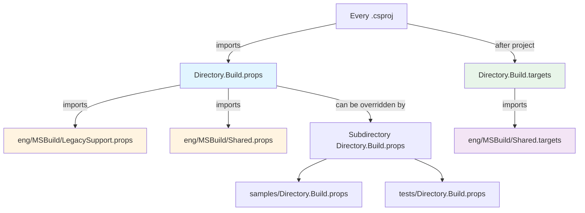

# .NET Build System Guide

> **Purpose**: This document provides a comprehensive deep-dive into the MSBuild infrastructure that powers the .NET Agent Framework. It's designed for developers new to .NET or MSBuild who want to understand how the build system works, why it's structured this way, and how to work with it effectively.

## Overview

### What is MSBuild?

MSBuild (Microsoft Build Engine) is the build platform for .NET applications. It's:
- **XML-based** - Build logic defined in `.csproj`, `.props`, and `.targets` files
- **Declarative** - Describe what you want to build, not how to build it
- **Extensible** - Import shared configuration, define custom tasks
- **Integrated** - Powers Visual Studio, Rider, and the `dotnet` CLI

### Why This Complexity?

The .NET Agent Framework has sophisticated build requirements:
- **30+ projects** across multiple packages
- **5 target frameworks** (net10.0, net9.0, net8.0, netstandard2.0, net472)
- **Modern C# features** on legacy frameworks (requires polyfills)
- **Code sharing** across projects without assembly references
- **Quality gates** (analyzers, nullable reference types, documentation)
- **Central package management** for 100+ dependencies

Instead of duplicating configuration in every `.csproj`, we centralize it in shared `.props` and `.targets` files.

### Quick Reference: File Purposes

| File | Purpose |
|------|---------|
| [Directory.Build.props](#directoryb uildprops) | Root configuration inherited by all projects |
| [Directory.Packages.props](#directorypackagesprops) | Central Package Management (CPM) - all NuGet versions |
| [eng/MSBuild/LegacySupport.props](#engmsbuildlegacysupportprops) | Polyfills for modern C# on old frameworks |
| [eng/MSBuild/Shared.props](#engmsbuildsharedprops) | Code injection system (link files) |
| [eng/MSBuild/Shared.targets](#engmsbuildsharedtargets) | Auto-configuration dependencies |
| [Directory.Build.targets](#directoryb uildtargets) | Post-build tasks (formatting) |
| [samples/Directory.Build.props](#samplesdirectoryb uildprops) | Sample-specific overrides |
| [tests/Directory.Build.props](#testsdirectoryb uildprops) | Test-specific configuration |

---

## The Import Chain

Understanding the import chain is critical to understanding how build properties flow through the system.



**Import Order**:
1. **Directory.Build.props** (root) - Evaluated first, sets defaults
2. **eng/MSBuild/LegacySupport.props** - Injects polyfills based on properties
3. **eng/MSBuild/Shared.props** - Injects shared code based on properties
4. **Subdirectory overrides** - samples/ and tests/ can override
5. **Project .csproj** - The actual project file
6. **Directory.Build.targets** - Post-build tasks
7. **eng/MSBuild/Shared.targets** - Auto-dependency configuration

---

## Core Files Explained

### Directory.Build.props

**Location**: `dotnet/Directory.Build.props`

**Purpose**: Root configuration file that defines shared build properties inherited by **all** projects in the solution.

**Key Features**:

```xml
<Project>
  <!-- CODE QUALITY ENFORCEMENT -->
  <PropertyGroup>
    <RunAnalyzersDuringBuild>true</RunAnalyzersDuringBuild>
    <EnableNETAnalyzers>true</EnableNETAnalyzers>
    <AnalysisLevel>10.0-all</AnalysisLevel>
    <TreatWarningsAsErrors>true</TreatWarningsAsErrors>
  </PropertyGroup>
```
- **What it does**: Enables all .NET analyzers and treats warnings as errors
- **Why it exists**: Enforces code quality consistently across all projects
- **Junior dev confusion**: "Why can't I ignore this warning?" → Answer: Quality is non-negotiable at the repository level

```xml
  <!-- MULTI-TARGETING STRATEGY -->
  <PropertyGroup>
    <TargetFrameworksCore>net10.0;net9.0;net8.0</TargetFrameworksCore>
    <TargetFrameworks>$(TargetFrameworksCore);netstandard2.0;net472</TargetFrameworks>
  </PropertyGroup>
```
- **What it does**: Defines default target frameworks for all projects
- **Why these versions**:
  - `net10.0, net9.0, net8.0` - Modern .NET (current and 2 previous LTS)
  - `netstandard2.0` - Cross-platform compatibility (.NET Framework 4.7.2+, .NET Core 2.0+)
  - `net472` - Legacy .NET Framework support for enterprise customers
- **Junior dev confusion**: "Do I need all these targets?" → Answer: Yes for libraries, samples can override

```xml
  <!-- MODERN C# FEATURES -->
  <PropertyGroup>
    <LangVersion>latest</LangVersion>
    <Nullable>enable</Nullable>
  </PropertyGroup>
```
- **What it does**: Enables latest C# language features and nullable reference types
- **Why it exists**: Modern C# = better code safety and developer experience
- **Junior dev confusion**: "Why all these nullability warnings on netstandard2.0?" → Answer: See next section

```xml
  <!-- SUPPRESS NULLABLE WARNINGS ON LEGACY FRAMEWORKS -->
  <PropertyGroup Condition=" '$(TargetFramework)' == 'netstandard2.0' OR '$(TargetFramework)' == 'net472' ">
    <NoWarn>$(NoWarn);nullable</NoWarn>
  </PropertyGroup>
```
- **What it does**: Disables nullable reference type warnings for legacy frameworks
- **Why it exists**: Those frameworks don't have runtime support for nullability attributes
- **Benefit**: Write modern code once, compiles cleanly on all frameworks

```xml
  <!-- AOT (AHEAD-OF-TIME COMPILATION) COMPATIBILITY -->
  <PropertyGroup>
    <IsAotCompatible Condition="$([MSBuild]::IsTargetFrameworkCompatible('$(TargetFramework)', 'net7.0'))">true</IsAotCompatible>
  </PropertyGroup>
```
- **What it does**: Marks modern frameworks as AOT-compatible
- **Why it exists**: Enables Native AOT scenarios (faster startup, smaller binaries)
- **When it matters**: Serverless, containers, embedded systems

```xml
  <!-- DISABLE NUGET PACKAGING BY DEFAULT -->
  <PropertyGroup>
    <IsPackable>false</IsPackable>
  </PropertyGroup>
```
- **What it does**: Projects don't create NuGet packages unless explicitly enabled
- **Why it exists**: Only library projects should create packages, not tests or samples
- **How to override**: Set `<IsPackable>true</IsPackable>` in your library's `.csproj`

**Imports**:
```xml
  <Import Project="$(MSBuildThisFileDirectory)\eng\MSBuild\LegacySupport.props" />
  <Import Project="$(MSBuildThisFileDirectory)\eng\MSBuild\Shared.props" />
```

---

### Directory.Packages.props

**Location**: `dotnet/Directory.Packages.props`

**Purpose**: Central Package Management (CPM) - defines versions for all NuGet packages in one place.

**Key Features**:

```xml
<Project>
  <PropertyGroup>
    <ManagePackageVersionsCentrally>true</ManagePackageVersionsCentrally>
    <CentralPackageTransitivePinningEnabled>true</CentralPackageTransitivePinningEnabled>
  </PropertyGroup>
```
- **What it does**: Enables CPM and pins transitive dependencies
- **Why it exists**: Prevents version conflicts, ensures reproducible builds
- **Learn more**: [Microsoft Docs - Central Package Management](https://learn.microsoft.com/nuget/consume-packages/Central-Package-Management)

```xml
  <ItemGroup>
    <!-- AI Providers -->
    <PackageVersion Include="Anthropic" Version="12.0.0" />
    <PackageVersion Include="Azure.AI.OpenAI" Version="2.8.0-beta.1" />
    <PackageVersion Include="OpenAI" Version="2.8.0" />

    <!-- Microsoft.Extensions.* -->
    <PackageVersion Include="Microsoft.Extensions.AI" Version="10.1.1" />
    <PackageVersion Include="Microsoft.Extensions.DependencyInjection" Version="10.0.0" />

    <!-- Test frameworks -->
    <PackageVersion Include="xunit" Version="2.9.3" />
    <PackageVersion Include="FluentAssertions" Version="8.8.0" />
  </ItemGroup>
```
- **How it works**: Define `<PackageVersion>` here, reference without version in `.csproj`
- **100+ packages** centralized in this file

**Before CPM** (old way):
```xml
<!-- In ProjectA.csproj -->
<PackageReference Include="Newtonsoft.Json" Version="13.0.3" />

<!-- In ProjectB.csproj -->
<PackageReference Include="Newtonsoft.Json" Version="13.0.4" /> <!-- Version conflict! -->
```

**After CPM** (new way):
```xml
<!-- In Directory.Packages.props -->
<PackageVersion Include="Newtonsoft.Json" Version="13.0.4" />

<!-- In ProjectA.csproj and ProjectB.csproj -->
<PackageReference Include="Newtonsoft.Json" /> <!-- Version inherited automatically -->
```

**Benefits**:
1. **Single source of truth** - Change version once, applies everywhere
2. **No version conflicts** - Impossible to have different versions across projects
3. **Easy upgrades** - Update one line, rebuild solution
4. **Transitive pinning** - Control indirect dependencies (security patches)

**Junior dev confusion**: "Why can't I specify Version in my .csproj?" → Answer: CPM requires centralized versions for consistency

---

### eng/MSBuild/LegacySupport.props

**Location**: `dotnet/eng/MSBuild/LegacySupport.props`

**Purpose**: Provides polyfills (compatibility shims) for modern C# features on legacy frameworks (netstandard2.0, net472).

**Problem It Solves**:

Modern C# features like `init` properties, `required` members, and `CallerArgumentExpression` require runtime types that don't exist in older frameworks. Without polyfills, this code fails on net472:

```csharp
public class MyClass
{
    public required string Name { get; init; } // ❌ Fails on net472
}
```

**How It Works**:

The polyfill system uses **MSBuild file linking** - it compiles polyfill source files directly into your project when targeting legacy frameworks, without creating assembly references.

**Available Polyfills** (all opt-in):

| Property | Polyfill For | Enables |
|----------|-------------|---------|
| `InjectIsExternalInitOnLegacy` | `System.Runtime.CompilerServices.IsExternalInit` | `init` properties |
| `InjectRequiredMemberOnLegacy` | `System.Runtime.CompilerServices.RequiredMemberAttribute` | `required` members |
| `InjectCallerAttributesOnLegacy` | `CallerArgumentExpressionAttribute` | `[CallerArgumentExpression]` |
| `InjectDiagnosticAttributesOnLegacy` | `StackTraceHiddenAttribute`, `DoesNotReturnAttribute` | Diagnostic helpers |
| `InjectDiagnosticClassesOnLegacy` | `UnreachableException` | Throw helpers |
| `InjectExperimentalAttributeOnLegacy` | `ExperimentalAttribute` | Mark experimental APIs |
| `InjectTrimAttributesOnLegacy` | Trimming attributes | AOT/trimming support |
| `InjectCompilerFeatureRequiredOnLegacy` | `CompilerFeatureRequiredAttribute` | Advanced compiler features |

**Example Implementation**:

```xml
<ItemGroup Condition="'$(InjectIsExternalInitOnLegacy)' == 'true' AND !$([MSBuild]::IsTargetFrameworkCompatible('$(TargetFramework)', 'net8.0'))">
  <Compile Include="$(MSBuildThisFileDirectory)\..\..\src\LegacySupport\IsExternalInit\*.cs" LinkBase="LegacySupport\IsExternalInit" />
</ItemGroup>
```

**How to Use**:

In your `.csproj`, enable polyfills you need:

```xml
<PropertyGroup>
  <InjectIsExternalInitOnLegacy>true</InjectIsExternalInitOnLegacy>
  <InjectRequiredMemberOnLegacy>true</InjectRequiredMemberOnLegacy>
</PropertyGroup>
```

**What Happens at Build Time**:
1. MSBuild checks target framework (e.g., net472)
2. Sees `InjectIsExternalInitOnLegacy=true`
3. Checks if framework is < net8.0 (yes)
4. Links `src/LegacySupport/IsExternalInit/*.cs` into your project
5. Compiles polyfill types **into your assembly** (not a reference)
6. Your `init` properties now work on net472! ✅

**Junior dev confusion**:
- "Why do I see LegacySupport files in my project tree?" → Answer: Linked files, not copied
- "Do these polyfills ship in my DLL?" → Answer: Yes, but only for legacy frameworks
- "Will this conflict with real types on modern frameworks?" → Answer: No, the condition prevents that

---

### eng/MSBuild/Shared.props

**Location**: `dotnet/eng/MSBuild/Shared.props`

**Purpose**: Code injection system for sharing source files across projects without creating assembly references.

**Problem It Solves**:

Some code needs to be shared across projects, but **shouldn't be in a shared library** because:
- **Performance** - Inlining is better than cross-assembly calls
- **Deployment** - Fewer DLLs to ship
- **Internal types** - Shared code uses internal types that can't be exposed

**How It Works**:

Similar to LegacySupport, uses **MSBuild file linking** to compile shared source files directly into projects that need them.

**Available Shared Code** (all opt-in):

| Property | Shared Code | Purpose |
|----------|-------------|---------|
| `InjectSharedThrow` | Argument validation helpers | Consistent exception throwing |
| `InjectSharedSamples` | Sample helper utilities | Common sample code |
| `InjectSharedIntegrationTestCode` | Integration test utilities | Test helpers |
| `InjectSharedBuildTestCode` | Build-time test code | Code analysis tests |
| `InjectSharedWorkflowsExecution` | Workflow execution logic | Workflow engine internals |
| `InjectSharedWorkflowsSettings` | Workflow settings | Configuration management |
| `InjectSharedFoundryAgents` | Foundry agent helpers | Azure AI Foundry integration |

**Example Usage**:

```xml
<!-- In your .csproj -->
<PropertyGroup>
  <InjectSharedThrow>true</InjectSharedThrow>
</PropertyGroup>
```

**What Gets Injected**:

```xml
<ItemGroup Condition="'$(InjectSharedThrow)' == 'true'">
  <Compile Include="$(MSBuildThisFileDirectory)\..\..\src\Shared\Throw\*.cs" LinkBase="Shared\Throw" />
</ItemGroup>
```

This links all `*.cs` files from `src/Shared/Throw/` into your project, appearing under a virtual `Shared\Throw` folder.

**Example Shared Code (Throw.cs)**:

```csharp
// src/Shared/Throw/Throw.cs
internal static class Throw
{
    public static void IfNull([NotNull] object? argument, [CallerArgumentExpression(nameof(argument))] string? paramName = null)
    {
        if (argument is null)
        {
            throw new ArgumentNullException(paramName);
        }
    }
}
```

Every project that sets `InjectSharedThrow=true` gets this code compiled in, without needing a shared DLL.

**Why Not a Shared Library?**

| Shared Library (NuGet) | Code Injection (Linked Files) |
|------------------------|-------------------------------|
| ❌ Cross-assembly call overhead | ✅ Inlined by JIT |
| ❌ Extra DLL to ship | ✅ Compiled into consumer |
| ❌ Can't use internal types | ✅ Full access to internal types |
| ✅ Easy to update (rebuild one DLL) | ❌ Consumers must rebuild |

**When to Use Each**:
- **Shared library**: Public APIs, stable contracts, large dependencies
- **Code injection**: Internal helpers, performance-critical code, small utilities

**Junior dev confusion**: "Why do I see Shared\Throw but it's not in my project folder?" → Answer: Linked files, shown in IDE for convenience

---

### eng/MSBuild/Shared.targets

**Location**: `dotnet/eng/MSBuild/Shared.targets`

**Purpose**: Auto-configuration logic that injects required dependencies for shared code.

**Problem It Solves**:

When you use `InjectSharedThrow=true`, the `Throw.cs` code depends on certain polyfills (like `CallerArgumentExpression`). Instead of requiring developers to manually enable both, Shared.targets automatically enables dependencies.

**Example**:

```xml
<PropertyGroup Condition="'$(InjectSharedThrow)' == 'true'">
  <InjectCallerAttributesOnLegacy Condition="'$(InjectCallerAttributesOnLegacy)' == ''">true</InjectCallerAttributesOnLegacy>
  <InjectDiagnosticAttributesOnLegacy Condition="'$(InjectDiagnosticAttributesOnLegacy)' == ''">true</InjectDiagnosticAttributesOnLegacy>
</PropertyGroup>
```

**What It Does**:
1. Detects `InjectSharedThrow=true`
2. Checks if `InjectCallerAttributesOnLegacy` is set (not set = empty string)
3. Auto-enables it: `InjectCallerAttributesOnLegacy=true`
4. Same for `InjectDiagnosticAttributesOnLegacy`

**Why It Exists**: Developer ergonomics - you shouldn't need to know implementation details of shared code to use it.

**Junior dev confusion**: "I only set `InjectSharedThrow`, why are other polyfills enabled?" → Answer: Auto-dependency resolution

---

### Directory.Build.targets

**Location**: `dotnet/Directory.Build.targets`

**Purpose**: Post-build tasks that run **after** the project file is evaluated.

**Key Features**:

```xml
<Project>
  <!-- Central Package Management SDK -->
  <Sdk Name="Microsoft.Build.CentralPackageVersions" Version="2.1.3" />
```
- **What it does**: Enables older CPM implementation for backward compatibility
- **Modern alternative**: `ManagePackageVersionsCentrally` in Directory.Packages.props
- **Why it's here**: Targets files are evaluated after props files

```xml
  <!-- Auto-format on Release builds (local only, not CI) -->
  <Target Name="DotnetFormatOnBuild" BeforeTargets="Build" Condition=" '$(Configuration)' == 'Release' AND '$(GITHUB_ACTIONS)' == '' ">
    <Message Text="Running dotnet format" Importance="high" />
    <Exec Command="dotnet format --no-restore -v diag $(ProjectFileName)" />
  </Target>
```
- **What it does**: Automatically runs `dotnet format` before Release builds on developer machines
- **Why local only**: CI has its own formatting job, avoid redundant work
- **Condition breakdown**:
  - `'$(Configuration)' == 'Release'` - Only Release builds (not Debug)
  - `'$(GITHUB_ACTIONS)' == ''` - Not running in GitHub Actions
- **Junior dev confusion**: "Why does my build take longer in Release mode?" → Answer: Auto-formatting runs

```xml
  <Import Project="$(MSBuildThisFileDirectory)\eng\MSBuild\Shared.targets" />
```

---

### samples/Directory.Build.props

**Location**: `dotnet/samples/Directory.Build.props`

**Purpose**: Override root settings for sample applications.

**Key Differences from Root**:

```xml
<!-- Samples typically target fewer frameworks -->
<TargetFrameworks>net10.0;net9.0</TargetFrameworks>

<!-- Enable user secrets for local development -->
<UserSecretsId>sample-{unique-guid}</UserSecretsId>

<!-- Samples are not packable -->
<IsPackable>false</IsPackable>
```

**Why Separate Configuration**:
- **Fewer targets**: Samples demonstrate features, don't need legacy framework support
- **User secrets**: Samples often need API keys for local testing
- **Not packable**: Samples never ship as NuGet packages

---

### tests/Directory.Build.props

**Location**: `dotnet/tests/Directory.Build.props`

**Purpose**: Override root settings for test projects.

**Key Differences from Root**:

```xml
<!-- Test projects are not packable -->
<IsPackable>false</IsPackable>

<!-- Test-specific packages (xunit, FluentAssertions, Moq) -->
<ItemGroup>
  <PackageReference Include="xunit" />
  <PackageReference Include="FluentAssertions" />
  <PackageReference Include="Moq" Version="[4.18.4]" /> <!-- Exact version -->
</ItemGroup>

<!-- Global usings for tests -->
<ItemGroup>
  <Using Include="Xunit" />
  <Using Include="FluentAssertions" />
</ItemGroup>
```

**Why Separate Configuration**:
- **Test frameworks**: All test projects need xunit, assertions, mocking
- **Global usings**: Reduce boilerplate `using` statements in every test file
- **Exact Moq version**: `[4.18.4]` pins exact version (security/compatibility)

---

## Multi-Targeting Strategy

### Framework Support Matrix

| Framework | .NET Version | Release Date | Purpose | End of Support |
|-----------|--------------|--------------|---------|----------------|
| **net10.0** | .NET 10 | Nov 2025 | Latest features | Nov 2026 (preview) |
| **net9.0** | .NET 9 | Nov 2024 | Current LTS | Nov 2027 |
| **net8.0** | .NET 8 | Nov 2023 | Previous LTS | Nov 2026 |
| **netstandard2.0** | .NET Standard 2.0 | Aug 2017 | Cross-platform compatibility | Indefinite |
| **net472** | .NET Framework 4.7.2 | Apr 2018 | Legacy enterprise support | While Windows supports |

### Why These Specific Versions?

**net10.0, net9.0, net8.0** (Modern .NET):
- Latest language features (C# 13, 12, 11)
- Best performance (Span<T>, stackalloc, struct improvements)
- AOT compilation support
- Spans 3 years of .NET releases (current + 2 LTS)

**netstandard2.0** (Compatibility):
- Works on .NET Framework 4.7.2+, .NET Core 2.0+, Xamarin, Unity
- Largest compatibility surface
- Lacks modern features but maximizes reach

**net472** (.NET Framework):
- Enterprise customers with Windows-only deployments
- Can't upgrade to .NET Core/.NET due to dependencies
- Still widely used in large organizations

### Conditional Compilation

Use `#if` directives for framework-specific code:

```csharp
#if NET10_0_OR_GREATER
    // Modern .NET (10+) specific code
    public async IAsyncEnumerable<T> StreamResultsAsync<T>()
    {
        await foreach (var item in source.ConfigureAwait(false))
        {
            yield return item;
        }
    }
#elif NETSTANDARD2_0
    // .NET Standard 2.0 fallback (no IAsyncEnumerable)
    public async Task<IEnumerable<T>> StreamResultsAsync<T>()
    {
        var results = new List<T>();
        // ... collect all results ...
        return results;
    }
#endif
```

**Available Preprocessor Symbols**:
- `NET10_0`, `NET9_0`, `NET8_0` - Specific versions
- `NET10_0_OR_GREATER` - Version ranges
- `NETSTANDARD2_0`, `NET472` - Legacy targets
- `NETFRAMEWORK`, `NETCOREAPP` - Platform families

### TFM Compatibility Functions

MSBuild provides helper functions for version checks:

```xml
<!-- Check if target framework is >= net8.0 -->
<PropertyGroup Condition="$([MSBuild]::IsTargetFrameworkCompatible('$(TargetFramework)', 'net8.0'))">
  <DefineConstants>$(DefineConstants);HAS_MODERN_FEATURES</DefineConstants>
</PropertyGroup>
```

---

## Central Package Management (CPM)

### Before CPM: Package Hell

```
Solution with 20 projects:
- 10 projects reference Newtonsoft.Json 13.0.1
- 5 projects reference Newtonsoft.Json 13.0.2
- 3 projects reference Newtonsoft.Json 13.0.3
- 2 projects don't reference it directly but get 12.0.3 transitively

Result: Build warnings, runtime errors, confusion
```

### After CPM: Single Source of Truth

```xml
<!-- Directory.Packages.props -->
<PackageVersion Include="Newtonsoft.Json" Version="13.0.3" />

<!-- All projects inherit this version automatically -->
```

### How to Add a Package

**Step 1**: Add version to `Directory.Packages.props`

```xml
<ItemGroup>
  <PackageVersion Include="Polly" Version="8.0.0" />
</ItemGroup>
```

**Step 2**: Reference in your `.csproj` (no version!)

```xml
<ItemGroup>
  <PackageReference Include="Polly" />
</ItemGroup>
```

**Step 3**: Build - version is automatically applied

### Transitive Dependency Pinning

**Problem**: Your project references PackageA 1.0, which references PackageB 2.0. Later, PackageA 1.1 references PackageB 2.1. Your project now gets PackageB 2.1 without you knowing (potential breaking changes or security vulnerabilities).

**Solution**: Enable transitive pinning

```xml
<PropertyGroup>
  <CentralPackageTransitivePinningEnabled>true</CentralPackageTransitivePinningEnabled>
</PropertyGroup>
```

Now transitive dependencies are controlled by `Directory.Packages.props`, not by your direct dependencies.

### Troubleshooting Version Conflicts

**Symptom**: `error NU1107: Version conflict detected for PackageName`

**Solution**:

```bash
# Clear NuGet cache
dotnet nuget locals all --clear

# Force restore
dotnet restore --force

# Check for duplicate <PackageVersion> entries
grep "PackageName" Directory.Packages.props
```

**Common causes**:
- Duplicate `<PackageVersion>` entries
- Project still has `Version` attribute on `<PackageReference>`
- Transitive dependency conflict (use pinning)

---

## Polyfill System Deep-Dive

### What Problems Do Polyfills Solve?

Modern C# introduces new language features that require runtime types:

| C# Feature | Runtime Type Required | Introduced In |
|------------|----------------------|---------------|
| `init` properties | `IsExternalInit` | C# 9 (.NET 5) |
| `required` members | `RequiredMemberAttribute` | C# 11 (.NET 7) |
| `[CallerArgumentExpression]` | `CallerArgumentExpressionAttribute` | C# 10 (.NET 6) |
| `[DoesNotReturn]` | `DoesNotReturnAttribute` | C# 8 (.NET 3.0) |

**Problem**: These types don't exist in netstandard2.0 or net472. The compiler refuses to compile code using them.

**Solution**: Include minimal implementations of these types in your project for legacy frameworks only.

### How Polyfills Work (Technical)

**The `init` Property Example**:

```csharp
public class Person
{
    public string Name { get; init; } // Compile-time error on net472 without polyfill
}
```

**What the compiler needs**:

```csharp
namespace System.Runtime.CompilerServices
{
    internal static class IsExternalInit { }
}
```

**How LegacySupport.props provides it**:

```xml
<ItemGroup Condition="'$(InjectIsExternalInitOnLegacy)' == 'true' AND !$([MSBuild]::IsTargetFrameworkCompatible('$(TargetFramework)', 'net8.0'))">
  <Compile Include="$(MSBuildThisFileDirectory)\..\..\src\LegacySupport\IsExternalInit\IsExternalInit.cs" LinkBase="LegacySupport\IsExternalInit" />
</ItemGroup>
```

**Condition breakdown**:
1. `'$(InjectIsExternalInitOnLegacy)' == 'true'` - User opted in
2. `!$([MSBuild]::IsTargetFrameworkCompatible('$(TargetFramework)', 'net8.0'))` - Framework < net8.0
3. If both true → link `IsExternalInit.cs` into project
4. Compiler sees the type, compilation succeeds

**What gets compiled**:

- **net10.0 build**: No polyfill (uses BCL version)
- **net472 build**: Polyfill compiled into your DLL

**No conflicts**: Modern frameworks ignore the polyfill because their BCL already has `IsExternalInit`.

### Available Polyfills Table

| Property to Enable | Type(s) Injected | Enables C# Feature | File Location |
|--------------------|------------------|-------------------|---------------|
| `InjectIsExternalInitOnLegacy` | `IsExternalInit` | `init` properties | `src/LegacySupport/IsExternalInit/` |
| `InjectRequiredMemberOnLegacy` | `RequiredMemberAttribute`, `SetsRequiredMembersAttribute` | `required` members | `src/LegacySupport/RequiredMemberAttribute/` |
| `InjectCallerAttributesOnLegacy` | `CallerArgumentExpressionAttribute`, `CallerMemberNameAttribute` | Caller info | `src/LegacySupport/CallerAttributes/` |
| `InjectDiagnosticAttributesOnLegacy` | `StackTraceHiddenAttribute`, `DoesNotReturnAttribute` | Diagnostic hints | `src/LegacySupport/DiagnosticAttributes/` |
| `InjectDiagnosticClassesOnLegacy` | `UnreachableException` | Throw helpers | `src/LegacySupport/DiagnosticClasses/` |
| `InjectExperimentalAttributeOnLegacy` | `ExperimentalAttribute` | Mark experimental APIs | `src/LegacySupport/ExperimentalAttribute/` |
| `InjectTrimAttributesOnLegacy` | Trimming attributes | AOT/trimming | `src/LegacySupport/TrimAttributes/` |
| `InjectCompilerFeatureRequiredOnLegacy` | `CompilerFeatureRequiredAttribute` | Compiler features | `src/LegacySupport/CompilerFeatureRequiredAttribute/` |

### When to Use Each Polyfill

**Starting a new project?** Enable these by default:

```xml
<PropertyGroup>
  <InjectIsExternalInitOnLegacy>true</InjectIsExternalInitOnLegacy>
  <InjectRequiredMemberOnLegacy>true</InjectRequiredMemberOnLegacy>
  <InjectCallerAttributesOnLegacy>true</InjectCallerAttributesOnLegacy>
</PropertyGroup>
```

**Need diagnostic helpers?** Add:

```xml
<PropertyGroup>
  <InjectDiagnosticAttributesOnLegacy>true</InjectDiagnosticAttributesOnLegacy>
  <InjectDiagnosticClassesOnLegacy>true</InjectDiagnosticClassesOnLegacy>
</PropertyGroup>
```

**Building for AOT?** Add:

```xml
<PropertyGroup>
  <InjectTrimAttributesOnLegacy>true</InjectTrimAttributesOnLegacy>
</PropertyGroup>
```

---

## Code Injection Pattern

### Why Inject Code Instead of Shared Libraries?

Consider this utility code:

```csharp
internal static class Throw
{
    public static void IfNull([NotNull] object? argument, [CallerArgumentExpression(nameof(argument))] string? paramName = null)
    {
        if (argument is null)
        {
            throw new ArgumentNullException(paramName);
        }
    }
}
```

**Option 1: Shared Library (Microsoft.Agents.AI.Utilities.dll)**

Pros:
- ✅ Easy to update (rebuild one project)
- ✅ Standard approach

Cons:
- ❌ Cross-assembly call overhead (can't inline)
- ❌ Extra DLL to ship
- ❌ Must be public (can't be internal)
- ❌ Hard to version (breaking changes affect all consumers)

**Option 2: Code Injection (Link Files)**

Pros:
- ✅ Zero overhead (inlined by JIT)
- ✅ No extra DLLs
- ✅ Can stay internal
- ✅ Full access to consumer's internal types

Cons:
- ❌ Changes require rebuilding consumers
- ❌ Code duplication in binaries (small cost)

### Available Shared Code

| Property | What Gets Injected | Use Case |
|----------|-------------------|----------|
| `InjectSharedThrow` | Argument validation helpers | Guard clauses, null checks |
| `InjectSharedSamples` | Sample utilities | Common sample code patterns |
| `InjectSharedIntegrationTestCode` | Integration test helpers | Shared test utilities |
| `InjectSharedBuildTestCode` | Build-time tests | Code analysis tests |
| `InjectSharedWorkflowsExecution` | Workflow internals | Workflow engine core logic |
| `InjectSharedWorkflowsSettings` | Workflow configuration | Settings management |
| `InjectSharedFoundryAgents` | Foundry helpers | Azure AI Foundry integration |

### How to Use Code Injection

**Step 1**: Enable in your `.csproj`

```xml
<PropertyGroup>
  <InjectSharedThrow>true</InjectSharedThrow>
</PropertyGroup>
```

**Step 2**: Use the injected code

```csharp
public class MyService
{
    public MyService(ILogger logger)
    {
        Throw.IfNull(logger); // Shared code, compiled into your assembly
    }
}
```

**Step 3**: Build - files are linked automatically

### When to Use Shared Libraries vs Code Injection

| Scenario | Recommendation |
|----------|---------------|
| Public API surface | ✅ Shared library (NuGet package) |
| Internal utilities (< 100 LOC) | ✅ Code injection |
| Performance-critical paths | ✅ Code injection (better inlining) |
| Stable, versioned contracts | ✅ Shared library |
| Helper code that changes frequently | ✅ Code injection (no versioning headaches) |
| Code using internal types | ✅ Code injection (can't expose internals) |

---

## Common Tasks

### Adding a New Project

**Step 1**: Create the project

```bash
# Create class library
dotnet new classlib -n Microsoft.Agents.AI.NewFeature -o src/Microsoft.Agents.AI.NewFeature

# Add to solution
dotnet sln agent-framework-dotnet.slnx add src/Microsoft.Agents.AI.NewFeature/
```

**Step 2**: Configure target frameworks (if different from default)

```xml
<!-- src/Microsoft.Agents.AI.NewFeature/Microsoft.Agents.AI.NewFeature.csproj -->
<PropertyGroup>
  <!-- Override inherited TargetFrameworks if needed -->
  <TargetFrameworks>net10.0;net9.0;net8.0</TargetFrameworks>
</PropertyGroup>
```

**Step 3**: Enable polyfills (if using modern C#)

```xml
<PropertyGroup>
  <InjectIsExternalInitOnLegacy>true</InjectIsExternalInitOnLegacy>
  <InjectRequiredMemberOnLegacy>true</InjectRequiredMemberOnLegacy>
</PropertyGroup>
```

**Step 4**: Add package references (no versions!)

```xml
<ItemGroup>
  <PackageReference Include="Microsoft.Extensions.DependencyInjection.Abstractions" />
</ItemGroup>
```

**Step 5**: Enable packaging (if this is a library to ship)

```xml
<PropertyGroup>
  <IsPackable>true</IsPackable>
</PropertyGroup>
```

**Step 6**: Build and test

```bash
dotnet build src/Microsoft.Agents.AI.NewFeature/
dotnet pack src/Microsoft.Agents.AI.NewFeature/
```

### Changing Target Frameworks

**Scenario**: You want to drop netstandard2.0 from your project.

**Option 1**: Override in .csproj (project-specific)

```xml
<PropertyGroup>
  <TargetFrameworks>net10.0;net9.0;net8.0</TargetFrameworks>
</PropertyGroup>
```

**Option 2**: Modify Directory.Build.props (solution-wide)

```xml
<!-- Change for ALL projects -->
<TargetFrameworks>net10.0;net9.0;net8.0</TargetFrameworks>
```

**After changing**: Clean and rebuild

```bash
dotnet clean
dotnet build
```

### Enabling Polyfills

**In your .csproj**:

```xml
<PropertyGroup>
  <!-- Enable polyfills for modern C# on legacy frameworks -->
  <InjectIsExternalInitOnLegacy>true</InjectIsExternalInitOnLegacy>
  <InjectRequiredMemberOnLegacy>true</InjectRequiredMemberOnLegacy>
  <InjectCallerAttributesOnLegacy>true</InjectCallerAttributesOnLegacy>
</PropertyGroup>
```

**Verify it worked**: Build and check for `LegacySupport` folder in IDE Solution Explorer (linked files).

### Debugging MSBuild

**Problem**: Build behaving unexpectedly, need to see what properties are set.

**Solution**: Use MSBuild binary log or diagnostic output.

**Binary Log (recommended)**:

```bash
dotnet build -bl:build.binlog
```

Open `build.binlog` with [MSBuild Structured Log Viewer](http://msbuildlog.com/).

**Diagnostic Verbosity**:

```bash
dotnet build -v:diag > build.log
```

Search `build.log` for property assignments.

**Get Single Property Value**:

```bash
dotnet msbuild -getProperty:TargetFrameworks
# Output: net10.0;net9.0;net8.0;netstandard2.0;net472
```

**Check where a property is set**:

```bash
dotnet msbuild -pp:expanded.xml
```

Open `expanded.xml` to see fully expanded project with all imports.

---

## Troubleshooting

### "Package version conflict detected for PackageName"

**Symptom**:
```
error NU1107: Version conflict detected for Microsoft.Extensions.Logging.
  Project references multiple versions: 9.0.0, 10.0.0
```

**Causes**:
1. `<PackageReference>` has `Version` attribute (should be removed for CPM)
2. Duplicate `<PackageVersion>` entries in Directory.Packages.props
3. Transitive dependency conflict

**Solutions**:

```bash
# 1. Check for Version attributes in .csproj files
grep -r "PackageReference Include=\"Microsoft.Extensions.Logging\" Version" .

# 2. Check for duplicates in Directory.Packages.props
grep "Microsoft.Extensions.Logging" Directory.Packages.props

# 3. Clear caches and force restore
dotnet nuget locals all --clear
dotnet restore --force
```

**Fix**: Remove `Version` from `.csproj`, ensure single entry in `Directory.Packages.props`.

### "Modern C# features don't compile on net472"

**Symptom**:
```
error CS0518: Predefined type 'System.Runtime.CompilerServices.IsExternalInit' is not defined or imported
```

**Cause**: Using `init` properties without enabling polyfill.

**Solution**: Enable polyfill in `.csproj`

```xml
<PropertyGroup>
  <InjectIsExternalInitOnLegacy>true</InjectIsExternalInitOnLegacy>
</PropertyGroup>
```

**Other common errors**:

| Error | Missing Polyfill | Solution |
|-------|-----------------|----------|
| `CS0246: 'RequiredMemberAttribute' not found` | `InjectRequiredMemberOnLegacy` | Enable polyfill |
| `CS0246: 'CallerArgumentExpressionAttribute' not found` | `InjectCallerAttributesOnLegacy` | Enable polyfill |
| `CS0246: 'UnreachableException' not found` | `InjectDiagnosticClassesOnLegacy` | Enable polyfill |

### "Directory.Build.props changes not picked up"

**Symptom**: Changed `Directory.Build.props`, rebuild shows old values.

**Cause**: MSBuild caches evaluated properties in `obj/` folders.

**Solution**:

```bash
# Clean all build artifacts
dotnet clean

# Remove obj/bin directories (nuclear option)
find . -name "bin" -o -name "obj" | xargs rm -rf

# Restore and rebuild
dotnet restore
dotnet build
```

**Pro tip**: Always clean after changing `.props`/`.targets` files.

### "Build is slow on WSL"

**Symptom**: Builds take 5x longer on WSL compared to Windows.

**Causes**:
1. Repository cloned to `/mnt/c/` (cross-filesystem access is slow)
2. Windows Defender scanning WSL files
3. WSL 1 instead of WSL 2

**Solutions**:

```bash
# 1. Clone to WSL native filesystem
cd ~
mkdir workspace
cd workspace
git clone https://github.com/microsoft/agent-framework.git

# 2. Exclude from Windows Defender
# In PowerShell (admin):
Add-MpPreference -ExclusionPath "\\wsl$\Ubuntu\home\youruser\workspace"

# 3. Upgrade to WSL 2
wsl --set-version Ubuntu 2
```

**Expected performance**: Builds should be similar speed to native Windows/Linux.

### "Tests fail with 'Cosmos DB not available'"

**Symptom**: Integration tests fail with connection errors.

**Cause**: Cosmos DB Emulator not running.

**Solutions**:

**Windows**:
```bash
# Start Cosmos DB Emulator from Start menu
# Or via PowerShell:
Start-CosmosDbEmulator
```

**Linux/macOS** (Docker):
```bash
docker run -p 8081:8081 -p 10251:10251 mcr.microsoft.com/cosmosdb/linux/azure-cosmos-emulator
```

**Alternative** - Skip Cosmos tests:
```bash
dotnet test --filter "FullyQualifiedName!~Cosmos"
```

### "My .csproj changes are ignored"

**Symptom**: Added `<PropertyGroup>` in `.csproj`, no effect.

**Cause**: Property overridden by `Directory.Build.props` (evaluated **after** project file).

**Solution**: Use `Condition` to prevent override

```xml
<!-- In .csproj -->
<PropertyGroup>
  <MyProperty Condition="'$(MyProperty)' == ''">MyValue</MyProperty>
</PropertyGroup>
```

This sets `MyProperty` **only if not already set** by Directory.Build.props.

---

## Coming from Other Ecosystems

### npm/Node.js → .NET/MSBuild

| npm/Node.js | .NET Equivalent | Notes |
|-------------|-----------------|-------|
| `package.json` | `.csproj` + `Directory.Packages.props` | XML-based, more declarative |
| `package-lock.json` | `packages.lock.json` | Auto-generated, commit to source control |
| `node_modules/` | `~/.nuget/packages/` | Global cache, not per-project |
| `npm install` | `dotnet restore` | Downloads packages |
| `npm run build` | `dotnet build` | Compiles project |
| `npm test` | `dotnet test` | Runs tests |
| `npm publish` | `dotnet pack` + `dotnet nuget push` | Publish to NuGet |
| `scripts` in package.json | MSBuild Targets | Define custom build tasks |
| Babel/TypeScript polyfills | `LegacySupport.props` | MSBuild-level polyfills |
| Lerna/npm workspaces | Solution (`.slnx`) | Multi-project management |

### Python/Poetry → .NET/MSBuild

| Python/Poetry | .NET Equivalent | Notes |
|---------------|-----------------|-------|
| `pyproject.toml` | `.csproj` + `Directory.Packages.props` | Unified project config |
| `poetry.lock` | `packages.lock.json` | Lock file for dependencies |
| `__init__.py` | Namespaces (implicit) | No explicit file needed |
| `requirements.txt` | `Directory.Packages.props` | Dependency list |
| `poetry install` | `dotnet restore` | Install dependencies |
| `poetry build` | `dotnet pack` | Build distribution |
| `poetry publish` | `dotnet nuget push` | Publish to PyPI/NuGet |
| Virtual environments | SDK-based projects | No manual venv needed |
| `setup.py` | `.csproj` | Less scripting, more declarative |

### Gradle/Maven → .NET/MSBuild

| Gradle/Maven | .NET Equivalent | Notes |
|--------------|-----------------|-------|
| `build.gradle` / `pom.xml` | `.csproj` | Project definition |
| `settings.gradle` | `.slnx` | Multi-project solution |
| `gradlew` / `mvnw` | `dotnet` CLI | SDK-based tooling |
| `dependencies {}` | `<ItemGroup><PackageReference>` | Dependency declarations |
| `repositories {}` | NuGet.config | Package sources |
| `buildSrc/` | `eng/MSBuild/*.props` | Custom build logic |
| Plugins | MSBuild SDKs | Extensibility mechanism |
| `./gradlew build` | `dotnet build` | Build command |
| `./gradlew test` | `dotnet test` | Test command |

---

## Advanced Topics

### MSBuild Property Evaluation Order

**Understanding evaluation order is critical for debugging**.

**Order**:
1. Environment variables
2. `Directory.Build.props` (repo root)
3. Subdirectory `Directory.Build.props` (if exists)
4. NuGet-restored `.props` files (from packages)
5. Project `.csproj`
6. Imported `.props` files
7. `Directory.Build.targets`
8. Imported `.targets` files

**Key Rule**: **Last write wins**. If `Directory.Build.props` sets `<Foo>A</Foo>` and `.csproj` sets `<Foo>B</Foo>`, the value is `B`.

**Conditional Assignment**:

```xml
<!-- Set only if not already set -->
<PropertyGroup>
  <Foo Condition="'$(Foo)' == ''">DefaultValue</Foo>
</PropertyGroup>
```

### Using MSBuild Functions

MSBuild supports inline functions for complex logic.

**Check framework compatibility**:

```xml
<PropertyGroup Condition="$([MSBuild]::IsTargetFrameworkCompatible('$(TargetFramework)', 'net8.0'))">
  <DefineConstants>$(DefineConstants);HAS_MODERN_FEATURES</DefineConstants>
</PropertyGroup>
```

**Get directory name**:

```xml
<PropertyGroup>
  <RepoRoot>$([System.IO.Path]::GetDirectoryName($([MSBuild]::GetPathOfFileAbove('CODE_OF_CONDUCT.md', '$(MSBuildThisFileDirectory)'))))</RepoRoot>
</PropertyGroup>
```

**String operations**:

```xml
<PropertyGroup>
  <UpperCaseValue>$([System.String]::new('$(MyValue)').ToUpper())</UpperCaseValue>
</PropertyGroup>
```

[MSBuild Property Functions Reference](https://learn.microsoft.com/visualstudio/msbuild/property-functions)

### Custom .props/.targets in Your Projects

You can create project-specific `.props`/`.targets` files.

**Example**: `src/MyProject/MyProject.props`

```xml
<Project>
  <PropertyGroup>
    <MyCustomProperty>CustomValue</MyCustomProperty>
  </PropertyGroup>
</Project>
```

**Import in .csproj**:

```xml
<Project Sdk="Microsoft.NET.Sdk">
  <Import Project="MyProject.props" />
  <!-- Rest of project -->
</Project>
```

**When to use**: Project-specific shared configuration used by multiple `.csproj` files.

### Performance Tuning

**Incremental Builds**:

MSBuild tracks file changes and only rebuilds what changed. To maximize:

```xml
<PropertyGroup>
  <!-- Enable deterministic builds (same inputs = same outputs) -->
  <Deterministic>true</Deterministic>
  <ContinuousIntegrationBuild>true</ContinuousIntegrationBuild>
</PropertyGroup>
```

**Parallel Builds**:

```bash
# Build with 8 parallel processes
dotnet build -m:8
```

**Build Caching** (advanced):

Use [Microsoft.Build.Cache](https://github.com/microsoft/MSBuildCache) for distributed caching (CI scenarios).

---

## Summary

### Key Takeaways

1. **Directory.Build.props** controls shared configuration for all projects
2. **Directory.Packages.props** centralizes NuGet versions (CPM)
3. **LegacySupport.props** enables modern C# on old frameworks
4. **Shared.props** injects shared code without assembly references
5. **Multi-targeting** supports 5 frameworks (net10.0 → net472)
6. **Polyfills** make modern C# work on legacy targets
7. **Code injection** is better than shared libraries for small utilities

### When to Use Each File

| File | Use Case |
|------|---------|
| `Directory.Build.props` | Change default for **all** projects |
| `Directory.Packages.props` | Add/update NuGet packages |
| Project `.csproj` | Project-specific configuration |
| `eng/MSBuild/LegacySupport.props` | Add new polyfills (rare) |
| `eng/MSBuild/Shared.props` | Add new shared code (rare) |

### Further Reading

- [MSBuild Documentation](https://learn.microsoft.com/visualstudio/msbuild/)
- [Central Package Management](https://learn.microsoft.com/nuget/consume-packages/central-package-management)
- [Multi-Targeting](https://learn.microsoft.com/dotnet/standard/frameworks)
- [.NET Target Framework Monikers](https://learn.microsoft.com/dotnet/standard/frameworks)

---

*For developer setup and common workflows, see [dotnet/DEV_SETUP.md](../../dotnet/DEV_SETUP.md).*

*For architecture documentation, see [overview.md](overview.md).*
