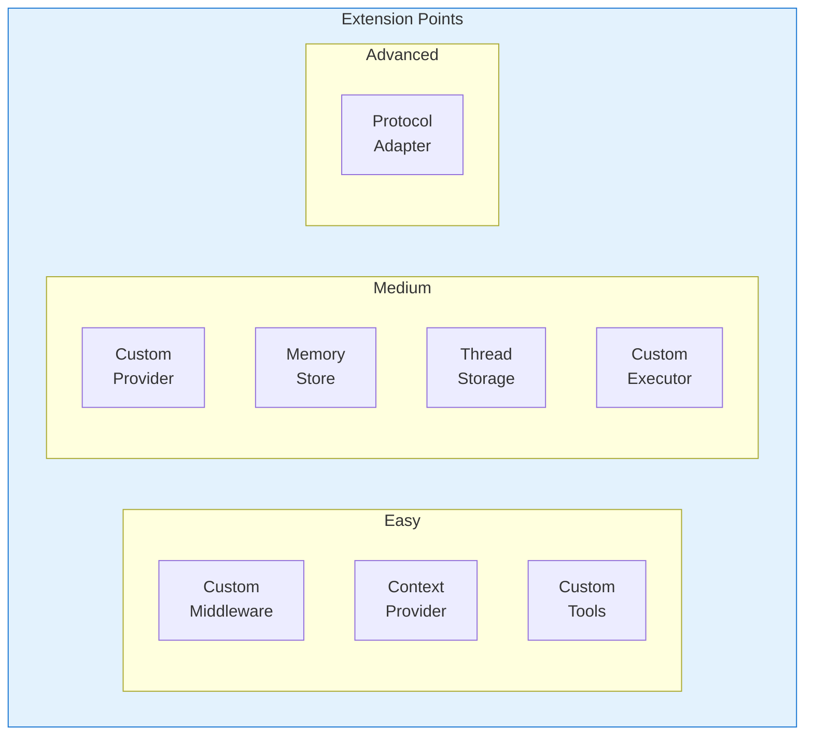

# Extension Guide

> **Purpose**: This document provides step-by-step guides for extending the Microsoft Agent Framework.

## Overview

The Agent Framework is designed for extensibility at every layer. This guide covers the most common extension points:

| Extension Type | When to Use | Difficulty |
|----------------|-------------|------------|
| Custom Middleware | Cross-cutting concerns (logging, rate limiting, caching) | Easy |
| Custom Provider | New LLM backend or API | Medium |
| Custom Context Provider | Dynamic context injection | Easy |
| Custom Memory Store | Persistent conversation history | Medium |
| Custom Thread Storage | Hosted agent thread persistence | Medium |
| Custom Tools | New agent capabilities | Easy |
| Custom Executors | Workflow processing nodes | Medium |
| Custom Protocol Adapter | New communication protocol | Advanced |



---

## Creating Custom Middleware

### When to Create One

Create custom middleware when you need to:
- Add logging or telemetry around agent invocations
- Implement rate limiting or throttling
- Add caching for repeated queries
- Modify requests before they reach the agent
- Transform responses before returning to the caller
- Implement retry logic or circuit breakers

### Prerequisites

- Understanding of the Decorator pattern
- Familiarity with `DelegatingAIAgent` base class

### Step-by-Step Guide

**Step 1**: Create a class inheriting from `DelegatingAIAgent`

```csharp
public class RateLimitingAgent : DelegatingAIAgent
{
    private readonly SemaphoreSlim _semaphore;
    private readonly int _maxConcurrent;

    public RateLimitingAgent(AIAgent innerAgent, int maxConcurrentRequests = 5)
        : base(innerAgent)
    {
        _maxConcurrent = maxConcurrentRequests;
        _semaphore = new SemaphoreSlim(maxConcurrentRequests);
    }
}
```

**Step 2**: Override `RunAsync` to add your logic

```csharp
public override async Task<AgentRunResponse> RunAsync(
    IEnumerable<ChatMessage> messages,
    AgentThread? thread = null,
    AgentRunOptions? options = null,
    CancellationToken cancellationToken = default)
{
    await _semaphore.WaitAsync(cancellationToken);
    try
    {
        return await base.RunAsync(messages, thread, options, cancellationToken);
    }
    finally
    {
        _semaphore.Release();
    }
}
```

**Step 3**: Override `RunStreamingAsync` for streaming support

```csharp
public override async IAsyncEnumerable<AgentRunResponseUpdate> RunStreamingAsync(
    IEnumerable<ChatMessage> messages,
    AgentThread? thread = null,
    AgentRunOptions? options = null,
    [EnumeratorCancellation] CancellationToken cancellationToken = default)
{
    await _semaphore.WaitAsync(cancellationToken);
    try
    {
        await foreach (var update in base.RunStreamingAsync(
            messages, thread, options, cancellationToken))
        {
            yield return update;
        }
    }
    finally
    {
        _semaphore.Release();
    }
}
```

**Step 4**: Register using `AIAgentBuilder.Use()`

```csharp
var agent = new AIAgentBuilder(baseAgent)
    .Use(inner => new RateLimitingAgent(inner, maxConcurrentRequests: 10))
    .Build();
```

### Complete Working Example

```csharp
/// <summary>
/// Middleware that adds retry logic with exponential backoff.
/// </summary>
public class RetryAgent : DelegatingAIAgent
{
    private readonly int _maxRetries;
    private readonly TimeSpan _baseDelay;
    private readonly ILogger<RetryAgent>? _logger;

    public RetryAgent(
        AIAgent innerAgent,
        int maxRetries = 3,
        TimeSpan? baseDelay = null,
        ILoggerFactory? loggerFactory = null)
        : base(innerAgent)
    {
        _maxRetries = maxRetries;
        _baseDelay = baseDelay ?? TimeSpan.FromSeconds(1);
        _logger = loggerFactory?.CreateLogger<RetryAgent>();
    }

    public override async Task<AgentRunResponse> RunAsync(
        IEnumerable<ChatMessage> messages,
        AgentThread? thread = null,
        AgentRunOptions? options = null,
        CancellationToken cancellationToken = default)
    {
        var attempt = 0;
        while (true)
        {
            try
            {
                return await base.RunAsync(messages, thread, options, cancellationToken);
            }
            catch (Exception ex) when (attempt < _maxRetries && IsTransient(ex))
            {
                attempt++;
                var delay = TimeSpan.FromMilliseconds(
                    _baseDelay.TotalMilliseconds * Math.Pow(2, attempt - 1));

                _logger?.LogWarning(ex,
                    "Attempt {Attempt} failed, retrying in {Delay}ms",
                    attempt, delay.TotalMilliseconds);

                await Task.Delay(delay, cancellationToken);
            }
        }
    }

    private static bool IsTransient(Exception ex) =>
        ex is HttpRequestException or TimeoutException or TaskCanceledException;
}

// Usage
var resilientAgent = new AIAgentBuilder(agent)
    .Use(inner => new RetryAgent(inner, maxRetries: 3))
    .Use(inner => new RateLimitingAgent(inner, maxConcurrentRequests: 10))
    .Build();
```

### Common Pitfalls

- **Forgetting streaming**: Always override `RunStreamingAsync` if your middleware affects the response
- **Not disposing resources**: Use `IDisposable` pattern for resources like semaphores
- **Blocking async code**: Avoid `.Result` or `.Wait()` - always use `await`
- **Not preserving thread**: Pass the `thread` parameter through to maintain context

---

## Creating a Custom Provider

### When to Create One

Create a custom provider when you need to:
- Support a new LLM backend not included in the framework
- Integrate with a proprietary AI service
- Add specialized handling for a specific provider's features

### Prerequisites

- Understanding of `IChatClient` from Microsoft.Extensions.AI
- Knowledge of your target LLM's API

### Step-by-Step Guide

**Step 1**: Create provider-specific extension methods

```csharp
namespace MyCompany.AI.MyProvider;

public static class MyProviderExtensions
{
    public static ChatClientAgent CreateAIAgent(
        this MyProviderClient client,
        string? instructions = null,
        string? name = null,
        IList<AITool>? tools = null,
        ILoggerFactory? loggerFactory = null)
    {
        var options = new ChatClientAgentOptions
        {
            Name = name,
            ChatOptions = new ChatOptions
            {
                Instructions = instructions,
                Tools = tools
            }
        };

        return client.CreateAIAgent(options, loggerFactory);
    }

    public static ChatClientAgent CreateAIAgent(
        this MyProviderClient client,
        ChatClientAgentOptions options,
        ILoggerFactory? loggerFactory = null)
    {
        // Convert to IChatClient
        var chatClient = client.AsIChatClient();

        return new ChatClientAgent(chatClient, options, loggerFactory);
    }
}
```

**Step 2**: Implement `IChatClient` adapter if needed

```csharp
public class MyProviderChatClient : IChatClient
{
    private readonly MyProviderClient _client;

    public MyProviderChatClient(MyProviderClient client)
    {
        _client = client;
    }

    public ChatClientMetadata Metadata => new ChatClientMetadata(
        providerName: "MyProvider",
        providerUrl: new Uri("https://myprovider.example.com"));

    public async Task<ChatResponse> GetResponseAsync(
        IEnumerable<ChatMessage> messages,
        ChatOptions? options = null,
        CancellationToken cancellationToken = default)
    {
        // Convert framework messages to provider format
        var request = ConvertToProviderRequest(messages, options);

        // Call provider API
        var response = await _client.CompleteAsync(request, cancellationToken);

        // Convert back to framework format
        return ConvertToFrameworkResponse(response);
    }

    public async IAsyncEnumerable<ChatResponseUpdate> GetStreamingResponseAsync(
        IEnumerable<ChatMessage> messages,
        ChatOptions? options = null,
        [EnumeratorCancellation] CancellationToken cancellationToken = default)
    {
        var request = ConvertToProviderRequest(messages, options);

        await foreach (var chunk in _client.StreamAsync(request, cancellationToken))
        {
            yield return ConvertToFrameworkUpdate(chunk);
        }
    }

    public TService? GetService<TService>(object? key = null) where TService : class
    {
        if (typeof(TService) == typeof(MyProviderClient))
            return _client as TService;
        return null;
    }

    public void Dispose() { }
}
```

**Step 3**: Add hosting integration (optional)

```csharp
public static class MyProviderHostingExtensions
{
    public static IHostedAgentBuilder AddMyProviderAgent(
        this IHostApplicationBuilder builder,
        string name,
        string apiKey,
        string? instructions = null)
    {
        var client = new MyProviderClient(apiKey);

        return builder.Services.AddAIAgent(name, (sp, key) =>
            client.CreateAIAgent(instructions, name));
    }
}
```

### Complete Working Example

```csharp
// Full provider package structure
namespace MyCompany.Agents.AI.CustomLLM;

/// <summary>
/// Extension methods for creating agents from CustomLLM clients.
/// </summary>
public static class CustomLLMExtensions
{
    /// <summary>
    /// Creates an AI agent from a CustomLLM client.
    /// </summary>
    public static ChatClientAgent CreateAIAgent(
        this CustomLLMClient client,
        string? instructions = null,
        string? name = null,
        string? description = null,
        IList<AITool>? tools = null,
        int? maxOutputTokens = null,
        ILoggerFactory? loggerFactory = null,
        IServiceProvider? services = null)
    {
        ArgumentNullException.ThrowIfNull(client);

        var chatClient = new CustomLLMChatClient(client);

        var options = new ChatClientAgentOptions
        {
            Name = name,
            Description = description,
            ChatOptions = new ChatOptions
            {
                Instructions = instructions,
                Tools = tools,
                MaxOutputTokens = maxOutputTokens
            }
        };

        return new ChatClientAgent(chatClient, options, loggerFactory, services);
    }
}

/// <summary>
/// IChatClient adapter for CustomLLM.
/// </summary>
internal sealed class CustomLLMChatClient : IChatClient
{
    private readonly CustomLLMClient _client;

    public CustomLLMChatClient(CustomLLMClient client) => _client = client;

    public ChatClientMetadata Metadata => new(
        providerName: "CustomLLM",
        providerUrl: new Uri("https://customllm.example.com"),
        modelId: _client.ModelId);

    // ... implement IChatClient methods
}
```

### Common Pitfalls

- **Token handling**: Ensure proper conversion of token limits between frameworks
- **Tool schemas**: Provider-specific tool format differences need careful mapping
- **Error handling**: Map provider-specific errors to framework exceptions
- **Streaming**: Some providers have unique streaming formats - handle accordingly

---

## Creating a Custom Context Provider

### When to Create One

Create a custom context provider when you need to:
- Inject dynamic context based on user or session
- Retrieve data from external systems before agent invocation
- Store information after agent responses

### Step-by-Step Guide

**Step 1**: Inherit from `AIContextProvider`

```csharp
public class DatabaseContextProvider : AIContextProvider
{
    private readonly IDbConnection _db;

    public DatabaseContextProvider(IDbConnection db)
    {
        _db = db;
    }
}
```

**Step 2**: Implement `InvokingAsync` for pre-invocation context

```csharp
public override async ValueTask<AIContext> InvokingAsync(
    InvokingContext context,
    CancellationToken cancellationToken = default)
{
    // Extract user ID from metadata
    if (!context.Metadata.TryGetValue("userId", out var userIdObj) ||
        userIdObj is not string userId)
    {
        return new AIContext();
    }

    // Fetch relevant data
    var userData = await _db.QueryFirstOrDefaultAsync<UserData>(
        "SELECT * FROM Users WHERE Id = @Id",
        new { Id = userId });

    if (userData is null)
        return new AIContext();

    // Return context to inject
    return new AIContext
    {
        Messages =
        [
            new ChatMessage(ChatRole.System,
                $"Current user: {userData.Name}, Account type: {userData.AccountType}")
        ]
    };
}
```

**Step 3**: Implement `InvokedAsync` for post-invocation processing

```csharp
public override async ValueTask InvokedAsync(
    InvokedContext context,
    CancellationToken cancellationToken = default)
{
    // Don't process on errors
    if (context.InvokeException is not null)
        return;

    // Log the interaction
    await _db.ExecuteAsync(
        "INSERT INTO Interactions (UserId, Query, Response, Timestamp) VALUES (@UserId, @Query, @Response, @Timestamp)",
        new
        {
            UserId = context.Metadata.GetValueOrDefault("userId"),
            Query = context.RequestMessages.LastOrDefault()?.Text,
            Response = context.ResponseMessages?.LastOrDefault()?.Text,
            Timestamp = DateTimeOffset.UtcNow
        });
}
```

**Step 4**: Implement `Serialize` for persistence

```csharp
public override JsonElement Serialize(JsonSerializerOptions? options = null)
{
    return JsonSerializer.SerializeToElement(new
    {
        ConnectionString = _db.ConnectionString
    }, options);
}
```

### Complete Working Example

```csharp
/// <summary>
/// Context provider that fetches relevant documents from a vector store.
/// </summary>
public class RAGContextProvider : AIContextProvider
{
    private readonly IVectorStore _vectorStore;
    private readonly IEmbeddingGenerator<string, Embedding<float>> _embeddings;
    private readonly int _topK;
    private readonly float _minScore;

    public RAGContextProvider(
        IVectorStore vectorStore,
        IEmbeddingGenerator<string, Embedding<float>> embeddings,
        int topK = 5,
        float minScore = 0.7f)
    {
        _vectorStore = vectorStore;
        _embeddings = embeddings;
        _topK = topK;
        _minScore = minScore;
    }

    public override async ValueTask<AIContext> InvokingAsync(
        InvokingContext context,
        CancellationToken cancellationToken = default)
    {
        // Get the user's query
        var query = context.RequestMessages
            .Where(m => m.Role == ChatRole.User)
            .LastOrDefault()?.Text;

        if (string.IsNullOrEmpty(query))
            return new AIContext();

        // Generate embedding for the query
        var embedding = await _embeddings.GenerateAsync(
            query,
            cancellationToken: cancellationToken);

        // Search for similar documents
        var results = await _vectorStore.SearchAsync(
            embedding.Vector,
            _topK,
            cancellationToken: cancellationToken);

        // Filter by minimum score
        var relevantDocs = results
            .Where(r => r.Score >= _minScore)
            .Select(r => r.Document)
            .ToList();

        if (relevantDocs.Count == 0)
            return new AIContext();

        // Format as context
        var contextText = string.Join("\n\n",
            relevantDocs.Select((d, i) => $"[Document {i + 1}]\n{d.Content}"));

        return new AIContext
        {
            Messages =
            [
                new ChatMessage(ChatRole.System,
                    $"## Relevant Documents\n\n{contextText}\n\n" +
                    "Use the above documents to inform your response.")
            ]
        };
    }

    public override JsonElement Serialize(JsonSerializerOptions? options = null)
    {
        return JsonSerializer.SerializeToElement(new
        {
            TopK = _topK,
            MinScore = _minScore
        }, options);
    }
}

// Usage
var ragProvider = new RAGContextProvider(vectorStore, embeddingGenerator);
var agent = new AIAgentBuilder(baseAgent)
    .UseContextProvider(ragProvider)
    .Build();
```

---

## Creating Custom Memory Storage

### When to Create One

Create a custom memory store when you need to:
- Persist conversation history to a specific database
- Implement custom retention policies
- Add encryption or compliance features

### Step-by-Step Guide

```csharp
public class SqlChatMessageStore : ChatMessageStore
{
    private readonly string _connectionString;
    private readonly string _conversationId;

    public SqlChatMessageStore(string connectionString, string conversationId)
    {
        _connectionString = connectionString;
        _conversationId = conversationId;
    }

    public override async Task<IEnumerable<ChatMessage>> GetMessagesAsync(
        CancellationToken cancellationToken = default)
    {
        using var connection = new SqlConnection(_connectionString);
        await connection.OpenAsync(cancellationToken);

        var rows = await connection.QueryAsync<MessageRow>(
            @"SELECT Role, Content, CreatedAt, MessageId
              FROM ChatMessages
              WHERE ConversationId = @ConversationId
              ORDER BY CreatedAt",
            new { ConversationId = _conversationId });

        return rows.Select(r => new ChatMessage(
            new ChatRole(r.Role),
            r.Content)
        {
            MessageId = r.MessageId,
            CreatedAt = r.CreatedAt
        });
    }

    public override async Task AddMessagesAsync(
        IEnumerable<ChatMessage> messages,
        CancellationToken cancellationToken = default)
    {
        using var connection = new SqlConnection(_connectionString);
        await connection.OpenAsync(cancellationToken);

        foreach (var message in messages)
        {
            await connection.ExecuteAsync(
                @"INSERT INTO ChatMessages (ConversationId, Role, Content, CreatedAt, MessageId)
                  VALUES (@ConversationId, @Role, @Content, @CreatedAt, @MessageId)",
                new
                {
                    ConversationId = _conversationId,
                    Role = message.Role.Value,
                    Content = message.Text,
                    CreatedAt = message.CreatedAt ?? DateTimeOffset.UtcNow,
                    MessageId = message.MessageId ?? Guid.NewGuid().ToString()
                });
        }
    }

    public override JsonElement Serialize(JsonSerializerOptions? options = null)
    {
        return JsonSerializer.SerializeToElement(new
        {
            ConversationId = _conversationId
        }, options);
    }

    private record MessageRow(string Role, string Content, DateTimeOffset CreatedAt, string MessageId);
}
```

---

## Creating Custom Tools

### When to Create One

Create custom tools to give agents new capabilities:
- Access external APIs
- Perform calculations
- Interact with databases
- Execute business logic

### Step-by-Step Guide

**Step 1**: Use `AIFunctionFactory` for simple functions

```csharp
[Description("Gets the current weather for a location")]
static async Task<WeatherInfo> GetWeather(
    [Description("The city name")] string city,
    [Description("Temperature unit")] string unit = "celsius")
{
    var weather = await weatherService.GetCurrentAsync(city);
    return new WeatherInfo(
        city,
        unit == "fahrenheit" ? CelsiusToFahrenheit(weather.TempC) : weather.TempC,
        weather.Condition);
}

var weatherTool = AIFunctionFactory.Create(GetWeather);
```

**Step 2**: For complex tools, inherit from `AITool`

```csharp
public class DatabaseQueryTool : AITool
{
    private readonly IDbConnection _db;

    public override string Name => "query_database";

    public override string Description =>
        "Executes a read-only SQL query against the database";

    public override JsonElement Schema => JsonSerializer.SerializeToElement(new
    {
        type = "object",
        properties = new
        {
            query = new { type = "string", description = "SQL SELECT query" }
        },
        required = new[] { "query" }
    });

    public DatabaseQueryTool(IDbConnection db) => _db = db;

    public override async Task<object?> InvokeAsync(
        JsonElement arguments,
        CancellationToken cancellationToken = default)
    {
        var query = arguments.GetProperty("query").GetString();

        // Validate query is read-only
        if (!query!.TrimStart().StartsWith("SELECT", StringComparison.OrdinalIgnoreCase))
        {
            throw new ArgumentException("Only SELECT queries are allowed");
        }

        var results = await _db.QueryAsync<dynamic>(query);
        return results.ToList();
    }
}
```

### Complete Working Example

```csharp
/// <summary>
/// Tool that allows agents to search and retrieve documents.
/// </summary>
public class DocumentSearchTool : AITool
{
    private readonly IDocumentService _documents;
    private readonly ILogger<DocumentSearchTool>? _logger;

    public override string Name => "search_documents";

    public override string Description =>
        "Searches for documents matching a query and returns relevant excerpts";

    public override JsonElement Schema => JsonSerializer.SerializeToElement(new
    {
        type = "object",
        properties = new
        {
            query = new
            {
                type = "string",
                description = "The search query"
            },
            maxResults = new
            {
                type = "integer",
                description = "Maximum number of results to return",
                @default = 5
            },
            category = new
            {
                type = "string",
                description = "Optional category filter",
                @enum = new[] { "technical", "legal", "hr", "general" }
            }
        },
        required = new[] { "query" }
    });

    public DocumentSearchTool(
        IDocumentService documents,
        ILoggerFactory? loggerFactory = null)
    {
        _documents = documents;
        _logger = loggerFactory?.CreateLogger<DocumentSearchTool>();
    }

    public override async Task<object?> InvokeAsync(
        JsonElement arguments,
        CancellationToken cancellationToken = default)
    {
        var query = arguments.GetProperty("query").GetString()!;
        var maxResults = arguments.TryGetProperty("maxResults", out var mr)
            ? mr.GetInt32() : 5;
        var category = arguments.TryGetProperty("category", out var cat)
            ? cat.GetString() : null;

        _logger?.LogInformation(
            "Searching documents: query={Query}, max={Max}, category={Category}",
            query, maxResults, category);

        var results = await _documents.SearchAsync(
            query,
            maxResults,
            category,
            cancellationToken);

        return results.Select(r => new
        {
            r.Title,
            r.Excerpt,
            r.Url,
            r.Score
        }).ToList();
    }
}

// Usage
var agent = chatClient.CreateAIAgent(
    instructions: "You are a helpful assistant with document search capabilities.",
    tools: [new DocumentSearchTool(documentService)]);
```

---

## Creating Custom Executors

### When to Create One

Create custom executors for workflow nodes that:
- Perform specialized processing
- Transform data between agents
- Integrate with external systems
- Implement custom routing logic

### Step-by-Step Guide

```csharp
/// <summary>
/// Executor that validates agent output against a JSON schema.
/// </summary>
public class SchemaValidationExecutor : Executor<List<ChatMessage>, List<ChatMessage>>
{
    private readonly JsonSchema _schema;
    private readonly ILogger<SchemaValidationExecutor>? _logger;

    public SchemaValidationExecutor(
        JsonSchema schema,
        ILoggerFactory? loggerFactory = null)
        : base("schema-validator")
    {
        _schema = schema;
        _logger = loggerFactory?.CreateLogger<SchemaValidationExecutor>();
    }

    public override async ValueTask<List<ChatMessage>> HandleAsync(
        List<ChatMessage> messages,
        IWorkflowContext context,
        CancellationToken cancellationToken = default)
    {
        var lastMessage = messages.LastOrDefault();
        if (lastMessage is null)
            return messages;

        // Try to parse as JSON
        if (!TryParseJson(lastMessage.Text, out var json))
        {
            _logger?.LogWarning("Output is not valid JSON");
            return messages;
        }

        // Validate against schema
        var result = _schema.Validate(json);
        if (!result.IsValid)
        {
            _logger?.LogWarning(
                "Schema validation failed: {Errors}",
                string.Join(", ", result.Errors));

            // Add validation error as context for retry
            messages.Add(new ChatMessage(ChatRole.System,
                $"Your previous output did not match the required schema. " +
                $"Errors: {string.Join(", ", result.Errors)}. Please try again."));
        }

        return messages;
    }

    private static bool TryParseJson(string? text, out JsonElement json)
    {
        json = default;
        if (string.IsNullOrEmpty(text))
            return false;

        try
        {
            json = JsonDocument.Parse(text).RootElement;
            return true;
        }
        catch
        {
            return false;
        }
    }
}

// Usage in workflow
var workflow = new WorkflowBuilder(agent)
    .AddEdge(agent, validator)
    .AddEdge(validator, output)
    .WithOutputFrom(output)
    .Build();
```

---

## Creating Custom Protocol Adapters

### When to Create One

Create a custom protocol adapter when you need to:
- Support a new communication protocol
- Expose agents via custom API formats
- Bridge to proprietary systems

### Step-by-Step Guide

**Step 1**: Create the server-side endpoint handler

```csharp
public static class CustomProtocolExtensions
{
    public static IEndpointConventionBuilder MapCustomProtocol(
        this IEndpointRouteBuilder endpoints,
        string path,
        AIAgent agent)
    {
        return endpoints.MapPost(path, async (
            HttpContext context,
            [FromBody] CustomRequest request,
            CancellationToken cancellationToken) =>
        {
            // Convert protocol request to framework messages
            var messages = request.Messages.Select(m =>
                new ChatMessage(
                    m.Type == "user" ? ChatRole.User : ChatRole.Assistant,
                    m.Content));

            // Run the agent
            if (request.Stream)
            {
                context.Response.ContentType = "text/event-stream";
                await foreach (var update in agent.RunStreamingAsync(
                    messages, cancellationToken: cancellationToken))
                {
                    await context.Response.WriteAsync(
                        $"data: {JsonSerializer.Serialize(new { text = update.Text })}\n\n");
                    await context.Response.Body.FlushAsync();
                }
            }
            else
            {
                var response = await agent.RunAsync(
                    messages, cancellationToken: cancellationToken);
                return Results.Ok(new CustomResponse { Text = response.Text });
            }

            return Results.Empty;
        });
    }
}
```

**Step 2**: Create the client-side agent wrapper

```csharp
public class CustomProtocolAgent : AIAgent
{
    private readonly HttpClient _httpClient;
    private readonly string _endpoint;

    public CustomProtocolAgent(HttpClient httpClient, string endpoint)
    {
        _httpClient = httpClient;
        _endpoint = endpoint;
    }

    public override AgentThread GetNewThread() => new InMemoryAgentThread();

    public override async Task<AgentRunResponse> RunAsync(
        IEnumerable<ChatMessage> messages,
        AgentThread? thread = null,
        AgentRunOptions? options = null,
        CancellationToken cancellationToken = default)
    {
        var request = new CustomRequest
        {
            Messages = messages.Select(m => new CustomMessage
            {
                Type = m.Role == ChatRole.User ? "user" : "assistant",
                Content = m.Text
            }).ToList()
        };

        var response = await _httpClient.PostAsJsonAsync(
            _endpoint, request, cancellationToken);

        var result = await response.Content.ReadFromJsonAsync<CustomResponse>(
            cancellationToken: cancellationToken);

        return new AgentRunResponse(
            [new ChatMessage(ChatRole.Assistant, result!.Text)]);
    }
}
```

---

## Best Practices

### 1. Follow Existing Patterns
Look at built-in implementations (`LoggingAgent`, `OpenAIChatClientExtensions`) for guidance.

### 2. Support Both Sync and Streaming
Always implement both `RunAsync` and `RunStreamingAsync` in middleware.

### 3. Preserve Context
Pass `thread` and `options` through to inner agents unchanged unless intentionally modifying them.

### 4. Use Dependency Injection
Accept dependencies via constructor for testability.

### 5. Add Telemetry
Use `ILogger` and OpenTelemetry activities for observability.

### 6. Handle Errors Gracefully
Catch and wrap provider-specific exceptions appropriately.

### 7. Write Tests
Test extensions in isolation using mocks before integration testing.

---

*Last updated: December 2024*
