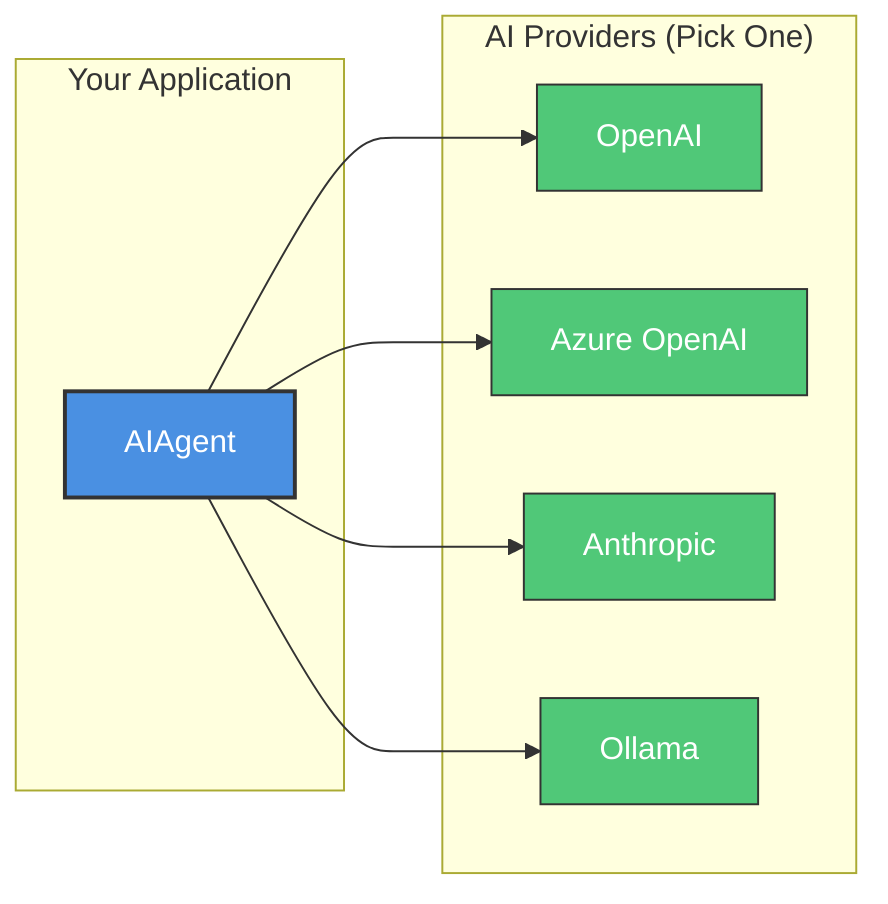
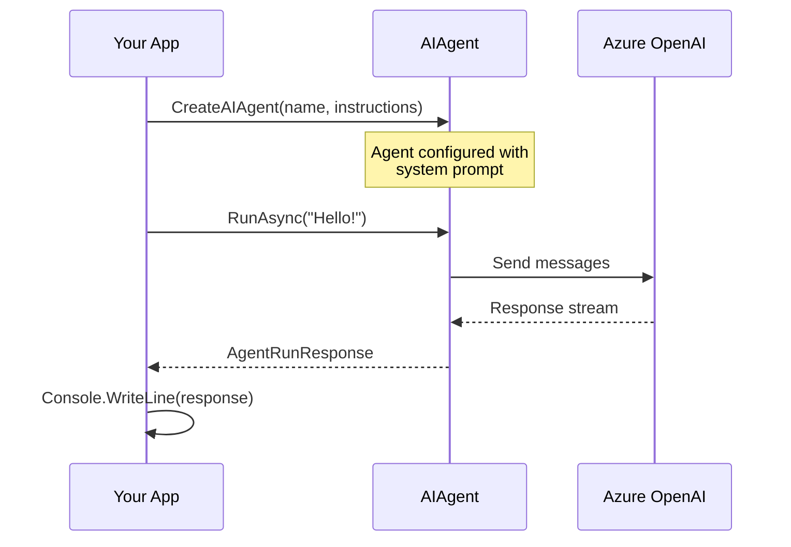
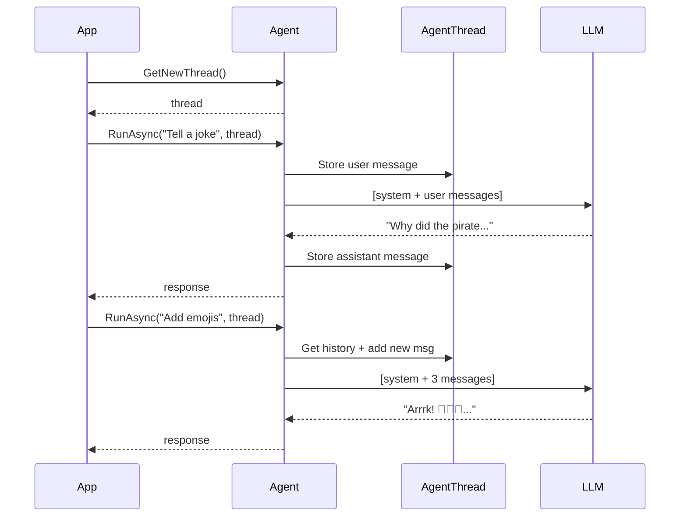

# Getting Started with the .NET Agent Framework

> **Purpose**: This guide walks you through setting up your development environment, running your first agent, and understanding the core patterns of the Agent Framework. By the end (approximately 30 minutes), you'll have a working agent and know where to go next.

## Overview

The Microsoft Agent Framework is a provider-agnostic SDK for building AI agents in .NET. It abstracts away the differences between AI providers (OpenAI, Azure OpenAI, Anthropic, etc.) while providing first-class support for middleware, observability, and production hosting.



**What you'll learn**:
1. Install prerequisites and clone the repository
2. Build the solution
3. Configure credentials for an AI provider
4. Run your first agent (Hello World)
5. Run an existing sample with conversation context
6. Understand next steps for deeper learning

---

## Prerequisites

### Required

| Requirement | Version | Notes |
|-------------|---------|-------|
| **.NET SDK** | **10.0.100** or later | Required. The repository uses `rollForward: minor` so 10.0.x will work. |
| **Git** | Any recent version | For cloning the repository |

> **Note**: The SDK version is specified in `dotnet/global.json`. If you have an older .NET SDK, the build will fail with a clear error message.

**Download .NET SDK**: [https://dotnet.microsoft.com/download/dotnet/10.0](https://dotnet.microsoft.com/download/dotnet/10.0)

Verify your installation:

```bash
dotnet --version
# Expected: 10.0.100 or higher
```

### AI Provider (Choose One)

You need credentials for at least one AI provider. Choose based on what you have access to:

| Provider | What You Need | Best For |
|----------|---------------|----------|
| **Azure OpenAI** | Azure subscription + deployed model | Enterprise use, Azure ecosystem |
| **OpenAI** | OpenAI API key | Quick start, personal projects |
| **Anthropic** | Anthropic API key | Claude models |
| **Ollama** | Local Ollama installation | Offline development, no API costs |

> **Tip**: If you're just exploring, **OpenAI** offers the fastest setup (just an API key). For production, **Azure OpenAI** is recommended for enterprise scenarios.

### Recommended IDEs

- **Visual Studio 2025** (Windows/Mac) - Full-featured IDE with best .NET support
- **JetBrains Rider** (Cross-platform) - Excellent for cross-platform development
- **Visual Studio Code** (Cross-platform) - Lightweight, requires [C# Dev Kit extension](https://marketplace.visualstudio.com/items?itemName=ms-dotnettools.csdevkit)

---

## Step 1: Clone and Build

### Clone the Repository

```bash
git clone https://github.com/microsoft/agent-framework.git
cd agent-framework
```

### Build the Solution

Navigate to the .NET directory and build:

```bash
cd dotnet
dotnet build agent-framework-dotnet.slnx
```

**Expected Output** (abbreviated):

```
Microsoft (R) Build Engine version 17.x
...
Build succeeded.
    0 Warning(s)
    0 Error(s)

Time Elapsed 00:00:XX.XX
```

> **Troubleshooting**: If you see SDK version errors, ensure you have .NET 10.0.100+ installed. Run `dotnet --list-sdks` to see installed versions.

### Verify with Unit Tests (Optional)

Run unit tests to confirm everything is working:

```bash
dotnet test --filter "FullyQualifiedName~UnitTests" --no-build
```

All tests should pass. If you see failures, check [DEV_SETUP.md](../../../dotnet/DEV_SETUP.md#troubleshooting) for troubleshooting steps.

---

## Step 2: Configure Your AI Provider

The samples support multiple AI providers. Configure credentials based on your choice.

### Option A: Azure OpenAI (Recommended for Enterprise)

**Prerequisites**:
- Azure subscription with Azure OpenAI resource
- Deployed model (e.g., `gpt-4o-mini`)
- Azure CLI installed and logged in (`az login`)
- `Cognitive Services OpenAI Contributor` role assigned

**Set Environment Variables**:

```powershell
# PowerShell (Windows)
$env:AZURE_OPENAI_ENDPOINT = "https://your-resource.openai.azure.com/"
$env:AZURE_OPENAI_DEPLOYMENT_NAME = "gpt-4o-mini"  # Your deployment name
```

```bash
# Bash (Linux/macOS)
export AZURE_OPENAI_ENDPOINT="https://your-resource.openai.azure.com/"
export AZURE_OPENAI_DEPLOYMENT_NAME="gpt-4o-mini"
```

> **Note**: The samples use `AzureCliCredential` for authentication. Ensure you're logged in with `az login` and have access to the OpenAI resource.

### Option B: OpenAI (Fastest Setup)

**Prerequisites**:
- OpenAI account with API key from [platform.openai.com](https://platform.openai.com/)

**Set Environment Variables**:

```powershell
# PowerShell (Windows)
$env:OPENAI_API_KEY = "sk-..."  # Your OpenAI API key
$env:OPENAI_MODEL = "gpt-4o-mini"  # Optional, defaults to gpt-4o-mini
```

```bash
# Bash (Linux/macOS)
export OPENAI_API_KEY="sk-..."
export OPENAI_MODEL="gpt-4o-mini"
```

### Option C: Using a .env File (Recommended)

For persistent configuration, create a `.env` file in the `dotnet` directory:

```env
# For Azure OpenAI
AZURE_OPENAI_ENDPOINT=https://your-resource.openai.azure.com/
AZURE_OPENAI_DEPLOYMENT_NAME=gpt-4o-mini

# OR for OpenAI
OPENAI_API_KEY=sk-...
OPENAI_MODEL=gpt-4o-mini
```

> **Important**: Add `.env` to your `.gitignore` to avoid committing secrets.

Load the `.env` file before running samples:

```powershell
# PowerShell
Get-Content .env | ForEach-Object { if ($_ -match '^([^=]+)=(.*)$') { Set-Item -Path "Env:$($matches[1])" -Value $matches[2] } }
```

```bash
# Bash
export $(cat .env | xargs)
```

---

## Step 3: Your First Agent (Hello World)

Let's create a minimal agent from scratch to understand the core pattern.

### Create a New Console Application

From the `dotnet` directory:

```bash
# Create a new console app
dotnet new console -n HelloAgent -o samples/HelloAgent

# Add required packages and project references
cd samples/HelloAgent
dotnet add package Azure.AI.OpenAI
dotnet add package Azure.Identity
dotnet add reference ../../src/Microsoft.Agents.AI.OpenAI/Microsoft.Agents.AI.OpenAI.csproj
```

### Write the Agent Code

Replace the contents of `Program.cs`:

```csharp
// HelloAgent/Program.cs
using Azure.AI.OpenAI;
using Azure.Identity;
using Microsoft.Agents.AI;

// Get configuration from environment variables
var endpoint = Environment.GetEnvironmentVariable("AZURE_OPENAI_ENDPOINT")
    ?? throw new InvalidOperationException("AZURE_OPENAI_ENDPOINT is not set.");
var deploymentName = Environment.GetEnvironmentVariable("AZURE_OPENAI_DEPLOYMENT_NAME")
    ?? "gpt-4o-mini";

// Create an AI agent with Azure OpenAI
AIAgent agent = new AzureOpenAIClient(
        new Uri(endpoint),
        new AzureCliCredential())
    .GetChatClient(deploymentName)
    .CreateAIAgent(
        name: "HelloAgent",
        instructions: "You are a friendly assistant that greets users warmly.");

// Run the agent with a simple prompt
var response = await agent.RunAsync("Hello! What's your name?");

// Output the response
Console.WriteLine("Agent Response:");
Console.WriteLine(response);
```

**For OpenAI instead of Azure OpenAI**, replace the agent creation:

```csharp
using Microsoft.Agents.AI;
using OpenAI;

var apiKey = Environment.GetEnvironmentVariable("OPENAI_API_KEY")
    ?? throw new InvalidOperationException("OPENAI_API_KEY is not set.");
var model = Environment.GetEnvironmentVariable("OPENAI_MODEL") ?? "gpt-4o-mini";

AIAgent agent = new OpenAIClient(apiKey)
    .GetChatClient(model)
    .CreateAIAgent(
        name: "HelloAgent",
        instructions: "You are a friendly assistant that greets users warmly.");
```

### Run Your Agent

```bash
dotnet run
```

**Expected Output**:

```
Agent Response:
Hello there! I'm your friendly assistant, here to help you out. You can call me
HelloAgent. How can I assist you today?
```

The exact wording will vary since LLMs generate different responses, but you should see a friendly greeting.

### Understanding the Code



**Key Concepts**:
1. **`CreateAIAgent()`** - Extension method that wraps a chat client in an `AIAgent`
2. **`instructions`** - The system prompt that defines agent behavior
3. **`RunAsync()`** - Sends a message and returns the complete response
4. **`AgentRunResponse`** - Contains the agent's text response and metadata

---

## Step 4: Run an Existing Sample

Now let's run a more complete sample that demonstrates multi-turn conversations.

### Navigate to the Sample

```bash
cd /path/to/agent-framework/dotnet/samples/GettingStarted/Agents/Agent_Step02_MultiturnConversation
```

### Review the Code

Open `Program.cs` to see the sample:

```csharp
// Agent_Step02_MultiturnConversation/Program.cs
using Azure.AI.OpenAI;
using Azure.Identity;
using Microsoft.Agents.AI;
using OpenAI.Chat;

var endpoint = Environment.GetEnvironmentVariable("AZURE_OPENAI_ENDPOINT")
    ?? throw new InvalidOperationException("AZURE_OPENAI_ENDPOINT is not set.");
var deploymentName = Environment.GetEnvironmentVariable("AZURE_OPENAI_DEPLOYMENT_NAME")
    ?? "gpt-4o-mini";

AIAgent agent = new AzureOpenAIClient(
    new Uri(endpoint),
    new AzureCliCredential())
    .GetChatClient(deploymentName)
    .CreateAIAgent(instructions: "You are good at telling jokes.", name: "Joker");

// Multi-turn conversation with context preserved in the thread
AgentThread thread = agent.GetNewThread();
Console.WriteLine(await agent.RunAsync("Tell me a joke about a pirate.", thread));
Console.WriteLine(await agent.RunAsync("Now add some emojis to the joke and tell it in the voice of a pirate's parrot.", thread));

// Streaming version
thread = agent.GetNewThread();
await foreach (var update in agent.RunStreamingAsync("Tell me a joke about a pirate.", thread))
{
    Console.Write(update);
}
Console.WriteLine();
await foreach (var update in agent.RunStreamingAsync("Now add some emojis.", thread))
{
    Console.Write(update);
}
```

### Run the Sample

Ensure your environment variables are set, then:

```bash
dotnet run
```

**Expected Output** (varies based on LLM):

```
Why did the pirate go to school?

To improve his "arrrrrticulation"!

Arrrrk! Why did the pirate go to school, ye say?

To improve his "arrrrrticulation"! 🏴‍☠️🦜⚓

Squawk! That be a good one, matey! 🦜
```

### Key Concepts Demonstrated

| Concept | Code | Description |
|---------|------|-------------|
| **AgentThread** | `agent.GetNewThread()` | Creates a conversation context that maintains history |
| **Multi-turn** | `agent.RunAsync(msg, thread)` | Passing the same thread preserves conversation context |
| **Streaming** | `agent.RunStreamingAsync()` | Returns tokens as they're generated for real-time UI |



---

## Step 5: Explore More Samples

The `GettingStarted` folder contains progressively more advanced samples:

### Recommended Learning Path

| Step | Sample | What You'll Learn |
|------|--------|-------------------|
| 1 | `Agent_Step01_Running` | Basic agent creation and invocation |
| 2 | `Agent_Step02_MultiturnConversation` | Conversation context with threads |
| 3 | `Agent_Step03_UsingFunctionTools` | Adding tools/functions to agents |
| 4 | `Agent_Step04_UsingFunctionToolsWithApprovals` | Human-in-the-loop approvals |
| 5 | `Agent_Step08_Observability` | Adding telemetry and logging |
| 6 | `Agent_Step09_DependencyInjection` | Integrating with .NET DI |

### By Provider

If you want to see how different providers work:

| Provider | Sample Location |
|----------|-----------------|
| **OpenAI** | `AgentProviders/Agent_With_OpenAIChatCompletion/` |
| **Azure OpenAI** | `AgentProviders/Agent_With_AzureOpenAIChatCompletion/` |
| **Anthropic Claude** | `AgentWithAnthropic/Agent_Anthropic_Step01_Running/` |
| **Ollama** | `AgentProviders/Agent_With_Ollama/` |

### Running Any Sample

The pattern is consistent across all samples:

```bash
# Navigate to the sample
cd dotnet/samples/GettingStarted/Agents/Agent_Step03_UsingFunctionTools

# Build and run
dotnet run
```

Each sample has a `README.md` with specific prerequisites and configuration.

---

## Next Steps

Now that you have a working agent, explore these areas based on your goals:

### Learn the Architecture

| Document | What You'll Learn |
|----------|-------------------|
| [**core-abstractions.md**](core-abstractions.md) | `AIAgent`, `AgentThread`, response types, context providers |
| [**core-framework.md**](core-framework.md) | `AIAgentBuilder`, `ChatClientAgent`, middleware pipeline |
| [**design-patterns.md**](design-patterns.md) | Decorator pattern, context injection, bridge pattern |

### Add Capabilities

| Feature | Document | Sample |
|---------|----------|--------|
| **Function Tools** | [extension-guide.md](extension-guide.md#custom-tools) | `Agent_Step03_UsingFunctionTools` |
| **Middleware** | [extension-guide.md](extension-guide.md#custom-middleware) | `Agent_Step14_Middleware` |
| **Memory** | [extension-guide.md](extension-guide.md#custom-memory) | `AgentWithMemory/` |
| **RAG** | [cross-cutting.md](cross-cutting.md) | `AgentWithRAG/` |

### Production Deployment

| Scenario | Document | Sample |
|----------|----------|--------|
| **Dependency Injection** | [hosting.md](hosting.md) | `Agent_Step09_DependencyInjection` |
| **ASP.NET Core** | [hosting.md](hosting.md#aspnet-core) | `HostedAgents/` |
| **Azure Functions** | [hosting.md](hosting.md#azure-functions) | `AzureFunctions/` |
| **Multi-Agent Workflows** | [workflows.md](workflows.md) | `Workflows/` |

### Quick Reference

```csharp
// Create an agent
AIAgent agent = chatClient.CreateAIAgent("name", "instructions");

// Single response
var response = await agent.RunAsync("Hello");

// Multi-turn conversation
var thread = agent.GetNewThread();
await agent.RunAsync("First message", thread);
await agent.RunAsync("Follow-up", thread);

// Streaming
await foreach (var update in agent.RunStreamingAsync("Hello"))
{
    Console.Write(update);
}

// With middleware
var enhanced = agent.AsBuilder()
    .Use(inner => new LoggingAgent(inner, logger))
    .Build();
```

---

## Troubleshooting

### Common Issues

| Issue | Solution |
|-------|----------|
| **SDK version error** | Install .NET SDK 10.0.100+ from [dotnet.microsoft.com](https://dotnet.microsoft.com/download) |
| **Environment variable not found** | Check variable names match exactly (case-sensitive on Linux/macOS) |
| **Azure auth fails** | Run `az login` and ensure you have the `Cognitive Services OpenAI Contributor` role |
| **Rate limiting** | OpenAI/Azure OpenAI have rate limits; wait and retry or use a different model |
| **Build errors after pulling** | Run `dotnet clean` then `dotnet restore` before rebuilding |

### Getting Help

- **Issues**: [github.com/microsoft/agent-framework/issues](https://github.com/microsoft/agent-framework/issues)
- **Discussions**: [github.com/microsoft/agent-framework/discussions](https://github.com/microsoft/agent-framework/discussions)
- **Full Dev Setup**: [DEV_SETUP.md](../../../dotnet/DEV_SETUP.md)

---

*Last updated: 2025-12-26*
