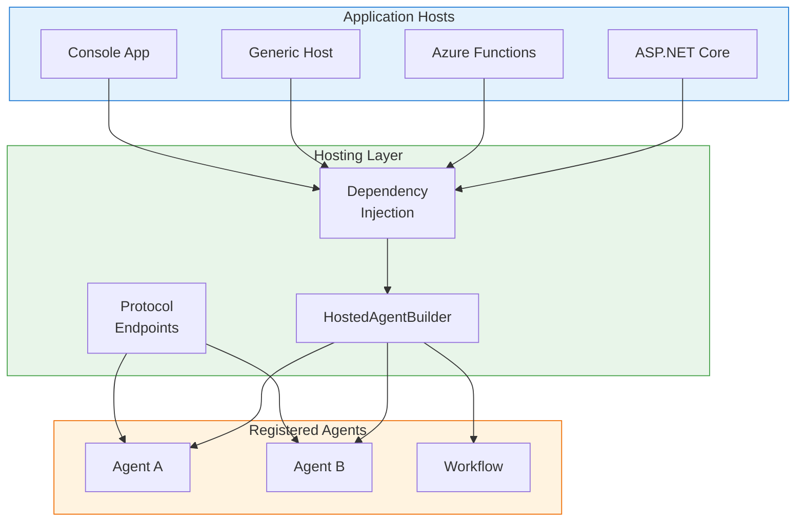
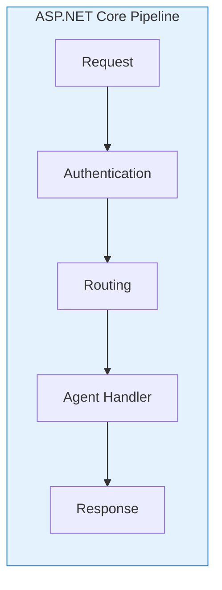
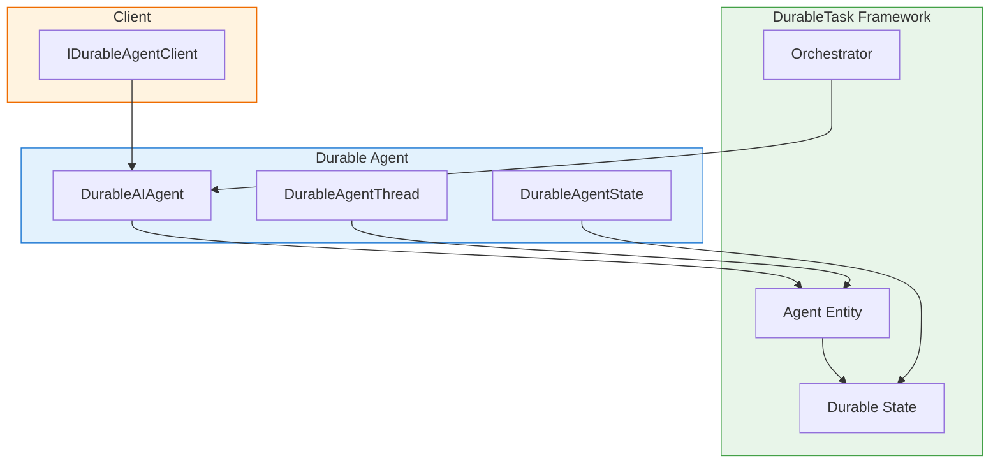

# Hosting & Runtime

> **Purpose**: This document explains how to integrate agents into .NET hosting environments.

## Overview

The Agent Framework provides comprehensive hosting support for integrating agents into various .NET application types. The hosting layer handles:

- **Dependency Injection**: Register and resolve agents using standard .NET DI patterns
- **Protocol Endpoints**: Expose agents via A2A, AG-UI, or OpenAI-compatible APIs
- **Durable Execution**: Long-running agents with state persistence
- **Multi-Host Support**: ASP.NET Core, Azure Functions, Generic Host, and more



---

## Dependency Injection

**Package**: `Microsoft.Agents.AI.Hosting`

### Registration Patterns

The framework provides multiple ways to register agents with the dependency injection container:

```csharp
var builder = WebApplication.CreateBuilder(args);

// Pattern 1: Simple registration with instructions
builder.AddAIAgent("assistant", "You are a helpful assistant.");

// Pattern 2: With specific chat client
builder.AddAIAgent("researcher",
    instructions: "Research topics thoroughly.",
    chatClient: openAIChatClient);

// Pattern 3: With keyed chat client from DI
builder.AddAIAgent("analyzer",
    instructions: "Analyze the input.",
    chatClientServiceKey: "openai-client");

// Pattern 4: Factory delegate for full control
builder.AddAIAgent("custom", (serviceProvider, name) =>
{
    var chatClient = serviceProvider.GetRequiredKeyedService<IChatClient>("my-client");
    return chatClient.CreateAIAgent(
        instructions: "Custom agent instructions.",
        name: name,
        tools: [AIFunctionFactory.Create(MyTool)]);
});
```

### IHostedAgentBuilder

The `AddAIAgent` methods return an `IHostedAgentBuilder` for fluent configuration:

```csharp
builder.AddAIAgent("support", "You provide customer support.")
    .WithAITools(
        AIFunctionFactory.Create(LookupCustomer),
        AIFunctionFactory.Create(CreateTicket))
    .WithInMemoryThreadStore();
```

#### Available Extensions

| Method | Description |
|--------|-------------|
| `WithAITool(tool)` | Add a single AI tool |
| `WithAITools(tools)` | Add multiple AI tools |
| `WithInMemoryThreadStore()` | Use in-memory thread storage |
| `WithThreadStore(store)` | Use custom thread store |
| `WithThreadStore(factory)` | Use factory for thread store |

### Keyed Services

Agents are registered as keyed services, allowing multiple agents with different names:

```csharp
// Register multiple agents
builder.AddAIAgent("triage", "Route customer inquiries.");
builder.AddAIAgent("sales", "Handle purchase questions.");
builder.AddAIAgent("support", "Resolve technical issues.");

// Later, resolve by name
var app = builder.Build();
var triageAgent = app.Services.GetRequiredKeyedService<AIAgent>("triage");
```

### Thread Stores

Thread stores persist conversation history for multi-turn interactions:

```csharp
// In-memory (for development/testing)
builder.AddAIAgent("agent", "Instructions")
    .WithInMemoryThreadStore();

// Custom implementation
builder.AddAIAgent("agent", "Instructions")
    .WithThreadStore((sp, name) =>
        new SqlAgentThreadStore(sp.GetRequiredService<IDbConnection>(), name));
```

Thread store interface:

```csharp
public abstract class AgentThreadStore
{
    public abstract ValueTask<AgentThread?> GetThreadAsync(
        string threadId,
        CancellationToken cancellationToken = default);

    public abstract ValueTask SaveThreadAsync(
        string threadId,
        AgentThread thread,
        CancellationToken cancellationToken = default);
}
```

---

## ASP.NET Core Hosting

### Basic Setup

```csharp
var builder = WebApplication.CreateBuilder(args);

// Register chat client
builder.Services.AddChatClient(new OpenAIClient("key").GetChatClient("gpt-4o"));

// Register agent
builder.AddAIAgent("assistant", "You are a helpful assistant.")
    .WithInMemoryThreadStore();

var app = builder.Build();

// Map protocol endpoints
app.MapA2A("assistant", "/agents/assistant");
app.MapAGUI("/agui/assistant", app.Services.GetRequiredKeyedService<AIAgent>("assistant"));
app.MapOpenAI();

app.Run();
```

### Protocol Endpoints

#### A2A Endpoints

```csharp
// Basic A2A endpoint
app.MapA2A("assistant", "/agents/assistant");

// With AgentCard for discovery
app.MapA2A("assistant", "/agents/assistant", new AgentCard
{
    Name = "Assistant",
    Description = "A helpful assistant agent",
    Capabilities = new AgentCapabilities
    {
        SupportsStreaming = true,
        SupportsTasks = true
    }
});

// With task manager configuration
app.MapA2A("assistant", "/agents/assistant", taskManager =>
{
    taskManager.OnTaskCreated += (task, ct) =>
        Console.WriteLine($"Task {task.Id} created");
});
```

#### AG-UI Endpoints

```csharp
// Map AG-UI streaming endpoint
app.MapAGUI("/api/run", agent);

// Or using service resolution
app.MapPost("/api/run", async (
    HttpContext context,
    [FromKeyedServices("assistant")] AIAgent agent) =>
{
    // Custom handling with AG-UI streaming
});
```

#### OpenAI-Compatible Endpoints

```csharp
builder.AddOpenAIHosting(options =>
{
    options.EnableResponsesApi = true;
    options.EnableChatCompletionsApi = true;
    options.EnableConversationsApi = true;
});

var app = builder.Build();
app.MapOpenAI();
```

### Middleware Integration



```csharp
app.MapA2A("assistant", "/agents/assistant")
    .RequireAuthorization("AgentPolicy")
    .WithMetadata(new RateLimitingMetadata { RequestsPerMinute = 100 });
```

---

## Azure Functions Hosting

**Package**: `Microsoft.Agents.AI.Hosting.AzureFunctions`

### Configuration

```csharp
var builder = FunctionsApplication.CreateBuilder(args);

builder.ConfigureDurableAgents(options =>
{
    options.AddAgent<MyAgentEntity>("my-agent", agentOptions =>
    {
        agentOptions.Instructions = "You are a helpful assistant.";
        agentOptions.ChatClientFactory = sp =>
            sp.GetRequiredService<IChatClient>();
    });
});

builder.Build().Run();
```

### HTTP Trigger Integration

Durable agents automatically generate HTTP triggers:

```csharp
// Automatically creates:
// POST /api/agents/{agentName}/run
// POST /api/agents/{agentName}/sessions/{sessionId}/run
// GET  /api/agents/{agentName}/sessions/{sessionId}
```

### Custom Functions with Agents

```csharp
public class AgentFunctions
{
    private readonly IDurableAgentClient _agentClient;

    public AgentFunctions(IDurableAgentClient agentClient)
    {
        _agentClient = agentClient;
    }

    [Function("ProcessCustomer")]
    public async Task<IActionResult> ProcessCustomer(
        [HttpTrigger(AuthorizationLevel.Function, "post")] HttpRequest req,
        [DurableClient] DurableTaskClient durableClient)
    {
        var message = await req.ReadAsStringAsync();

        // Get or create agent session
        var sessionId = new AgentSessionId("support-agent", Guid.NewGuid().ToString());

        var response = await _agentClient.RunAsync(
            sessionId,
            [new ChatMessage(ChatRole.User, message)]);

        return new OkObjectResult(response.Text);
    }
}
```

### MCP Tool Integration

```csharp
builder.ConfigureDurableAgents(options =>
{
    options.AddAgent<MyAgentEntity>("my-agent", agentOptions =>
    {
        // Enable MCP tool trigger
        agentOptions.EnableMcpTools = true;
        agentOptions.McpToolOptions = new McpToolTriggerOptions
        {
            ToolPrefix = "myagent_"
        };
    });
});
```

---

## DurableTask Integration

**Package**: `Microsoft.Agents.AI.DurableTask`

### Architecture



### DurableAIAgent

A special agent implementation that delegates execution to a durable entity:

```csharp
// In an orchestrator
[DurableTask]
public async Task<string> ProcessWorkflow(TaskOrchestrationContext context)
{
    // Get a durable agent proxy
    var agent = context.GetDurableAIAgent("my-agent");

    // Create a session (thread)
    var thread = agent.GetNewThread();

    // Run the agent (execution is durably persisted)
    var response = await agent.RunAsync(
        [new ChatMessage(ChatRole.User, "Analyze this data...")],
        thread);

    return response.Text;
}
```

### Key Types

| Type | Description |
|------|-------------|
| `DurableAIAgent` | AIAgent that executes via durable entity |
| `DurableAgentThread` | Thread that persists to entity state |
| `DurableAgentState` | Serializable agent conversation state |
| `AgentEntity` | Durable entity hosting the agent |
| `IDurableAgentClient` | Client for invoking durable agents |
| `AgentSessionId` | Unique identifier for agent sessions |

### Agent Entity

```csharp
public class AgentEntity : TaskEntity<DurableAgentState>
{
    private readonly AIAgent _innerAgent;

    public AgentEntity(AIAgent innerAgent)
    {
        _innerAgent = innerAgent;
    }

    public async Task<AgentRunResponse> Run(RunRequest request)
    {
        // Restore conversation history
        var messages = this.State.GetMessages();
        messages.AddRange(request.Messages);

        // Run the inner agent
        var response = await _innerAgent.RunAsync(messages);

        // Persist new messages
        this.State.AddMessages(response.Messages);

        return response;
    }
}
```

### State Persistence

Agent state is automatically persisted:

```csharp
// State structure
public class DurableAgentState
{
    public List<DurableAgentStateMessage> Messages { get; set; } = [];
    public Dictionary<string, object> Metadata { get; set; } = [];

    public void AddMessages(IEnumerable<ChatMessage> messages)
    {
        foreach (var msg in messages)
        {
            Messages.Add(DurableAgentStateMessage.FromChatMessage(msg));
        }
    }
}
```

### Long-Running Operations

Durable agents support long-running operations with continuation:

```csharp
public async Task<AgentRunResponse> RunWithToolApproval(
    RunRequest request,
    [DurableClient] DurableTaskClient client)
{
    // Agent may pause waiting for tool approval
    var response = await _innerAgent.RunAsync(
        request.Messages,
        options: new AgentRunOptions { AllowBackgroundResponses = true });

    if (response.ContinuationToken is not null)
    {
        // Store continuation and wait for external event
        this.State.PendingContinuation = response.ContinuationToken;

        // Schedule callback for tool approval
        await Context.ScheduleNewOrchestration(
            "WaitForToolApproval",
            new { SessionId = Context.Id, Response = response });
    }

    return response;
}
```

---

## Generic Host

Use agents in any .NET Generic Host application:

```csharp
var builder = Host.CreateApplicationBuilder(args);

// Register chat client
builder.Services.AddSingleton<IChatClient>(
    new OpenAIClient("key").GetChatClient("gpt-4o").AsIChatClient());

// Register agent
builder.AddAIAgent("processor", "Process incoming messages.");

// Register a hosted service that uses the agent
builder.Services.AddHostedService<AgentWorkerService>();

var host = builder.Build();
await host.RunAsync();
```

Worker service example:

```csharp
public class AgentWorkerService : BackgroundService
{
    private readonly AIAgent _agent;
    private readonly IMessageQueue _queue;

    public AgentWorkerService(
        [FromKeyedServices("processor")] AIAgent agent,
        IMessageQueue queue)
    {
        _agent = agent;
        _queue = queue;
    }

    protected override async Task ExecuteAsync(CancellationToken stoppingToken)
    {
        await foreach (var message in _queue.ReadAllAsync(stoppingToken))
        {
            var response = await _agent.RunAsync(
                [new ChatMessage(ChatRole.User, message.Content)],
                cancellationToken: stoppingToken);

            await _queue.SendResponseAsync(message.Id, response.Text);
        }
    }
}
```

---

## Workflow Hosting

**Package**: `Microsoft.Agents.AI.Hosting`

Register and host workflows alongside agents:

```csharp
var builder = WebApplication.CreateBuilder(args);

// Register individual agents
builder.AddAIAgent("researcher", "Research the topic.");
builder.AddAIAgent("writer", "Write based on research.");
builder.AddAIAgent("editor", "Edit and improve the writing.");

// Register a workflow using those agents
builder.AddHostedWorkflow("content-pipeline", (sp, name) =>
{
    var researcher = sp.GetRequiredKeyedService<AIAgent>("researcher");
    var writer = sp.GetRequiredKeyedService<AIAgent>("writer");
    var editor = sp.GetRequiredKeyedService<AIAgent>("editor");

    return AgentWorkflowBuilder.BuildSequential(researcher, writer, editor);
});

var app = builder.Build();

// Use the workflow
var workflow = app.Services.GetRequiredKeyedService<Workflow>("content-pipeline");
var result = await workflow.RunAsync<List<ChatMessage>>(
    [new ChatMessage(ChatRole.User, "Write about AI agents")]);
```

---

## Best Practices

### 1. Use Keyed Services for Multi-Agent Scenarios

```csharp
// Register
builder.AddAIAgent("agent-a", "...");
builder.AddAIAgent("agent-b", "...");

// Resolve
public class MyService(
    [FromKeyedServices("agent-a")] AIAgent agentA,
    [FromKeyedServices("agent-b")] AIAgent agentB)
{
    // Use both agents
}
```

### 2. Configure Thread Stores for Production

```csharp
// Development
builder.AddAIAgent("agent", "...")
    .WithInMemoryThreadStore();

// Production
builder.AddAIAgent("agent", "...")
    .WithThreadStore((sp, name) =>
        new CosmosAgentThreadStore(sp.GetRequiredService<CosmosClient>(), name));
```

### 3. Use Durable Agents for Long-Running Operations

```csharp
// For operations that may take minutes/hours
builder.ConfigureDurableAgents(options =>
{
    options.AddAgent<ResearchAgent>("research-agent", opts =>
    {
        opts.EnableBackgroundExecution = true;
        opts.MaxExecutionTime = TimeSpan.FromHours(1);
    });
});
```

### 4. Secure Protocol Endpoints

```csharp
app.MapA2A("assistant", "/agents/assistant")
    .RequireAuthorization("AgentPolicy");

app.MapOpenAI()
    .RequireAuthorization()
    .AddEndpointFilter<ApiKeyValidationFilter>();
```

---

*Last updated: December 2024*
