# Microsoft Agent Framework - Dotnet SDK Architecture Overview

This document provides a high-level map of the dotnet SDK, its project structure, and how the major components integrate. Use this as an index to navigate into detailed drill-down pages.

## Solution & Repository Map

| Path | Purpose |
|------|---------|
| `dotnet/agent-framework-dotnet.slnx` | Main solution containing all source, samples, and tests |
| `dotnet/Directory.Build.props` | Shared MSBuild properties (TFMs, analyzers, nullable, versioning) |
| `dotnet/Directory.Packages.props` | Central package management for all dependencies |
| `dotnet/global.json` | SDK version: `10.0.100` |
| `dotnet/src/` | Core SDK libraries |
| `dotnet/samples/` | Getting-started samples, hosted agents, workflows |
| `dotnet/tests/` | Unit tests (`*.UnitTests`) and integration tests (`*.IntegrationTests`) |
| `dotnet/eng/MSBuild/` | Shared build props/targets (legacy support, shared utilities) |
| `.github/workflows/dotnet-build-and-test.yml` | CI: build + unit/integration tests across net8.0, net9.0, net10.0, net472 |

## High-Level Architecture Diagram

```mermaid
flowchart TB
    subgraph Core["Core Abstractions"]
        Abstractions["Microsoft.Agents.AI.Abstractions<br/>(AIAgent, AgentThread, AgentRunResponse)"]
        AI["Microsoft.Agents.AI<br/>(AIAgentBuilder, Memory, Telemetry)"]
    end

    subgraph Providers["Provider Adapters"]
        OpenAI["Microsoft.Agents.AI.OpenAI"]
        AzureAI["Microsoft.Agents.AI.AzureAI"]
        AzureAIPersistent["Microsoft.Agents.AI.AzureAI.Persistent"]
        Anthropic["Microsoft.Agents.AI.Anthropic"]
        CopilotStudio["Microsoft.Agents.AI.CopilotStudio"]
    end

    subgraph Protocols["Protocol Adapters"]
        A2A["Microsoft.Agents.AI.A2A<br/>(Agent-to-Agent)"]
        AGUI["Microsoft.Agents.AI.AGUI<br/>(Agent-UI)"]
        MCP["ModelContextProtocol<br/>(external)"]
    end

    subgraph Workflows["Workflow Engine"]
        WF["Microsoft.Agents.AI.Workflows<br/>(WorkflowBuilder, Executors, Edges)"]
        WFDecl["Microsoft.Agents.AI.Workflows.Declarative<br/>(YAML-defined workflows)"]
    end

    subgraph Hosting["Hosting & Runtime"]
        Host["Microsoft.Agents.AI.Hosting<br/>(DI, HostedAgentBuilder)"]
        HostA2A["Microsoft.Agents.AI.Hosting.A2A"]
        HostAGUI["Microsoft.Agents.AI.Hosting.AGUI.AspNetCore"]
        HostOpenAI["Microsoft.Agents.AI.Hosting.OpenAI"]
        HostFunctions["Microsoft.Agents.AI.Hosting.AzureFunctions"]
        DurableTask["Microsoft.Agents.AI.DurableTask"]
    end

    subgraph CrossCutting["Cross-Cutting Concerns"]
        Declarative["Microsoft.Agents.AI.Declarative<br/>(Declarative agent definitions)"]
        Mem0["Microsoft.Agents.AI.Mem0<br/>(Memory provider)"]
        CosmosNoSql["Microsoft.Agents.AI.CosmosNoSql<br/>(Thread storage)"]
        Purview["Microsoft.Agents.AI.Purview<br/>(Compliance)"]
        DevUI["Microsoft.Agents.AI.DevUI<br/>(Developer tooling)"]
    end

    subgraph Samples["Samples"]
        GettingStarted["GettingStarted/*"]
        AzureFunctionsSamples["AzureFunctions/*"]
        HostedAgentsSamples["HostedAgents/*"]
    end

    %% Core dependencies
    AI --> Abstractions
    
    %% Providers depend on core
    OpenAI --> AI
    AzureAI --> AI
    AzureAIPersistent --> AI
    Anthropic --> AI
    CopilotStudio --> Abstractions
    
    %% Protocols depend on abstractions
    A2A --> Abstractions
    AGUI --> Abstractions
    
    %% Workflows depend on core
    WF --> AI
    WF --> Abstractions
    WFDecl --> WF
    
    %% Hosting depends on core and workflows
    Host --> AI
    Host --> WF
    Host --> Abstractions
    HostA2A --> Host
    HostA2A --> A2A
    HostAGUI --> Host
    HostAGUI --> AGUI
    HostOpenAI --> Host
    HostFunctions --> Host
    DurableTask --> Host
    
    %% Cross-cutting depends on core
    Declarative --> AI
    Mem0 --> AI
    CosmosNoSql --> Abstractions
    Purview --> AI
    DevUI --> AI
    
    %% Samples use hosting and providers
    GettingStarted --> Host
    GettingStarted --> OpenAI
    GettingStarted --> AzureAI
    AzureFunctionsSamples --> HostFunctions
    HostedAgentsSamples --> Host
```



## Architecture Walkthrough

The SDK follows a **layered architecture** with clear separation of concerns:

1. **Core Abstractions** (`Microsoft.Agents.AI.Abstractions`): Defines the fundamental types—`AIAgent`, `AgentThread`, `AgentRunResponse`—that all agents implement. Provider-agnostic; depends only on `Microsoft.Extensions.AI.Abstractions`.

2. **Core Framework** (`Microsoft.Agents.AI`): Builds on abstractions to provide `AIAgentBuilder`, memory abstractions, function-invocation middleware, logging/telemetry decorators, and text-search providers.

3. **Provider Adapters**: Concrete implementations connecting to backend AI services:
   - `Microsoft.Agents.AI.OpenAI` – OpenAI and Azure OpenAI via chat-completion or responses API
   - `Microsoft.Agents.AI.AzureAI` – Azure AI Foundry projects
   - `Microsoft.Agents.AI.AzureAI.Persistent` – Azure AI Agents (persistent/managed)
   - `Microsoft.Agents.AI.Anthropic` – Anthropic Claude models
   - `Microsoft.Agents.AI.CopilotStudio` – Microsoft Copilot Studio agents

4. **Protocol Adapters**: Enable agent interoperability:
   - `Microsoft.Agents.AI.A2A` – Agent-to-Agent protocol (A2A) for cross-agent communication
   - `Microsoft.Agents.AI.AGUI` – Agent-User Interaction protocol for streaming UI events

5. **Workflow Engine** (`Microsoft.Agents.AI.Workflows`): Graph-based orchestration with `WorkflowBuilder`, `Executor`, and edge definitions. Supports checkpointing, human-in-the-loop, and observability hooks. `Workflows.Declarative` adds YAML-based workflow definitions.

6. **Hosting & Runtime**: Integrates agents into ASP.NET Core, Azure Functions, or generic hosts:
   - `Microsoft.Agents.AI.Hosting` – `IHostedAgentBuilder`, DI extensions, thread-store abstractions
   - Protocol-specific hosting: `Hosting.A2A`, `Hosting.AGUI.AspNetCore`, `Hosting.OpenAI`
   - `Microsoft.Agents.AI.Hosting.AzureFunctions` – Durable Functions integration for long-running agents
   - `Microsoft.Agents.AI.DurableTask` – Low-level durable-task orchestration support

7. **Cross-Cutting Concerns**:
   - `Declarative` – JSON/YAML agent definitions
   - `Mem0` – Mem0 memory integration
   - `CosmosNoSql` – Cosmos DB thread/state storage
   - `Purview` – Microsoft Purview compliance hooks
   - `DevUI` – Developer-facing UI helpers

8. **Samples**: Organized under `dotnet/samples/GettingStarted/` (agents, workflows, providers, protocols), `AzureFunctions/`, `HostedAgents/`, and more.

## Drill-Down Pages

| Area | Link | Scope |
|------|------|-------|
| Core Abstractions & Framework | [core.md](core.md) | `Microsoft.Agents.AI.Abstractions`, `Microsoft.Agents.AI` |
| Hosting & Runtime | [hosting.md](hosting.md) | `Microsoft.Agents.AI.Hosting`, `Hosting.*`, `DurableTask` |
| Provider Adapters | [adapters.md](adapters.md) | `OpenAI`, `AzureAI`, `Anthropic`, `CopilotStudio`, `A2A`, `AGUI` |
| Cross-Cutting Concerns | [cross-cutting.md](cross-cutting.md) | `Declarative`, `Mem0`, `CosmosNoSql`, `Purview`, `DevUI` |
| Workflow Engine | [workflows.md](workflows.md) | `Microsoft.Agents.AI.Workflows`, `Workflows.Declarative` |
| Samples | [samples.md](samples.md) | `dotnet/samples/*` |
| Tests | [tests.md](tests.md) | `dotnet/tests/*` |

## Build & Test Commands

```bash
# Restore and build (all TFMs)
dotnet build dotnet/agent-framework-dotnet.slnx

# Run unit tests (specific TFM)
dotnet test dotnet/agent-framework-dotnet.slnx --framework net10.0 --filter "FullyQualifiedName~UnitTests"

# Run integration tests (requires env vars / emulators)
dotnet test dotnet/agent-framework-dotnet.slnx --framework net10.0 --filter "FullyQualifiedName~IntegrationTests"
```

**Prerequisites**: .NET SDK 10.0.100 (see `global.json`). Some integration tests require environment variables for Azure OpenAI, Anthropic, or local emulators (Cosmos DB).

## Extension Points (How to Extend)

- **Implement a new provider**: Derive from `AIAgent` or use `AIAgentBuilder` with a custom `IChatClient`.
- **Add middleware**: Use `AIAgentBuilder.Use(...)` or `FunctionInvocationDelegatingAgent` to intercept tool calls.
- **Custom thread storage**: Implement `IAgentThreadStore` and register via DI.
- **New protocol adapter**: Implement `AIAgent` wrapping protocol-specific client; see `A2AAgent` for reference.
- **Declarative agents**: Add schema-compliant YAML/JSON under a declarative loader.

---

*Last updated: 2025-12-23*
