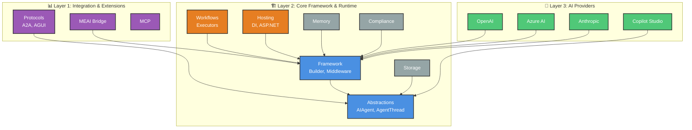

# Microsoft Agent Framework - .NET SDK Architecture Overview

The .NET Agent Framework is a **layered, extensible SDK** for building AI agents with support for multiple providers, workflow orchestration, and production hosting. It provides a consistent abstraction over AI services while enabling deep customization through middleware, context providers, and declarative patterns.

This document serves as the **navigation hub** for all architecture documentation. Use it to understand the system's design philosophy and navigate to detailed drill-down pages.

---

## Quick Start

```csharp
using Microsoft.Agents.AI;
using Azure.AI.OpenAI;

// Create an agent from any AI provider
var agent = new AzureOpenAIClient(endpoint, credential)
    .GetOpenAIResponseClient(deploymentName)
    .CreateAIAgent("MyAgent", "You are a helpful assistant");

// Run the agent
var response = await agent.RunAsync("What is the weather today?");
Console.WriteLine(response.Text);

// Add middleware for observability
var enhancedAgent = agent.AsBuilder()
    .Use(inner => new LoggingAgent(inner, logger))
    .Use(inner => new OpenTelemetryAgent(inner))
    .Build();
```

---

## High-Level Architecture



**Architecture Overview**: The framework uses a **3-tier layered architecture** organized top-to-bottom:

**📊 Layer 1: Integration & Extensions** (Purple)
- Bridges to external systems and standards
- **MEAI Bridge**: Microsoft.Extensions.AI integration for unified IChatClient abstraction
- **Protocols**: Agent-to-Agent (A2A), Agent-UI (AGUI) communication standards
- **MCP**: Model Context Protocol for tool/resource sharing

**🏗️ Layer 2: Core Framework & Runtime** (Blue/Orange/Gray)
- **Core** (Blue): Provider-agnostic abstractions and framework services
  - **Abstractions**: `AIAgent`, `AgentThread`, `AIContextProvider`, response types
  - **Framework**: `AIAgentBuilder`, middleware (Logging, Telemetry), `ChatClientAgent`
- **Runtime** (Orange): Orchestration and hosting infrastructure
  - **Workflows**: Executors, workflow patterns (sequential, concurrent, handoff, group chat)
  - **Hosting**: Dependency injection, ASP.NET Core, Azure Functions integration
- **Support** (Gray): Cross-cutting services
  - **Memory**: Memory providers, context injection
  - **Storage**: Thread/state persistence (CosmosDB, custom)
  - **Compliance**: Governance and compliance hooks (Purview)

**🔌 Layer 3: AI Providers** (Green)
- Concrete AI service integrations following a consistent pattern
- **OpenAI**: OpenAI & Azure OpenAI via Chat Completion and Responses API
- **Azure AI**: Azure AI Foundry project-based agents
- **Anthropic**: Claude models with extended thinking
- **Copilot Studio**: Microsoft Copilot Studio agents

**Dependency Flow**: Dependencies flow **upward** (bottom → top). Layer 3 (Providers) depends on Layer 2 (Core/Runtime). Layer 1 (Integration) depends on Layer 2. This enables provider-agnostic development and easy provider switching.

---

## Core Design Patterns

The framework employs several **architectural patterns** throughout:

### 1. Decorator Pattern (Middleware)
**Purpose**: Composable agent pipelines for cross-cutting concerns

```csharp
// Chain multiple decorators
var agent = baseAgent.AsBuilder()
    .Use(inner => new LoggingAgent(inner, logger))           // Observability
    .Use(inner => new OpenTelemetryAgent(inner))             // Tracing
    .Use(inner => new FunctionInvocationDelegatingAgent(...)) // Tool interception
    .Build();
```

- **Base**: `DelegatingAIAgent` wraps an `InnerAgent`
- **Builder**: `AIAgentBuilder.Use()` composes middleware (FIFO ordering)
- **Built-in**: `LoggingAgent`, `OpenTelemetryAgent`, `FunctionInvocationDelegatingAgent`
- **See**: [design-patterns.md](design-patterns.md#decorator-pattern)

### 2. Context Provider Pattern
**Purpose**: Dynamic runtime context injection (RAG, memory, tool injection)

```csharp
public class MyContextProvider : AIContextProvider
{
    public override async Task<AIContext> InvokingAsync(AgentRunRequest request, ...)
    {
        // Add dynamic context: tools, instructions, messages
        return new AIContext
        {
            Tools = await _toolRegistry.GetToolsAsync(request),
            Instructions = "Additional context: ...",
            Messages = await _memory.GetRelevantAsync(request)
        };
    }
}
```

- **Lifecycle Hooks**: `InvokingAsync()` (before agent), `InvokedAsync()` (after agent)
- **Integration**: `ChatClientAgentOptions.AIContextProviderFactory`
- **See**: [core-abstractions.md](core-abstractions.md#aicontextprovider)

### 3. Bridge Pattern (Microsoft.Extensions.AI)
**Purpose**: Unified abstraction over all AI providers

```csharp
// Any IChatClient → AIAgent
IChatClient chatClient = /* OpenAI, Anthropic, Ollama, etc. */;
var agent = new ChatClientAgent(chatClient, "MyAgent", "instructions");
```

- **`ChatClientAgent`** wraps any `IChatClient` from Microsoft.Extensions.AI
- Automatic middleware injection via `WithDefaultAgentMiddleware()`
- Enables consistent API across all providers
- **See**: [core-framework.md](core-framework.md#chatclientagent)

### 4. Dual Thread Pattern
**Purpose**: Support both server-managed and client-managed conversation state

- **Server-Managed**: Backend maintains history (conversation ID only)
  - `ServiceIdAgentThread` with `ConversationId`
  - Used by: Azure AI Foundry, Copilot Studio

- **Client-Managed**: Local history with `ChatMessageStore`
  - `ChatClientAgentThread` with message persistence
  - Used by: OpenAI, Anthropic, custom providers

- **Auto-Detection**: `ChatClientAgent` selects thread type based on service capabilities
- **See**: [core-abstractions.md](core-abstractions.md#agentthread)

### 5. Continuation Pattern (Long-Running Operations)
**Purpose**: Support asynchronous/background agent responses

```csharp
var options = new AgentRunOptions { AllowBackgroundResponses = true };
var response = await agent.RunAsync(messages, thread, options);

if (response.ContinuationToken != null)
{
    // Resume later
    var nextOptions = new AgentRunOptions
    {
        ContinuationToken = response.ContinuationToken
    };
    var nextResponse = await agent.RunAsync(messages, thread, nextOptions);
}
```

- **`ResponseContinuationToken`** for resuming operations
- Provider-specific implementations (OpenAI Responses, Azure AI, A2A)
- **See**: [ADR-0009: Long-Running Operations](../../decisions/0009-long-running-operations.md), [core-abstractions.md](core-abstractions.md#continuation-tokens)

---

## Solution & Repository Map

| Path | Purpose | Key Technologies |
|------|---------|------------------|
| `dotnet/agent-framework-dotnet.slnx` | Main solution (XML format) | All projects |
| `dotnet/Directory.Build.props` | Shared MSBuild properties | TFMs: net8.0, net9.0, net10.0, net472 |
| `dotnet/Directory.Packages.props` | Central package management | All NuGet dependencies |
| `dotnet/global.json` | SDK version pinning | .NET SDK 10.0.100 |
| `dotnet/src/` | Core SDK libraries | 30+ projects |
| `dotnet/samples/` | Example applications | GettingStarted, Workflows, HostedAgents |
| `dotnet/tests/` | Test suites | Unit + Integration tests |
| `dotnet/eng/MSBuild/` | Build infrastructure | Shared props/targets |
| `.github/workflows/dotnet-build-and-test.yml` | CI/CD pipeline | Multi-TFM builds |

---

## Architectural Layers (Detailed)

### 1. Core Abstractions (`Microsoft.Agents.AI.Abstractions`)

**Purpose**: Provider-agnostic foundation for all agents

**Key Types**:
- **`AIAgent`** - Base class for all agents (`RunAsync`, `RunStreamingAsync`, `GetNewThread`)
- **`DelegatingAIAgent`** - Base decorator for middleware pattern
- **`AgentRunResponse`** / **`AgentRunResponseUpdate`** - Response types with metadata
- **`AgentThread`** - Conversation state abstraction (serializable, persistable)
- **`ChatMessageStore`** - Abstract message persistence (`GetMessagesAsync`, `AddMessagesAsync`)
- **`AIContextProvider`** - Lifecycle-based context injection
- **`AgentRunOptions`** - Configuration (continuation tokens, background responses)

**Extension Points**:
- Derive from `AIAgent` for custom agent types
- Derive from `DelegatingAIAgent` for middleware
- Implement `ChatMessageStore` for custom storage
- Implement `AIContextProvider` for dynamic context

**Dependencies**: Only `Microsoft.Extensions.AI.Abstractions`

**See**: [core-abstractions.md](core-abstractions.md)

---

### 2. Core Framework (`Microsoft.Agents.AI`)

**Purpose**: Framework services, middleware, and agent builder

**Key Components**:

#### AIAgentBuilder
- Fluent API for composing agent pipelines
- `.Use()` methods for middleware registration
- FIFO ordering (first added is outermost decorator)
- Support for both agent factories and anonymous delegates

#### ChatClientAgent
- **Bridge to Microsoft.Extensions.AI**: Wraps any `IChatClient`
- Automatic middleware injection (`WithDefaultAgentMiddleware`)
- Thread type auto-detection (server vs. client managed)
- Options merging (agent defaults + runtime options)
- Structured output support (`RunAsync<T>()`)

#### Built-in Middleware
- **`LoggingAgent`** - Structured logging with `ILogger` (debug, trace, error levels)
- **`OpenTelemetryAgent`** - Distributed tracing (GenAI semantic conventions v1.37)
- **`FunctionInvocationDelegatingAgent`** - Tool call interception

#### Memory Providers
- **`ChatHistoryMemoryProvider`** - Sliding window memory
- **`ChatHistoryMemoryProviderScope`** - Scoped memory management
- Integration with `AIContextProvider` for dynamic injection

#### Anonymous Middleware
- **`AnonymousDelegatingAIAgent`** - Inline middleware via delegates
- Separate handlers for streaming vs. non-streaming

**See**: [core-framework.md](core-framework.md)

---

### 3. Provider Adapters

**Integration Strategy**: All providers follow a **consistent pattern**:

1. Provider-specific client (e.g., `AzureOpenAIClient`, `AnthropicClient`)
2. Adapter to `Microsoft.Extensions.AI.IChatClient`
3. Extension method `CreateAIAgent()` wrapping in `ChatClientAgent`
4. Provider-specific options/configuration

This enables:
- Consistent API across all providers
- Shared middleware (logging, telemetry)
- Easy provider switching
- Provider-specific features via options

**Providers**:

| Provider | Package | Key Features |
|----------|---------|--------------|
| **OpenAI & Azure OpenAI** | `Microsoft.Agents.AI.OpenAI` | Chat Completion API, Responses API, structured outputs, function calling |
| **Azure AI Foundry** | `Microsoft.Agents.AI.AzureAI` | Project-based agents, server-managed threads |
| **Azure AI Agents (Persistent)** | `Microsoft.Agents.AI.AzureAI.Persistent` | Managed agents with backend orchestration, long-running ops |
| **Anthropic Claude** | `Microsoft.Agents.AI.Anthropic` | Claude models, extended thinking, prompt caching |
| **Copilot Studio** | `Microsoft.Agents.AI.CopilotStudio` | Microsoft Copilot Studio integration |

**Extension Guide**: [providers.md](providers.md) for detailed provider docs and [extension-guide.md](extension-guide.md#custom-provider) for adding new providers

---

### 4. Protocol Adapters

**Purpose**: Enable agent interoperability and communication patterns

| Protocol | Package | Description | Use Cases |
|----------|---------|-------------|-----------|
| **Agent-to-Agent (A2A)** | `Microsoft.Agents.AI.A2A` | Cross-agent communication standard | Multi-agent orchestration, agent handoffs |
| **Agent-UI (AGUI)** | `Microsoft.Agents.AI.AGUI` | Streaming UI events protocol | Real-time UI updates, progress reporting |
| **Model Context Protocol (MCP)** | External integration | Context sharing protocol | Tool discovery, resource sharing |

**Hosting**: Protocol-specific hosting via `Microsoft.Agents.AI.Hosting.A2A` and `Microsoft.Agents.AI.Hosting.AGUI.AspNetCore`

**See**: [protocols.md](protocols.md)

---

### 5. Workflow Engine (`Microsoft.Agents.AI.Workflows`)

**Purpose**: Graph-based multi-agent orchestration with checkpointing and observability

**Core Abstractions**:
- **`Executor<TInput, TOutput>`** - Base component for workflow nodes
  - Lifecycle hooks: `InitializeAsync`, `OnCheckpointingAsync`, `OnCheckpointRestoredAsync`
  - Route-based message handling via `RouteBuilder`
  - Protocol description via `DescribeProtocol()`

- **`ExecutorBinding`** - Metadata + factory for executors
  - Shared vs. per-run instances
  - Placeholder support for late binding

- **`AgentWorkflowBuilder`** - Fluent API for workflow composition

**Workflow Patterns**:

1. **Sequential** - Pipeline (A → B → C)
   ```csharp
   var workflow = AgentWorkflowBuilder.BuildSequential(
       agent1, agent2, agent3
   );
   ```

2. **Concurrent** - Fan-out/fan-in (A → [B, C, D] → aggregate)
   ```csharp
   var workflow = AgentWorkflowBuilder.BuildConcurrent(
       new[] { agentB, agentC, agentD },
       aggregatorAgent
   );
   ```

3. **Handoff** - Tool-based routing (agent calls tool to transfer control)
   ```csharp
   var builder = AgentWorkflowBuilder.CreateHandoffBuilderWith(initialAgent)
       .AddAgent(salesAgent)
       .AddAgent(supportAgent);
   ```

4. **Group Chat** - Manager-directed coordination
   ```csharp
   var builder = AgentWorkflowBuilder.CreateGroupChatBuilderWith(managerFactory);
   ```

**Specialized Executors**:
- **`HandoffAgentExecutor`**, **`HandoffsStartExecutor`**, **`HandoffsEndExecutor`** - Human-in-the-loop
- **`AgentRunStreamingExecutor`** - Streaming integration
- **`CollectChatMessagesExecutor`** - Message aggregation
- **`ConcurrentEndExecutor`** - Parallel completion
- **`WorkflowHostExecutor`** - Nested workflow hosting

**State Management**:
- Checkpointing for long-running workflows
- Resumption after failures
- Event streaming for observability

**Declarative Workflows** (`Microsoft.Agents.AI.Workflows.Declarative`):
- YAML-based workflow definitions
- Schema validation
- Dynamic loading

**See**: [workflows.md](workflows.md)

---

### 6. Hosting & Runtime

**Purpose**: Integrate agents into .NET hosting environments with dependency injection

#### Dependency Injection (`Microsoft.Agents.AI.Hosting`)

```csharp
services.AddAIAgent("myAgent", (sp, name) => {
    var chatClient = sp.GetRequiredService<IChatClient>();
    var tools = sp.GetRequiredKeyedService<IList<AITool>>(name);
    return chatClient.CreateAIAgent(name, "instructions", tools: tools);
});

// Resolve agent by name
var agent = serviceProvider.GetRequiredKeyedService<AIAgent>("myAgent");
```

**Key Features**:
- **Keyed services** - Agents registered by name
- **Factory delegates** - Late binding with DI access
- **Tool injection** - Automatic via `LocalAgentToolRegistry`
- **`IHostedAgentBuilder`** - Fluent configuration

#### ASP.NET Core Hosting
- Protocol endpoints via `Microsoft.Agents.AI.Hosting.A2A.AspNetCore`
- AGUI streaming via `Microsoft.Agents.AI.Hosting.AGUI.AspNetCore`
- OpenAI-compatible API via `Microsoft.Agents.AI.Hosting.OpenAI`

#### Azure Functions Hosting (`Microsoft.Agents.AI.Hosting.AzureFunctions`)
- Durable Functions integration for long-running agents
- HTTP, Queue, Timer triggers
- State persistence via Durable Task

#### DurableTask Integration (`Microsoft.Agents.AI.DurableTask`)

**Entity Pattern** for stateful agents:
- **`DurableAIAgent`** - Agent as durable entity
- **`DurableAIAgentProxy`** - Client-side proxy for entity invocation
- **`AgentEntity`** - Stateful agent with session management
- **`DurableAgentState`** hierarchy - Serializable state management
- **`IDurableAgentClient`** - Orchestration client
- **`DurableAgentContext`** - Access to durable task features

**Long-Running Operations**:
- Agent sessions with handles
- Response resumption
- State checkpointing

**See**: [hosting.md](hosting.md)

---

### 7. Cross-Cutting Concerns

#### Memory & Context
- **Mem0** (`Microsoft.Agents.AI.Mem0`) - Mem0 memory service integration
- **`ChatHistoryMemoryProvider`** - Framework-native memory provider
- **`AIContextProvider`** - Dynamic context injection pattern

#### State Storage
- **CosmosDB** (`Microsoft.Agents.AI.CosmosNoSql`) - Cosmos DB thread/state storage
- **`IAgentThreadStore`** - Abstract thread persistence (implement for custom storage)

#### Compliance & Governance
- **Purview** (`Microsoft.Agents.AI.Purview`) - Microsoft Purview integration
- Data governance hooks
- Compliance tracking

#### Declarative Agents
- **`Microsoft.Agents.AI.Declarative`** - JSON/YAML agent definitions
- Schema-based validation
- Declarative agent loaders
- Runtime agent construction from config

#### Developer Tools
- **DevUI** (`Microsoft.Agents.AI.DevUI`) - Developer-facing UI helpers
- Debugging utilities
- Agent introspection

#### Legacy Support
- **`LegacySupport`** - Polyfills for .NET Framework 4.7.2
- CallerAttributes, CompilerFeatureRequired, ExperimentalAttribute

**See**: [cross-cutting.md](cross-cutting.md)

---

## Key Extension Points

The framework is designed for **deep extensibility** at every layer:

| To Extend | Implement/Derive | Pattern | Guide |
|-----------|------------------|---------|-------|
| **Add AI Provider** | `IChatClient` adapter + `CreateAIAgent()` extension | Bridge Pattern | [extension-guide.md#custom-provider](extension-guide.md#custom-provider) |
| **Add Middleware** | `DelegatingAIAgent` + `AIAgentBuilder.Use()` | Decorator Pattern | [extension-guide.md#custom-middleware](extension-guide.md#custom-middleware) |
| **Custom Context Injection** | `AIContextProvider` | Context Provider Pattern | [extension-guide.md#context-provider](extension-guide.md#context-provider) |
| **Custom Memory** | `ChatMessageStore` | Repository Pattern | [extension-guide.md#custom-memory](extension-guide.md#custom-memory) |
| **Custom Thread Storage** | `IAgentThreadStore` | Repository Pattern | [extension-guide.md#thread-storage](extension-guide.md#thread-storage) |
| **Custom Tools** | `AITool` | Strategy Pattern | [extension-guide.md#custom-tools](extension-guide.md#custom-tools) |
| **Workflow Executor** | `Executor<TInput, TOutput>` | Template Method Pattern | [extension-guide.md#custom-executor](extension-guide.md#custom-executor) |
| **Protocol Adapter** | `AIAgent` wrapping protocol client | Adapter Pattern | [extension-guide.md#protocol-adapter](extension-guide.md#protocol-adapter) |

---

## Build & Test

### Prerequisites
- **.NET SDK 10.0.100** (see `dotnet/global.json`)
- Optional: Azure emulators, API keys for integration tests

### Build Commands
```bash
# Build entire solution (all TFMs: net8.0, net9.0, net10.0, net472)
dotnet build dotnet/agent-framework-dotnet.slnx

# Build specific framework
dotnet build dotnet/agent-framework-dotnet.slnx --framework net10.0

# Restore packages only
dotnet restore dotnet/agent-framework-dotnet.slnx
```

### Test Commands
```bash
# Unit tests (no external dependencies)
dotnet test dotnet/agent-framework-dotnet.slnx --filter "FullyQualifiedName~UnitTests"

# Integration tests (requires env vars)
dotnet test dotnet/agent-framework-dotnet.slnx --filter "FullyQualifiedName~IntegrationTests"

# Specific TFM
dotnet test dotnet/agent-framework-dotnet.slnx --framework net10.0 --filter "FullyQualifiedName~UnitTests"
```

### Environment Variables (Integration Tests)
| Variable | Purpose | Example |
|----------|---------|---------|
| `AZURE_OPENAI_ENDPOINT` | Azure OpenAI service endpoint | `https://....openai.azure.com` |
| `AZURE_OPENAI_DEPLOYMENT_NAME` | Model deployment name | `gpt-4o` |
| `ANTHROPIC_API_KEY` | Anthropic API key | `sk-ant-...` |
| `COSMOS_EMULATOR_ENDPOINT` | Cosmos DB emulator | `https://localhost:8081` |

### CI/CD
- **Workflow**: `.github/workflows/dotnet-build-and-test.yml`
- **Triggers**: Pull request, push to main
- **Matrix**: net8.0, net9.0, net10.0, net472
- **Tests**: Unit + Integration (with service mocks)

**See**: [build-test.md](build-test.md) for troubleshooting and advanced scenarios

---

## Documentation Navigation

### Core Concepts
- [**Core Abstractions**](core-abstractions.md) - AIAgent, AgentThread, AgentRunResponse, AIContextProvider
- [**Core Framework**](core-framework.md) - AIAgentBuilder, ChatClientAgent, middleware, memory
- [**Design Patterns**](design-patterns.md) - Decorator, Context Provider, Bridge, Continuation

### Integration
- [**Providers**](providers.md) - OpenAI, Azure AI, Anthropic, Copilot Studio integration patterns
- [**Protocols**](protocols.md) - A2A, AGUI, MCP specifications
- [**Microsoft.Extensions.AI Bridge**](core-framework.md#meai-bridge) - IChatClient integration

### Advanced
- [**Workflows**](workflows.md) - Executors, workflow patterns, declarative workflows
- [**Hosting**](hosting.md) - DI, ASP.NET Core, Azure Functions, DurableTask
- [**Cross-Cutting**](cross-cutting.md) - Memory, storage, compliance, declarative agents

### Getting Started
- [**Getting Started Guide**](getting-started.md) - 30-minute walkthrough from clone to working agent

### Development
- [**Extension Guide**](extension-guide.md) - Step-by-step guides for extending the framework
- [**Samples**](samples.md) - Example applications and usage patterns
- [**Troubleshooting**](troubleshooting.md) - Debugging, common errors, and diagnostics
- [**Build System Deep-Dive**](dotnet-build-system.md) - MSBuild infrastructure, multi-targeting, polyfills

### Reference
- [**Architectural Decisions**](../../decisions/) - ADRs explaining design choices
- [**API Documentation**](https://docs.microsoft.com/dotnet/api/) - Generated API reference

---

## Samples Overview

| Category | Location | Demonstrates |
|----------|----------|--------------|
| **GettingStarted** | `dotnet/samples/GettingStarted/` | Basic agent usage, provider integration |
| **AgentProviders** | `GettingStarted/AgentProviders/` | OpenAI, Anthropic, Azure AI, Copilot Studio |
| **Workflows** | `GettingStarted/Workflows/` | Sequential, concurrent, handoff, group chat |
| **HostedAgents** | `dotnet/samples/HostedAgents/` | DI, ASP.NET Core, protocol hosting |
| **AzureFunctions** | `dotnet/samples/AzureFunctions/` | Durable Functions, HTTP triggers |
| **Protocols** | `GettingStarted/Protocols/` | A2A, AGUI usage |

**See**: [samples.md](samples.md) for detailed sample descriptions

---

## Design Philosophy

The framework is built on these **core principles**:

1. **Provider-Agnostic Abstractions** - Write once, run on any AI service
2. **Composability Through Middleware** - Layer cross-cutting concerns via decorators
3. **Deep Extensibility** - Extension points at every layer (agents, context, memory, storage)
4. **Production-Ready Hosting** - First-class DI, ASP.NET Core, Azure Functions support
5. **Explicit Over Implicit** - Clear contracts, predictable behavior, minimal magic
6. **Interoperability** - Standards-based protocols (A2A, AGUI, MCP)
7. **Observability Built-In** - Logging, telemetry, tracing by default
8. **Long-Running Operations** - Native support for async/background responses
9. **State Management** - Flexible thread models (server-managed vs. client-managed)
10. **Declarative Configuration** - YAML/JSON definitions for agents and workflows

---

## Related Documentation

- **Python SDK**: `docs/architecture/python/` (separate implementation)
- **Decisions**: `docs/decisions/*.md` (architectural decision records)
- **Samples**: `dotnet/samples/` (runnable examples)
- **API Reference**: Generated from XML docs

---

*Last updated: 2025-12-25*
