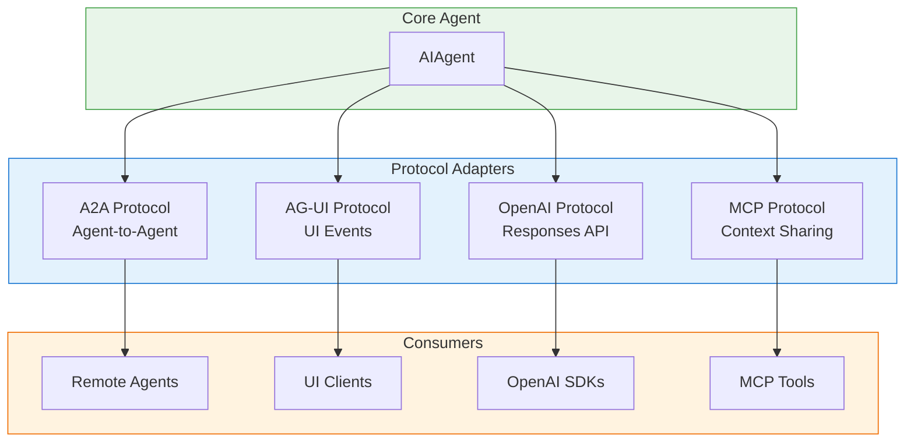
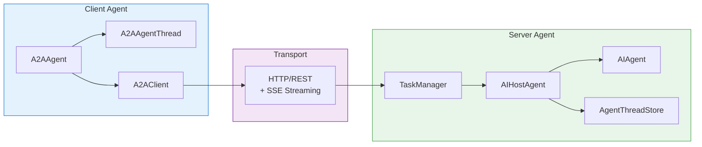
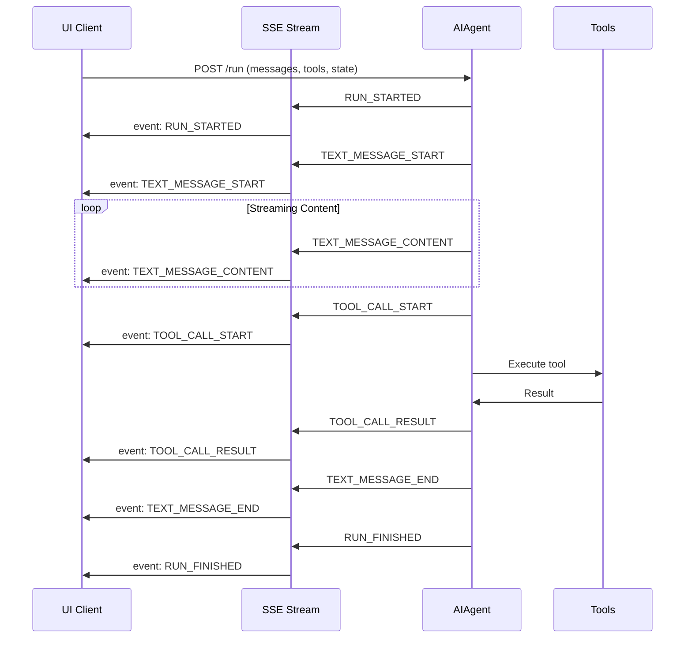
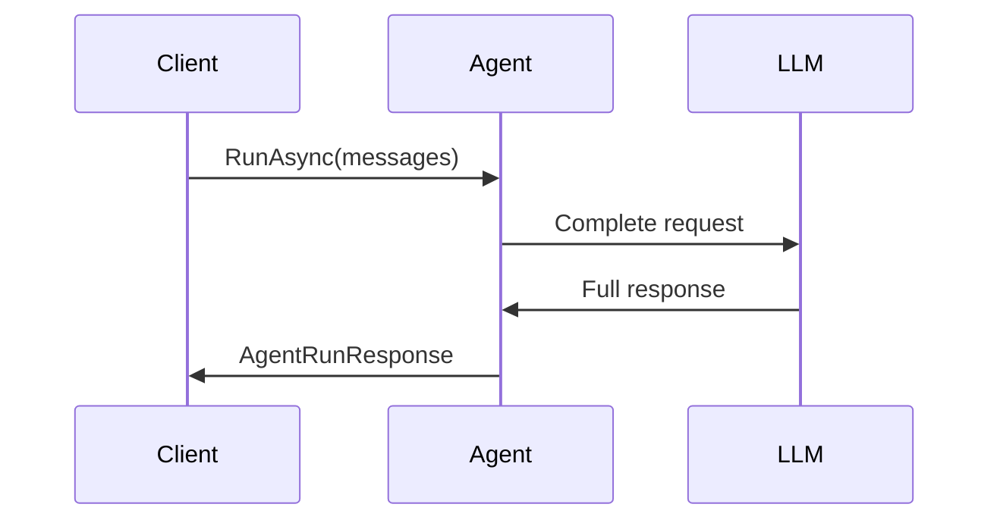
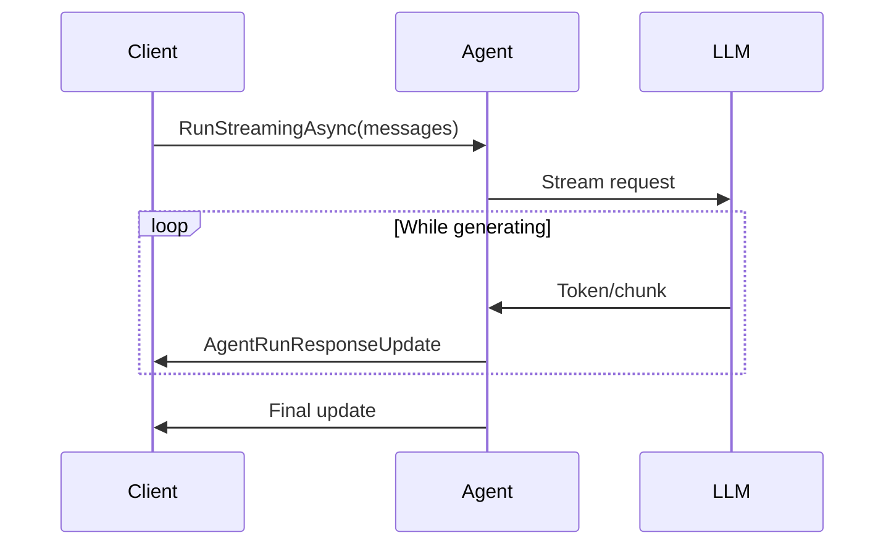
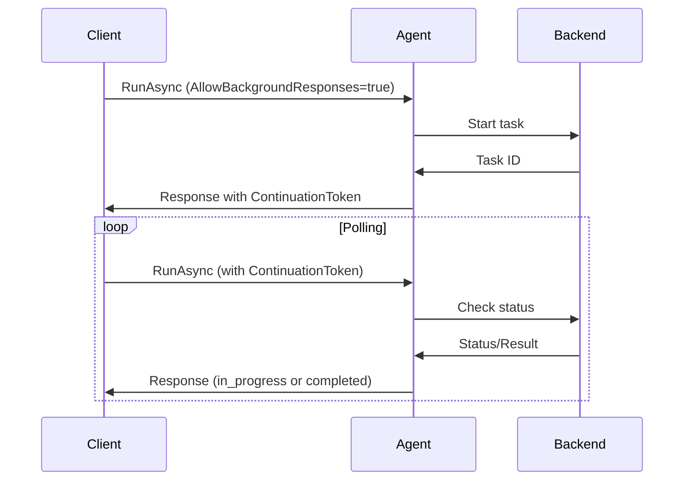

# Protocol Adapters

> **Purpose**: This document explains agent communication protocols and interoperability options in the Microsoft Agent Framework.

## Overview

The Agent Framework supports multiple communication protocols to enable interoperability with external systems, UI clients, and other agents. These protocols provide standardized ways for agents to:

- **Communicate with each other** (Agent-to-Agent / A2A protocol)
- **Stream events to user interfaces** (AG-UI protocol)
- **Expose OpenAI-compatible APIs** (OpenAI Responses/Chat Completions)
- **Share context and tools** (Model Context Protocol / MCP)

Each protocol is implemented as a separate package, allowing developers to choose the protocols their application needs without pulling in unnecessary dependencies.



---

## Agent-to-Agent (A2A) Protocol

**Packages**:
- `Microsoft.Agents.AI.A2A` (client)
- `Microsoft.Agents.AI.Hosting.A2A` (server adapter)
- `Microsoft.Agents.AI.Hosting.A2A.AspNetCore` (ASP.NET Core hosting)

### Purpose

The A2A protocol enables agents to communicate with each other across process and machine boundaries. It provides a standardized message format for agent-to-agent interactions, supporting both synchronous request-response and asynchronous task-based patterns.

Key capabilities:
- **Message-based communication**: Agents exchange structured messages
- **Task management**: Long-running operations with status tracking
- **Context preservation**: Conversation context persists across interactions
- **Streaming support**: Real-time updates via Server-Sent Events (SSE)
- **Discovery**: Agent cards for capability advertisement

### Architecture



### Key Classes

#### A2AAgent (Client)

Wraps an `A2AClient` to call remote A2A-compliant agents as if they were local agents:

```csharp
// A2AAgent implements AIAgent for calling remote agents
internal sealed class A2AAgent : AIAgent
{
    private readonly A2AClient _a2aClient;

    public override async Task<AgentRunResponse> RunAsync(
        IEnumerable<ChatMessage> messages,
        AgentThread? thread = null,
        AgentRunOptions? options = null,
        CancellationToken cancellationToken = default)
    {
        var typedThread = GetA2AThread(thread, options);
        var a2aMessage = CreateA2AMessage(typedThread, messages);

        var response = await _a2aClient
            .SendMessageAsync(new MessageSendParams { Message = a2aMessage }, cancellationToken)
            .ConfigureAwait(false);

        // Convert A2A response to AgentRunResponse
        // ...
    }
}
```

Key features:
- Uses `A2AAgentThread` to track context across calls
- Supports both message responses and task-based long-running operations
- Handles continuation tokens for async task polling
- Provides streaming via SSE for real-time updates

#### A2AAgentThread

Maintains conversation context with remote agents:

```csharp
public sealed class A2AAgentThread : AgentThread
{
    // Server-assigned context identifier
    public string? ContextId { get; internal set; }

    // Current task being processed
    public string? TaskId { get; internal set; }

    public override JsonElement Serialize(JsonSerializerOptions? options = null)
    {
        return JsonSerializer.SerializeToElement(new A2AAgentThreadState
        {
            ContextId = this.ContextId,
            TaskId = this.TaskId
        });
    }
}
```

### Hosting an A2A Endpoint

To expose your agent via the A2A protocol:

```csharp
var builder = WebApplication.CreateBuilder(args);

// Register your agent
builder.AddHostedAgent("my-agent", agent =>
{
    agent.UseChatClient(chatClient)
         .WithInstructions("You are a helpful assistant.");
});

var app = builder.Build();

// Map A2A endpoints at /agents/my-agent
app.MapA2A("my-agent", "/agents/my-agent");

app.Run();
```

With agent discovery (AgentCard):

```csharp
var agentCard = new AgentCard
{
    Name = "MyAgent",
    Description = "A helpful assistant agent",
    Capabilities = new AgentCapabilities
    {
        SupportsStreaming = true,
        SupportsTasks = true
    }
};

app.MapA2A("my-agent", "/agents/my-agent", agentCard);
```

### Calling a Remote A2A Agent

```csharp
// Create an A2A client pointing to the remote agent
var httpClient = new HttpClient { BaseAddress = new Uri("https://remote-agent.example.com") };
var a2aClient = new A2AClient(httpClient, "/agents/assistant");

// Wrap as an AIAgent
var remoteAgent = new A2AAgent(
    a2aClient,
    name: "RemoteAssistant",
    description: "A remote AI assistant");

// Use like any other agent
var thread = remoteAgent.GetNewThread();
var response = await remoteAgent.RunAsync(
    [new ChatMessage(ChatRole.User, "Hello!")],
    thread);
```

### Message Format

A2A messages follow the A2A specification format:

```json
{
  "messageId": "msg_abc123",
  "contextId": "ctx_xyz789",
  "role": "user",
  "parts": [
    {
      "kind": "text",
      "text": "What's the weather today?"
    }
  ],
  "metadata": {}
}
```

### Task-Based Responses

For long-running operations, A2A agents can return tasks:

```csharp
if (options?.AllowBackgroundResponses is true)
{
    // Agent returns a task that can be polled for completion
    var response = new AgentRunResponse
    {
        Messages = [...],
        ContinuationToken = CreateContinuationToken(taskId, state),
    };
}
```

**See Also**: [A2A Protocol Specification](https://github.com/a2aproject/A2A)

---

## Agent-UI (AG-UI) Protocol

**Packages**:
- `Microsoft.Agents.AI.AGUI` (client - for calling AG-UI servers)
- `Microsoft.Agents.AI.Hosting.AGUI.AspNetCore` (server - for exposing agents as AG-UI endpoints)

### Purpose

The AG-UI protocol provides a standardized way for agents to stream events to user interface clients. It enables:

- **Real-time text streaming**: Character-by-character message delivery
- **Tool call visibility**: UI can display tool invocations and results
- **State synchronization**: Share agent state with UI for reactive updates
- **Hybrid tool execution**: Server-side and client-side tool invocation

### Event Types

The protocol defines specific event types for streaming:

| Event Type | Description |
|------------|-------------|
| `RUN_STARTED` | Agent run has begun |
| `RUN_FINISHED` | Agent run completed |
| `RUN_ERROR` | Error occurred during run |
| `TEXT_MESSAGE_START` | Beginning of a text message |
| `TEXT_MESSAGE_CONTENT` | Text content chunk |
| `TEXT_MESSAGE_END` | End of text message |
| `TOOL_CALL_START` | Tool invocation beginning |
| `TOOL_CALL_ARGS` | Tool call arguments |
| `TOOL_CALL_END` | Tool invocation completed |
| `TOOL_CALL_RESULT` | Tool execution result |
| `STATE_SNAPSHOT` | Complete state snapshot |
| `STATE_DELTA` | Incremental state update |

### Architecture



### Request Format

AG-UI clients send requests with messages, tools, and optional state:

```csharp
internal sealed class RunAgentInput
{
    public string ThreadId { get; set; }
    public string RunId { get; set; }
    public JsonElement State { get; set; }
    public IEnumerable<AGUIMessage> Messages { get; set; }
    public IEnumerable<AGUITool>? Tools { get; set; }
    public AGUIContextItem[] Context { get; set; }
    public JsonElement ForwardedProperties { get; set; }
}
```

### Hosting an AG-UI Endpoint

```csharp
var builder = WebApplication.CreateBuilder(args);

// Configure AG-UI services
builder.Services.AddAGUI();

// Register your agent
builder.AddHostedAgent("assistant", agent =>
{
    agent.UseChatClient(chatClient)
         .WithInstructions("You are a helpful assistant.");
});

var app = builder.Build();

// Map AG-UI endpoint
app.MapAGUI("/api/run", agent);

app.Run();
```

The handler automatically:
- Converts AG-UI messages to framework `ChatMessage` format
- Extracts client-provided tools for hybrid execution
- Streams responses as Server-Sent Events
- Handles state synchronization

### SSE Response Streaming

Responses are streamed as Server-Sent Events:

```csharp
internal sealed class AGUIServerSentEventsResult : IResult
{
    public async Task ExecuteAsync(HttpContext httpContext)
    {
        httpContext.Response.ContentType = "text/event-stream";
        httpContext.Response.Headers.CacheControl = "no-cache,no-store";

        await SseFormatter.WriteAsync(
            WrapEventsAsSseItemsAsync(_events, cancellationToken),
            httpContext.Response.Body,
            SerializeEvent,
            cancellationToken);
    }
}
```

### Client-Side Tool Execution

AG-UI supports hybrid tool execution where some tools run on the server and others on the client:

```csharp
// Filter server tools from mixed invocations
events
    .FilterServerToolsFromMixedToolInvocationsAsync(clientTools, cancellationToken)
    .AsAGUIEventStreamAsync(threadId, runId, jsonOptions, cancellationToken);
```

### AGUIChatClient (Calling AG-UI Servers)

The framework also provides a client for calling AG-UI compliant servers:

```csharp
var httpClient = new HttpClient { BaseAddress = new Uri("https://agui-server.example.com") };
var aguiClient = new AGUIChatClient(
    httpClient,
    "/api/run",
    loggerFactory);

// AGUIChatClient implements IChatClient
await foreach (var update in aguiClient.GetStreamingResponseAsync(messages))
{
    Console.Write(update.Text);
}
```

**See Also**: [AG-UI Protocol Specification](https://docs.ag-ui.com/)

---

## OpenAI-Compatible API

**Package**: `Microsoft.Agents.AI.Hosting.OpenAI`

### Purpose

Exposes your agents as OpenAI-compatible API endpoints, allowing any OpenAI SDK or compatible client to interact with your agents. This provides:

- **Drop-in compatibility**: Use OpenAI SDKs with your agents
- **Standard API surface**: Familiar REST endpoints
- **Streaming support**: SSE-based streaming responses
- **Conversation management**: Built-in conversation/response storage

### Supported Endpoints

| Endpoint | Description |
|----------|-------------|
| `POST /v1/chat/completions` | Chat Completions API |
| `POST /v1/responses` | Responses API (create) |
| `GET /v1/responses/{id}` | Get response by ID |
| `DELETE /v1/responses/{id}` | Delete response |
| `POST /v1/conversations` | Create conversation |
| `GET /v1/conversations/{id}` | Get conversation |
| `POST /v1/conversations/{id}/messages` | Add message to conversation |

### Architecture

```mermaid
flowchart TB
    subgraph Client["OpenAI SDK / Client"]
        style Client fill:#e3f2fd,stroke:#1976d2
        SDK[OpenAI SDK]
    end

    subgraph Endpoints["API Endpoints"]
        style Endpoints fill:#fff3e0,stroke:#ef6c00
        Chat[/v1/chat/completions]
        Responses[/v1/responses]
        Conversations[/v1/conversations]
    end

    subgraph Handlers["Request Handlers"]
        style Handlers fill:#f3e5f5,stroke:#7b1fa2
        ChatHandler[ChatCompletions<br/>Processor]
        ResponseHandler[Responses<br/>HttpHandler]
        ConvHandler[Conversations<br/>HttpHandler]
    end

    subgraph Services["Backend Services"]
        style Services fill:#e8f5e9,stroke:#43a047
        ResponseSvc[IResponsesService]
        ConvStorage[IConversationStorage]
        Agent[AIAgent]
    end

    SDK --> Chat
    SDK --> Responses
    SDK --> Conversations

    Chat --> ChatHandler
    Responses --> ResponseHandler
    Conversations --> ConvHandler

    ChatHandler --> Agent
    ResponseHandler --> ResponseSvc
    ConvHandler --> ConvStorage
    ResponseSvc --> Agent
```

### Configuration

```csharp
var builder = WebApplication.CreateBuilder(args);

// Add OpenAI-compatible hosting
builder.AddOpenAIHosting(options =>
{
    options.EnableResponsesApi = true;
    options.EnableChatCompletionsApi = true;
    options.EnableConversationsApi = true;
});

// Register your agent
builder.AddHostedAgent("gpt-4", agent =>
{
    agent.UseChatClient(chatClient)
         .WithInstructions("You are a helpful assistant.");
});

var app = builder.Build();

// Map all OpenAI-compatible endpoints
app.MapOpenAI();

app.Run();
```

### Responses API

The Responses API provides a modern conversation-oriented interface:

```csharp
internal sealed class ResponsesHttpHandler
{
    public async Task<IResult> CreateResponseAsync(
        CreateResponse request,
        bool? stream,
        CancellationToken cancellationToken)
    {
        bool shouldStream = stream ?? request.Stream ?? false;

        if (shouldStream)
        {
            var streamingResponse = _responsesService.CreateResponseStreamingAsync(
                request, cancellationToken);

            return new SseJsonResult<StreamingResponseEvent>(
                streamingResponse,
                static evt => evt.Type,
                OpenAIHostingJsonContext.Default.StreamingResponseEvent);
        }

        return Results.Ok(await _responsesService.CreateResponseAsync(request, cancellationToken));
    }
}
```

### Chat Completions Format

Request and response follow OpenAI's Chat Completions format:

```json
// Request
{
  "model": "gpt-4",
  "messages": [
    {"role": "user", "content": "Hello!"}
  ],
  "stream": true
}

// Streaming Response (SSE)
data: {"id":"chatcmpl-abc","object":"chat.completion.chunk","choices":[{"delta":{"content":"Hi"}}]}
data: {"id":"chatcmpl-abc","object":"chat.completion.chunk","choices":[{"delta":{"content":"!"}}]}
data: [DONE]
```

### Custom Agent Resolution

Map different model names to different agents:

```csharp
app.MapOpenAI(agentResolver: (modelName, serviceProvider) =>
{
    return modelName switch
    {
        "gpt-4" => serviceProvider.GetKeyedService<AIAgent>("advanced-agent"),
        "gpt-3.5-turbo" => serviceProvider.GetKeyedService<AIAgent>("basic-agent"),
        _ => throw new ArgumentException($"Unknown model: {modelName}")
    };
});
```

---

## Model Context Protocol (MCP)

### Purpose

MCP enables agents to share context and discover tools from external sources. It provides:

- **Tool discovery**: Agents can discover and use tools from MCP servers
- **Resource sharing**: Share documents, files, and other context
- **Standardized interface**: Consistent way to extend agent capabilities

### Integration

MCP integration is typically handled at the tool level rather than as a full protocol adapter:

```csharp
// Add MCP-sourced tools to an agent
builder.AddHostedAgent("assistant", agent =>
{
    agent.UseChatClient(chatClient)
         .WithMcpTools(mcpClient)  // Tools from MCP server
         .WithTools([...]);        // Local tools
});
```

**See Also**: [Model Context Protocol Specification](https://modelcontextprotocol.io/)

---

## Communication Patterns

### Synchronous Request-Response

The simplest pattern where the client waits for a complete response:



### Streaming

Real-time streaming of partial responses:



### Long-Running Tasks (A2A)

For operations that take significant time:



### Server-Sent Events Transport

All streaming protocols use SSE for reliable, unidirectional streaming:

```
HTTP/1.1 200 OK
Content-Type: text/event-stream
Cache-Control: no-cache

event: message
data: {"type":"TEXT_MESSAGE_CONTENT","content":"Hello"}

event: message
data: {"type":"TEXT_MESSAGE_CONTENT","content":" world"}

event: message
data: {"type":"RUN_FINISHED"}
```

---

## Protocol Comparison

| Feature | A2A | AG-UI | OpenAI API |
|---------|-----|-------|------------|
| **Primary Use Case** | Agent-to-agent | Agent-to-UI | SDK compatibility |
| **Transport** | HTTP + SSE | HTTP + SSE | HTTP + SSE |
| **State Management** | Context ID | Thread ID | Conversation ID |
| **Tool Support** | Message-based | Client/Server split | Function calling |
| **Task Support** | Yes (long-running) | No | Yes (background) |
| **Discovery** | Agent Cards | No | Model listing |
| **Streaming** | SSE | SSE | SSE |

---

## Extension Points

### Creating a Custom Protocol Adapter

1. **Create the adapter package**:
```csharp
public static class CustomProtocolExtensions
{
    public static IEndpointConventionBuilder MapCustomProtocol(
        this IEndpointRouteBuilder endpoints,
        AIAgent agent,
        string path)
    {
        return endpoints.MapPost(path, async (
            HttpContext context,
            CancellationToken ct) =>
        {
            // Parse custom protocol request
            var request = await ParseRequest(context);

            // Convert to framework messages
            var messages = ConvertToMessages(request);

            // Run the agent
            var response = await agent.RunAsync(messages, cancellationToken: ct);

            // Convert to custom protocol response
            return ConvertToResponse(response);
        });
    }
}
```

2. **Handle streaming if needed**:
```csharp
public static IEndpointConventionBuilder MapCustomProtocolStreaming(
    this IEndpointRouteBuilder endpoints,
    AIAgent agent,
    string path)
{
    return endpoints.MapPost(path, async (HttpContext context, CancellationToken ct) =>
    {
        context.Response.ContentType = "text/event-stream";

        await foreach (var update in agent.RunStreamingAsync(messages, cancellationToken: ct))
        {
            await WriteEvent(context.Response, ConvertUpdate(update));
        }
    });
}
```

3. **Create a client wrapper** (optional):
```csharp
public class CustomProtocolAgent : AIAgent
{
    private readonly HttpClient _client;

    public override async Task<AgentRunResponse> RunAsync(...)
    {
        // Call remote custom protocol endpoint
        var response = await _client.PostAsync(...);
        return ConvertResponse(response);
    }
}
```

---

*Last updated: December 2024*
