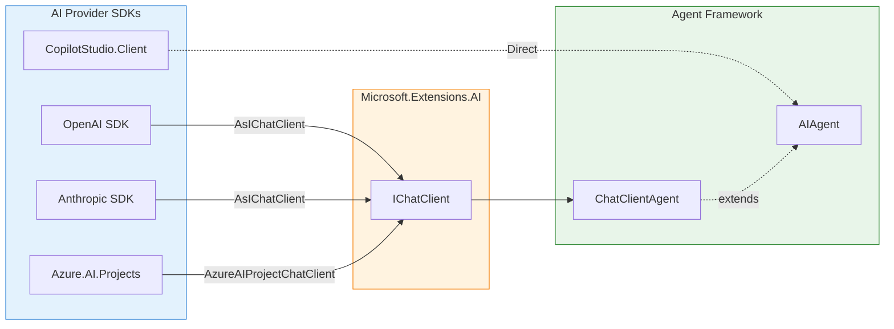

# Provider Adapters

> **Purpose**: This document explains how AI services integrate with the Microsoft Agent Framework, providing a consistent programming model across different AI providers.

## Overview

The framework uses a **provider adapter pattern** to integrate with various AI services while maintaining a unified API. Each provider package translates between the provider's native SDK and the framework's `AIAgent` abstraction through `Microsoft.Extensions.AI`'s `IChatClient` interface.



**Key Benefits**:
- **Consistent API**: Same `AIAgent` interface regardless of provider
- **Shared Middleware**: Logging, telemetry, function calling work across all providers
- **Easy Switching**: Change providers by updating the factory method call
- **Provider-Specific Features**: Access native capabilities when needed via `GetService<T>()`

---

## Provider Integration Pattern

### Universal Pattern

All IChatClient-based providers follow the same integration pattern:

```
Provider SDK Client
        ↓
    AsIChatClient() or custom wrapper
        ↓
    Optional: clientFactory transformation
        ↓
    ChatClientAgent
        ↓
    AIAgent (framework abstraction)
```

### Extension Method Conventions

| Method Name | Purpose | Returns |
|-------------|---------|---------|
| `CreateAIAgent()` | Create agent with inline configuration | `ChatClientAgent` |
| `GetAIAgent()` | Retrieve existing agent by name/ID | `ChatClientAgent` |
| `*Async()` | Async variants for server-side operations | `Task<ChatClientAgent>` |

### Common Parameters

All provider extension methods accept these parameters:

| Parameter | Type | Purpose |
|-----------|------|---------|
| `instructions` | `string?` | System prompt for the agent |
| `name` | `string?` | Agent name for identification |
| `description` | `string?` | Agent description |
| `tools` | `IList<AITool>?` | Function tools for the agent |
| `clientFactory` | `Func<IChatClient, IChatClient>?` | Middleware injection hook |
| `loggerFactory` | `ILoggerFactory?` | Logging integration |
| `services` | `IServiceProvider?` | DI container for tool resolution |

### The clientFactory Hook

The `clientFactory` parameter enables middleware injection at the `IChatClient` level:

```csharp
var agent = openAIClient.CreateAIAgent(
    instructions: "You are helpful",
    clientFactory: chatClient => new RateLimitingChatClient(chatClient, maxConcurrent: 5)
);
```

This is distinct from `AIAgentBuilder.Use()` which operates at the `AIAgent` level:
- **clientFactory**: Intercepts chat completion requests
- **AIAgentBuilder.Use()**: Intercepts agent run operations

---

## OpenAI & Azure OpenAI

**Package**: `Microsoft.Agents.AI.OpenAI`

**SDK Namespace**: `OpenAI.Chat`

### Integration Points

The OpenAI provider extends `ChatClient` from the official OpenAI SDK:

```csharp
using OpenAI.Chat;
using Microsoft.Agents.AI;

var openAIClient = new ChatClient("gpt-4o", apiKey);

// Simple creation
var agent = openAIClient.CreateAIAgent(
    instructions: "You are a helpful assistant",
    name: "MyAgent"
);

// With full options
var agent = openAIClient.CreateAIAgent(
    new ChatClientAgentOptions
    {
        Name = "MyAgent",
        Description = "A helpful assistant",
        ChatOptions = new ChatOptions
        {
            Instructions = "You are a helpful assistant",
            Temperature = 0.7f,
            Tools = [AIFunctionFactory.Create(MyToolMethod)]
        }
    }
);
```

### Extension Methods

```csharp
public static class OpenAIChatClientExtensions
{
    // Parameter-based creation
    public static ChatClientAgent CreateAIAgent(
        this ChatClient client,
        string? instructions = null,
        string? name = null,
        string? description = null,
        IList<AITool>? tools = null,
        Func<IChatClient, IChatClient>? clientFactory = null,
        ILoggerFactory? loggerFactory = null,
        IServiceProvider? services = null);

    // Options-based creation
    public static ChatClientAgent CreateAIAgent(
        this ChatClient client,
        ChatClientAgentOptions options,
        Func<IChatClient, IChatClient>? clientFactory = null,
        ILoggerFactory? loggerFactory = null,
        IServiceProvider? services = null);
}
```

### Provider-Specific Features

**Native Type Conversion**: Access OpenAI-specific response types:

```csharp
using Microsoft.Agents.AI.OpenAI;

var response = await agent.RunAsync(messages);

// Convert to native OpenAI ChatCompletion
ChatCompletion? completion = response.AsOpenAIChatCompletion();

// Or OpenAI Response (for Responses API)
Response? oaiResponse = response.AsOpenAIResponse();
```

**Responses API Support**: For the newer OpenAI Responses API:

```csharp
using OpenAI.Responses;

var responsesClient = new ResponsesClient("gpt-4o", apiKey);
var agent = responsesClient.CreateAIAgent(instructions: "...");
```

### Configuration Options

| Option | Type | Default | Description |
|--------|------|---------|-------------|
| `Temperature` | `float?` | Model default | Response randomness (0-2) |
| `TopP` | `float?` | Model default | Nucleus sampling |
| `MaxTokens` | `int?` | Model default | Maximum response tokens |
| `ResponseFormat` | `ChatResponseFormat?` | Text | JSON or text response |
| `Tools` | `IList<AITool>?` | None | Function tools |

### Tool Support

| Tool Type | Supported | Notes |
|-----------|-----------|-------|
| Function Calling | Yes | Via `AIFunctionFactory.Create()` |
| Code Interpreter | Deprecated | Use Azure AI Agents |
| File Search | Deprecated | Use Azure AI Agents |
| Structured Outputs | Yes | Via `ChatResponseFormatJson` |

### Design Considerations

**Deprecation Notice**: The OpenAI Assistants API is deprecated in favor of the Responses API. Extension methods for `AssistantClient` are marked `[Obsolete]` with migration guidance.

**Azure OpenAI**: Use the same extension methods with an Azure-configured `ChatClient`:

```csharp
var client = new AzureOpenAIClient(
    new Uri("https://your-resource.openai.azure.com"),
    new DefaultAzureCredential()
).GetChatClient("gpt-4o");

var agent = client.CreateAIAgent(instructions: "...");
```

---

## Azure AI Foundry

**Package**: `Microsoft.Agents.AI.AzureAI`

**SDK Namespace**: `Azure.AI.Projects`

### Integration Points

Azure AI Foundry provides managed agent infrastructure with versioning and server-side configuration:

```csharp
using Azure.AI.Projects;

var projectClient = new AIProjectClient(
    new Uri("https://your-project.azure.com"),
    new DefaultAzureCredential()
);

// Retrieve existing agent by name
var agent = await projectClient.GetAIAgentAsync("my-agent-name");

// Create new agent with model and instructions
var agent = projectClient.CreateAIAgent(
    name: "my-agent",
    model: "gpt-4o",
    instructions: "You are helpful"
);
```

### Extension Methods

```csharp
public static class AzureAIProjectChatClientExtensions
{
    // Retrieve by name (async)
    public static Task<ChatClientAgent> GetAIAgentAsync(
        this AIProjectClient client,
        string name,
        IList<AITool>? tools = null,
        Func<IChatClient, IChatClient>? clientFactory = null,
        IServiceProvider? services = null,
        CancellationToken cancellationToken = default);

    // Retrieve by AgentRecord
    public static ChatClientAgent GetAIAgent(
        this AIProjectClient client,
        AgentRecord agentRecord,
        IList<AITool>? tools = null,
        Func<IChatClient, IChatClient>? clientFactory = null,
        IServiceProvider? services = null);

    // Create new agent
    public static ChatClientAgent CreateAIAgent(
        this AIProjectClient client,
        string name,
        string model,
        string instructions,
        string? description = null,
        IList<AITool>? tools = null,
        Func<IChatClient, IChatClient>? clientFactory = null,
        IServiceProvider? services = null,
        CancellationToken cancellationToken = default);

    // Create with full options
    public static Task<ChatClientAgent> CreateAIAgentAsync(
        this AIProjectClient client,
        string model,
        ChatClientAgentOptions options,
        Func<IChatClient, IChatClient>? clientFactory = null,
        IServiceProvider? services = null,
        CancellationToken cancellationToken = default);
}
```

### Agent Version Management

Azure AI Foundry agents support versioning:

```csharp
// Get specific version
var agentVersion = agentRecord.Versions.Latest;
var agent = projectClient.GetAIAgent(agentVersion, tools: myTools);

// Access version metadata via GetService
var version = agent.GetService<AgentVersion>();
Console.WriteLine($"Version: {version?.Id}");
```

### Provider-Specific Features

**Server-Side Configuration**: Instructions, temperature, and tools can be configured server-side:

```csharp
// Tools are defined in Azure portal, just pass invocable implementations
var agent = await projectClient.GetAIAgentAsync(
    "my-configured-agent",
    tools: [
        AIFunctionFactory.Create(SearchDatabase),
        AIFunctionFactory.Create(SendEmail)
    ]
);
```

**Agent Metadata**: Access Azure-specific metadata:

```csharp
var record = agent.GetService<AgentRecord>();
var version = agent.GetService<AgentVersion>();
```

### Configuration Options

| Option | Type | Server-Side | Description |
|--------|------|-------------|-------------|
| `model` | `string` | Yes | Model deployment name |
| `instructions` | `string` | Yes | System prompt |
| `temperature` | `float?` | Yes | Response randomness |
| `topP` | `float?` | Yes | Nucleus sampling |
| `tools` | Array | Yes (declarative) | Tool definitions |

### Agent Name Validation

Agent names must:
- Be 1-63 characters
- Start and end with alphanumeric characters
- Contain only alphanumeric characters or hyphens

```csharp
// Valid names
"my-agent", "agent1", "CustomerServiceBot"

// Invalid names
"-my-agent", "my_agent", "a" * 100
```

### Design Considerations

**Declarative vs Invocable Tools**: When tools are defined server-side, you must provide the invocable implementations at runtime:

```csharp
// Server defines: search_database, send_email tools
// Client provides implementations:
var agent = await projectClient.GetAIAgentAsync(
    "agent-with-tools",
    tools: [
        AIFunctionFactory.Create(SearchDatabase, "search_database"),
        AIFunctionFactory.Create(SendEmail, "send_email")
    ]
);
```

---

## Azure AI Agents (Persistent)

**Package**: `Microsoft.Agents.AI.AzureAI.Persistent`

**SDK Namespace**: `Azure.AI.Agents.Persistent`

### Integration Points

Persistent agents provide long-running agent instances managed by Azure:

```csharp
using Azure.AI.Agents.Persistent;

var persistentClient = new PersistentAgentsClient(
    new Uri("https://your-endpoint"),
    new DefaultAzureCredential()
);

// Retrieve existing agent by ID
var agent = await persistentClient.GetAIAgentAsync("agent-id-123");

// Create new persistent agent
var agent = await persistentClient.CreateAIAgentAsync(
    model: "gpt-4o",
    name: "PersistentHelper",
    instructions: "You are helpful"
);
```

### Extension Methods

```csharp
public static class PersistentAgentsClientExtensions
{
    // Retrieve by ID
    public static Task<ChatClientAgent> GetAIAgentAsync(
        this PersistentAgentsClient client,
        string agentId,
        ChatOptions? chatOptions = null,
        Func<IChatClient, IChatClient>? clientFactory = null,
        IServiceProvider? services = null,
        CancellationToken cancellationToken = default);

    // Retrieve from response
    public static ChatClientAgent GetAIAgent(
        this PersistentAgentsClient client,
        PersistentAgent persistentAgentMetadata,
        ChatOptions? chatOptions = null,
        Func<IChatClient, IChatClient>? clientFactory = null,
        IServiceProvider? services = null);

    // Create new agent
    public static Task<ChatClientAgent> CreateAIAgentAsync(
        this PersistentAgentsClient client,
        string model,
        string? name = null,
        string? description = null,
        string? instructions = null,
        IEnumerable<ToolDefinition>? tools = null,
        ToolResources? toolResources = null,
        float? temperature = null,
        float? topP = null,
        BinaryData? responseFormat = null,
        IReadOnlyDictionary<string, string>? metadata = null,
        Func<IChatClient, IChatClient>? clientFactory = null,
        IServiceProvider? services = null,
        CancellationToken cancellationToken = default);
}
```

### Provider-Specific Features

**Hosted Tools**: Persistent agents support Azure-hosted tool implementations:

```csharp
// Code Interpreter with files
var tools = new List<AITool>
{
    new HostedCodeInterpreterTool
    {
        Inputs = [new HostedFileContent(fileId)]
    }
};

// File Search with vector store
var tools = new List<AITool>
{
    new HostedFileSearchTool
    {
        MaximumResultCount = 10,
        Inputs = [new HostedVectorStoreContent(vectorStoreId)]
    }
};

// Bing grounding for web search
var tools = new List<AITool>
{
    new HostedWebSearchTool
    {
        AdditionalProperties = { ["connectionId"] = bingConnectionId }
    }
};
```

### Tool Support

| Tool Type | Supported | Description |
|-----------|-----------|-------------|
| Code Interpreter | Yes | Execute Python code, analyze files |
| File Search | Yes | Search uploaded documents |
| Bing Grounding | Yes | Web search integration |
| Function Calling | Yes | Custom function implementations |

### Design Considerations

**Server-Managed State**: Unlike local agents, persistent agents store conversation history server-side. Thread management is handled differently:

```csharp
// Create a new thread (server-side)
var thread = await persistentClient.Threads.CreateThreadAsync();

// Messages are stored server-side
await agent.RunAsync(messages, threadId: thread.Id);
```

---

## Anthropic Claude

**Package**: `Microsoft.Agents.AI.Anthropic`

**SDK Namespace**: `Anthropic`

### Integration Points

The Anthropic provider integrates with Claude models:

```csharp
using Anthropic;

var anthropicClient = new AnthropicClient(apiKey);

// Create agent with model specification (required for Anthropic)
var agent = anthropicClient.CreateAIAgent(
    model: "claude-3-5-sonnet-20241022",
    instructions: "You are helpful"
);

// With full options
var agent = anthropicClient.CreateAIAgent(
    model: "claude-3-5-sonnet-20241022",
    instructions: "You are a coding assistant",
    name: "CodeHelper",
    tools: [AIFunctionFactory.Create(RunCode)],
    defaultMaxTokens: 8192
);
```

### Extension Methods

```csharp
public static class AnthropicClientExtensions
{
    // Default max tokens (configurable)
    public static int DefaultMaxTokens { get; set; } = 4096;

    // Parameter-based creation
    public static ChatClientAgent CreateAIAgent(
        this IAnthropicClient client,
        string model,
        string? instructions = null,
        string? name = null,
        string? description = null,
        IList<AITool>? tools = null,
        int? defaultMaxTokens = null,
        Func<IChatClient, IChatClient>? clientFactory = null,
        ILoggerFactory? loggerFactory = null,
        IServiceProvider? services = null);

    // Options-based creation
    public static ChatClientAgent CreateAIAgent(
        this IAnthropicClient client,
        ChatClientAgentOptions options,
        Func<IChatClient, IChatClient>? clientFactory = null,
        ILoggerFactory? loggerFactory = null,
        IServiceProvider? services = null);
}
```

### Provider-Specific Features

**Token Limit Management**: Anthropic requires explicit max token configuration:

```csharp
// Global default
AnthropicClientExtensions.DefaultMaxTokens = 8192;

// Per-agent
var agent = client.CreateAIAgent(
    model: "claude-3-5-sonnet-20241022",
    defaultMaxTokens: 16384
);
```

**Beta API Support**: Access experimental features via `IBetaService`:

```csharp
// Beta service extensions
var betaService = anthropicClient.Beta;
var agent = betaService.CreateAIAgent(
    model: "claude-3-5-sonnet-20241022",
    instructions: "..."
);
```

### Configuration Options

| Option | Type | Default | Description |
|--------|------|---------|-------------|
| `model` | `string` | Required | Claude model identifier |
| `defaultMaxTokens` | `int?` | 4096 | Maximum response tokens |
| `instructions` | `string?` | None | System prompt |
| `tools` | `IList<AITool>?` | None | Function tools |

### Model Selection

| Model | Use Case | Context |
|-------|----------|---------|
| `claude-3-5-sonnet-20241022` | Balanced performance | 200K |
| `claude-3-opus-20240229` | Highest capability | 200K |
| `claude-3-haiku-20240307` | Fast, economical | 200K |

### Tool Support

| Tool Type | Supported | Notes |
|-----------|-----------|-------|
| Function Calling | Yes | Standard implementation |
| Vision | Yes | Via `ImageContent` |
| Structured Outputs | Limited | Use function tools for structured data |

### Design Considerations

**Model Parameter Required**: Unlike OpenAI (configured in client), Anthropic requires model specification per agent:

```csharp
// OpenAI: model in client
var openAI = new ChatClient("gpt-4o", apiKey);
var agent = openAI.CreateAIAgent(...);

// Anthropic: model per agent
var anthropic = new AnthropicClient(apiKey);
var agent = anthropic.CreateAIAgent(model: "claude-3-5-sonnet-20241022", ...);
```

---

## Copilot Studio

**Package**: `Microsoft.Agents.AI.CopilotStudio`

**SDK Namespace**: `Microsoft.Agents.AI.CopilotStudio`

### Integration Points

Copilot Studio provides a unique integration as a **direct AIAgent implementation**, not a ChatClientAgent wrapper:

```csharp
using Microsoft.Agents.CopilotStudio.Client;
using Microsoft.Agents.AI.CopilotStudio;

var copilotClient = new CopilotClient(settings);
var agent = new CopilotStudioAgent(copilotClient);
```

### Agent Class

```csharp
public class CopilotStudioAgent : AIAgent
{
    public CopilotClient Client { get; }

    public CopilotStudioAgent(CopilotClient client, ILoggerFactory? loggerFactory = null);

    // Create new conversation thread
    public override AgentThread GetNewThread();

    // Continue existing conversation
    public AgentThread GetNewThread(string conversationId);

    // Restore from serialized state
    public override AgentThread DeserializeThread(JsonElement serializedThread, ...);
}
```

### Conversation Management

Copilot Studio uses server-managed conversations:

```csharp
// Start new conversation
var thread = agent.GetNewThread();
var response = await agent.RunAsync(messages, thread);

// Continue existing conversation
var existingThread = agent.GetNewThread(conversationId: "conv-123");
var response = await agent.RunAsync(moreMessages, existingThread);

// Access conversation ID
if (thread is CopilotStudioAgentThread csThread)
{
    string? convId = csThread.ConversationId;
}
```

### Provider-Specific Features

**Activity Processing**: Copilot responses are internally converted from Bot Framework activities:

```csharp
// Streaming support (automatic activity type detection)
await foreach (var update in agent.RunStreamingAsync(messages))
{
    Console.Write(update.Text);
}
```

**Service Access**: Access the underlying Copilot client:

```csharp
var client = agent.GetService<CopilotClient>();
var metadata = agent.GetService<AIAgentMetadata>();
// metadata.ProviderName == "copilot-studio"
```

### Configuration

Copilot configuration is handled through `CopilotClient` settings:

```csharp
var settings = new CopilotClientSettings
{
    BotId = "your-bot-id",
    DirectLineSecret = "your-secret",
    // Other configuration...
};

var client = new CopilotClient(settings);
var agent = new CopilotStudioAgent(client);
```

### Design Considerations

**Direct Implementation**: Unlike other providers, Copilot Studio implements `AIAgent` directly rather than wrapping `IChatClient`. This is because Copilot uses the Bot Framework activity model internally.

**Server-Side State**: All conversation state is managed by Copilot Studio. The `CopilotStudioAgentThread` only stores the `ConversationId` reference.

---

## Tool Support Comparison

| Feature | OpenAI | Azure AI Foundry | Azure Persistent | Anthropic | Copilot Studio |
|---------|--------|-----------------|------------------|-----------|----------------|
| **Function Calling** | Yes | Yes | Yes | Yes | Via Copilot SDK |
| **Code Interpreter** | Deprecated | Via Azure | Yes (hosted) | No | No |
| **File Search** | Deprecated | Via Azure | Yes (hosted) | No | No |
| **Web Search** | No | Via connection | Yes (Bing) | No | Via Power Platform |
| **Structured Outputs** | Yes | Yes | Yes | Limited | No |
| **Vision/Images** | Yes | Yes | Yes | Yes | Limited |
| **Streaming** | Yes | Yes | Yes | Yes | Yes |
| **Token Limits** | Model default | Model default | Model default | Required | N/A |
| **Thread Model** | Client-managed | Server-managed | Server-managed | Client-managed | Server-managed |

---

## Creating a Custom Provider

To integrate a new AI provider:

### Step 1: Create IChatClient Wrapper

```csharp
public class MyProviderChatClient : IChatClient
{
    private readonly MyProviderSdk _sdk;

    public MyProviderChatClient(MyProviderSdk sdk)
    {
        _sdk = sdk;
    }

    public async Task<ChatResponse> GetResponseAsync(
        IEnumerable<ChatMessage> messages,
        ChatOptions? options = null,
        CancellationToken cancellationToken = default)
    {
        // Convert M.E.AI messages to provider format
        var request = ConvertToProviderRequest(messages, options);

        // Call provider
        var response = await _sdk.ChatAsync(request, cancellationToken);

        // Convert back to M.E.AI format
        return ConvertFromProviderResponse(response);
    }

    // Implement GetStreamingResponseAsync, GetService, Dispose...
}
```

### Step 2: Create Extension Methods

```csharp
public static class MyProviderExtensions
{
    public static ChatClientAgent CreateAIAgent(
        this MyProviderSdk sdk,
        string? instructions = null,
        string? name = null,
        IList<AITool>? tools = null,
        Func<IChatClient, IChatClient>? clientFactory = null,
        ILoggerFactory? loggerFactory = null,
        IServiceProvider? services = null)
    {
        IChatClient chatClient = new MyProviderChatClient(sdk);

        if (clientFactory is not null)
            chatClient = clientFactory(chatClient);

        return new ChatClientAgent(
            chatClient,
            new ChatClientAgentOptions
            {
                Name = name,
                ChatOptions = new ChatOptions
                {
                    Instructions = instructions,
                    Tools = tools
                }
            },
            loggerFactory,
            services);
    }
}
```

### Step 3: Expose Provider-Specific Features

```csharp
// In your IChatClient implementation
public object? GetService(Type serviceType, object? serviceKey = null)
{
    if (serviceType == typeof(MyProviderSdk))
        return _sdk;

    if (serviceType == typeof(AIAgentMetadata))
        return new AIAgentMetadata("my-provider");

    return null;
}
```

---

## Related Documentation

- [Core Framework](core-framework.md): `ChatClientAgent` and `AIAgentBuilder`
- [Design Patterns](design-patterns.md): Bridge and Factory patterns
- [Hosting](hosting.md): Deploying agents with providers
- [Extension Guide](extension-guide.md): Creating custom providers

---

*Last updated: 2025-01-10*
