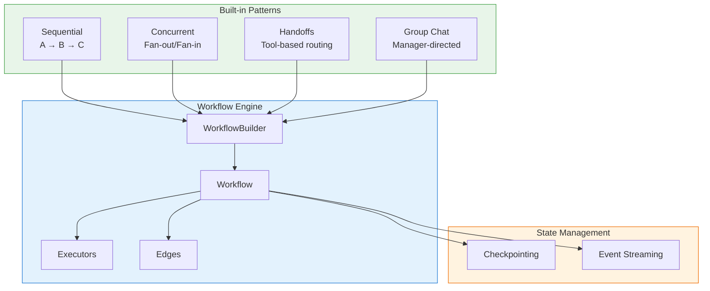
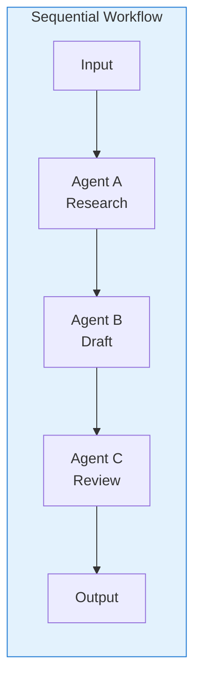
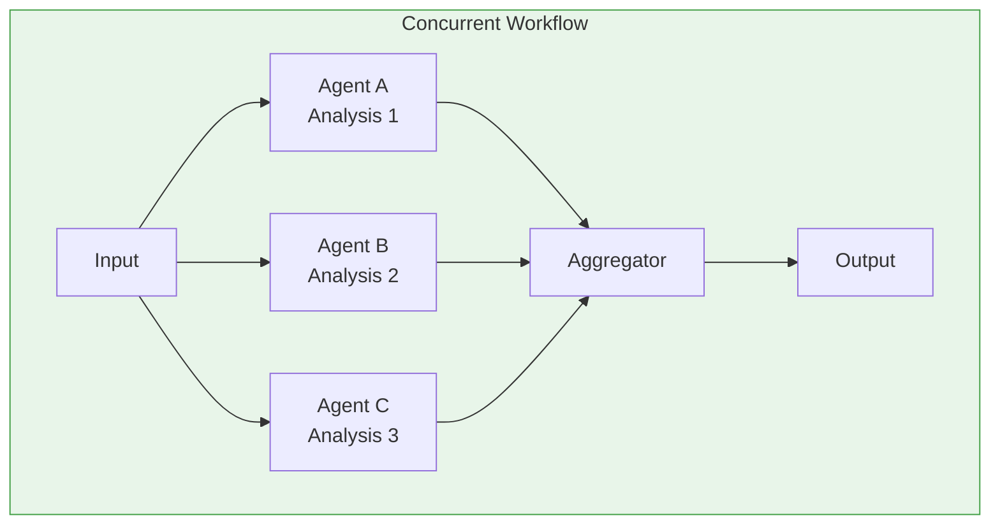
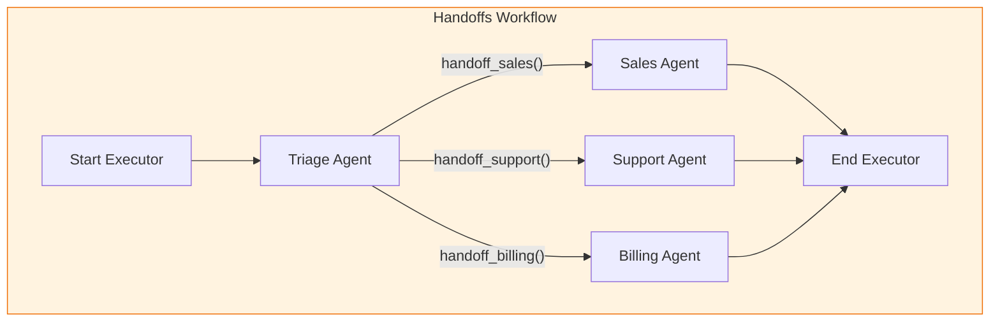
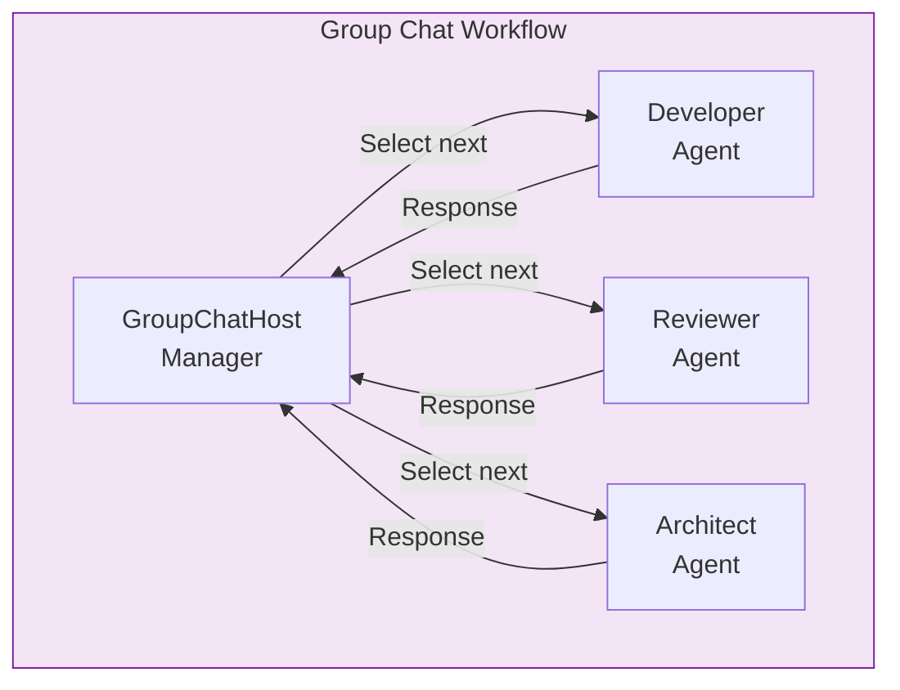
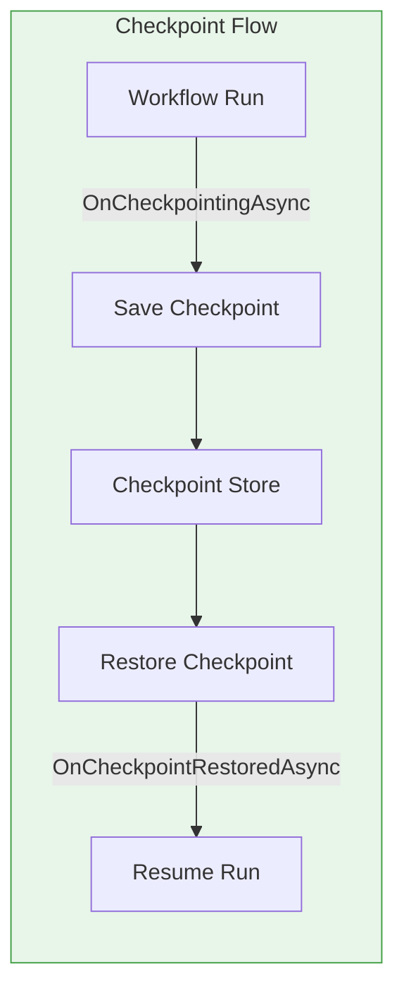

# Workflow Engine

> **Purpose**: This document explains graph-based multi-agent orchestration using the workflow engine.

## Overview

The Workflow Engine provides a graph-based orchestration system for composing multiple agents and custom processing logic into complex, coordinated workflows. It enables:

- **Graph-based composition**: Connect executors with edges to define message flow
- **Pre-built patterns**: Sequential, concurrent, handoff, and group chat workflows
- **Checkpointing**: Save and restore workflow state for long-running operations
- **Event streaming**: Real-time observability of workflow execution
- **Extensibility**: Create custom executors for specialized processing



---

## Core Abstractions

### Executor

**Purpose**: Base component for workflow nodes that process messages.

Executors are the fundamental building blocks of workflows. Each executor:
- Has a unique ID within the workflow
- Defines routes for handling different message types
- Can send messages to other executors
- Supports lifecycle hooks for initialization and checkpointing

```csharp
public abstract class Executor : IIdentified
{
    public string Id { get; }

    // Configure message handlers for this executor
    protected abstract RouteBuilder ConfigureRoutes(RouteBuilder routeBuilder);

    // Lifecycle: Called once when the executor is first used
    protected internal virtual ValueTask InitializeAsync(
        IWorkflowContext context,
        CancellationToken cancellationToken = default) => default;

    // Process an incoming message
    public async ValueTask<object?> ExecuteAsync(
        object message,
        TypeId messageType,
        IWorkflowContext context,
        CancellationToken cancellationToken = default);
}
```

#### Typed Executors

For simpler cases, use the typed executor base classes:

```csharp
// Executor with single input type (no output)
public abstract class Executor<TInput> : Executor
{
    public abstract ValueTask HandleAsync(
        TInput message,
        IWorkflowContext context,
        CancellationToken cancellationToken = default);
}

// Executor with input and output types
public abstract class Executor<TInput, TOutput> : Executor
{
    public abstract ValueTask<TOutput> HandleAsync(
        TInput message,
        IWorkflowContext context,
        CancellationToken cancellationToken = default);
}
```

#### Route Configuration

Executors use a RouteBuilder to configure message handlers:

```csharp
public class MyCustomExecutor : Executor
{
    public MyCustomExecutor() : base("my-executor") { }

    protected override RouteBuilder ConfigureRoutes(RouteBuilder routeBuilder) =>
        routeBuilder
            .AddHandler<string>(HandleStringAsync)
            .AddHandler<ChatMessage>(HandleChatMessageAsync)
            .AddHandler<List<ChatMessage>>(HandleMessagesAsync);

    private async ValueTask HandleStringAsync(
        string message,
        IWorkflowContext context,
        CancellationToken ct)
    {
        // Process string, optionally send to next executor
        await context.SendMessageAsync(
            new ChatMessage(ChatRole.User, message),
            cancellationToken: ct);
    }

    // ... other handlers
}
```

#### Lifecycle Hooks

| Method | When Called | Purpose |
|--------|-------------|---------|
| `InitializeAsync` | Once per executor instance | Async initialization |
| `OnCheckpointingAsync` | Before checkpoint save | Prepare state for persistence |
| `OnCheckpointRestoredAsync` | After checkpoint restore | Recover from persisted state |

### ExecutorBinding

**Purpose**: Metadata and factory for creating executor instances.

ExecutorBinding decouples executor definitions from their instantiation, enabling:
- Lazy instantiation of executors
- Shared vs. per-run executor instances
- Placeholder bindings resolved later

```csharp
public abstract record class ExecutorBinding(
    string Id,
    Func<string, ValueTask<Executor>>? FactoryAsync,
    Type ExecutorType,
    object? RawValue = null) : IIdentified
{
    // True if this is a placeholder (no factory defined)
    public bool IsPlaceholder => FactoryAsync == null;

    // Can this executor be shared across concurrent runs?
    public abstract bool SupportsConcurrentSharedExecution { get; }
}
```

#### Implicit Conversions

ExecutorBinding supports convenient implicit conversions:

```csharp
// From Executor instance
Executor executor = new MyExecutor();
ExecutorBinding binding = executor;  // Implicit conversion

// From AIAgent
AIAgent agent = ...;
ExecutorBinding agentBinding = agent;  // Wraps in AgentRunStreamingExecutor

// From string (placeholder)
ExecutorBinding placeholder = "future-executor";  // Creates ExecutorPlaceholder
```

### WorkflowBuilder

**Purpose**: Fluent API for constructing workflows by connecting executors with edges.

```csharp
// Create a workflow that processes through multiple agents
var workflow = new WorkflowBuilder(startExecutor)
    .AddEdge(startExecutor, processingAgent)
    .AddEdge(processingAgent, validationAgent)
    .AddEdge(validationAgent, outputExecutor)
    .WithOutputFrom(outputExecutor)
    .WithName("Processing Pipeline")
    .Build();
```

#### Edge Types

| Edge Type | Method | Description |
|-----------|--------|-------------|
| Direct | `AddEdge` | Simple A → B connection |
| Conditional | `AddEdge<T>` with condition | Route based on message content |
| Fan-out | `AddFanOutEdge` | One source to many targets |
| Fan-in | `AddFanInEdge` | Many sources to one target |

---

## Workflow Patterns

### Sequential Pattern

**Purpose**: Pipeline where output from one agent feeds into the next (A → B → C).



```csharp
// Using AgentWorkflowBuilder helper
var researchAgent = chatClient.CreateAIAgent(
    instructions: "Research the given topic thoroughly.");

var draftAgent = chatClient.CreateAIAgent(
    instructions: "Write a draft based on the research.");

var reviewAgent = chatClient.CreateAIAgent(
    instructions: "Review and improve the draft.");

var workflow = AgentWorkflowBuilder.BuildSequential(
    researchAgent,
    draftAgent,
    reviewAgent);

// Execute the workflow
var result = await workflow.RunAsync<List<ChatMessage>>(
    [new ChatMessage(ChatRole.User, "Write about quantum computing")]);
```

**How it works**:
1. Creates `AgentRunStreamingExecutor` for each agent
2. Chains them with direct edges
3. Adds `OutputMessagesExecutor` at the end to collect final messages

### Concurrent Pattern

**Purpose**: Fan-out to multiple agents, then aggregate results (A → [B, C, D] → Aggregate).



```csharp
var technicalAnalyst = chatClient.CreateAIAgent(
    instructions: "Analyze the technical aspects.");

var businessAnalyst = chatClient.CreateAIAgent(
    instructions: "Analyze the business implications.");

var riskAnalyst = chatClient.CreateAIAgent(
    instructions: "Identify potential risks.");

// Default aggregator: takes last message from each agent
var workflow = AgentWorkflowBuilder.BuildConcurrent(
    [technicalAnalyst, businessAnalyst, riskAnalyst]);

// Custom aggregator: combine all messages
var workflowWithCustomAgg = AgentWorkflowBuilder.BuildConcurrent(
    [technicalAnalyst, businessAnalyst, riskAnalyst],
    aggregator: results => results
        .SelectMany(r => r)
        .ToList());
```

**How it works**:
1. `ChatForwardingExecutor` broadcasts input to all agents
2. Each agent runs in parallel via fan-out edge
3. `CollectChatMessagesExecutor` batches each agent's output
4. `ConcurrentEndExecutor` aggregates all batched results

### Handoff Pattern

**Purpose**: Dynamic agent routing based on tool invocations.

Agents can "hand off" control to other agents by invoking special handoff tools. This enables dynamic, context-aware routing.



```csharp
var triageAgent = chatClient.CreateAIAgent(
    instructions: "Route customers to the appropriate department.");

var salesAgent = chatClient.CreateAIAgent(
    instructions: "Help customers with purchases and pricing.");

var supportAgent = chatClient.CreateAIAgent(
    instructions: "Resolve technical issues.");

var billingAgent = chatClient.CreateAIAgent(
    instructions: "Handle billing and payment questions.");

// Build handoff workflow
var workflow = AgentWorkflowBuilder
    .CreateHandoffBuilderWith(triageAgent)
    .AddHandoff(triageAgent, salesAgent, "Transfer to sales for purchase inquiries")
    .AddHandoff(triageAgent, supportAgent, "Transfer to support for technical issues")
    .AddHandoff(triageAgent, billingAgent, "Transfer to billing for payment questions")
    .Build();
```

**How it works**:
1. `HandoffsStartExecutor` initializes the workflow state
2. `HandoffAgentExecutor` wraps each agent with handoff tools
3. When an agent invokes a handoff tool, the workflow routes to that agent
4. `HandoffsEndExecutor` collects final output when no more handoffs occur

### Group Chat Pattern

**Purpose**: Manager-directed multi-agent conversation with turn-taking.

A manager agent (or custom logic) decides which agent speaks next based on the conversation context.



```csharp
var developerAgent = chatClient.CreateAIAgent(
    name: "Developer",
    instructions: "You write and explain code.");

var reviewerAgent = chatClient.CreateAIAgent(
    name: "Reviewer",
    instructions: "You review code for bugs and improvements.");

var architectAgent = chatClient.CreateAIAgent(
    name: "Architect",
    instructions: "You design system architecture.");

// Create with round-robin manager
var workflow = AgentWorkflowBuilder
    .CreateGroupChatBuilderWith(agents => new RoundRobinGroupChatManager(agents))
    .AddAgent(developerAgent)
    .AddAgent(reviewerAgent)
    .AddAgent(architectAgent)
    .WithMaxIterations(6)  // 2 rounds
    .Build();

// Create with custom manager (e.g., LLM-based selection)
var workflowWithLLM = AgentWorkflowBuilder
    .CreateGroupChatBuilderWith(agents => new LLMGroupChatManager(chatClient, agents))
    .AddAgent(developerAgent)
    .AddAgent(reviewerAgent)
    .AddAgent(architectAgent)
    .Build();
```

**How it works**:
1. `GroupChatHost` receives messages and accumulates them
2. Manager's `SelectNextAgentAsync` chooses the next speaker
3. Selected agent processes messages and responds
4. Response flows back to `GroupChatHost` for next iteration
5. Manager's `ShouldTerminateAsync` ends the conversation

---

## Specialized Executors

The framework provides several pre-built executors for common patterns:

| Executor | Purpose |
|----------|---------|
| `AgentRunStreamingExecutor` | Wraps an `AIAgent` for streaming execution in workflows |
| `HandoffsStartExecutor` | Initializes handoff workflow state |
| `HandoffsEndExecutor` | Terminates handoff workflow and yields output |
| `HandoffAgentExecutor` | Wraps agent with handoff tool routing |
| `CollectChatMessagesExecutor` | Batches streaming messages into a list |
| `ConcurrentEndExecutor` | Aggregates results from concurrent branches |
| `ChatForwardingExecutor` | Forwards messages to multiple targets |
| `OutputMessagesExecutor` | Collects and yields final output messages |
| `GroupChatHost` | Manages group chat turn-taking |
| `WorkflowHostExecutor` | Hosts a nested workflow as an executor |

### AgentRunStreamingExecutor

The most commonly used executor, it wraps an `AIAgent` for streaming execution:

```csharp
// Created implicitly when adding agents to workflows
var executor = new AgentRunStreamingExecutor(
    agent,
    includeInputInOutput: true  // Include input messages in output
);
```

### Creating Custom Executors

```csharp
public class TransformationExecutor : Executor<List<ChatMessage>, List<ChatMessage>>
{
    public TransformationExecutor()
        : base("transformation", declareCrossRunShareable: true) { }

    public override async ValueTask<List<ChatMessage>> HandleAsync(
        List<ChatMessage> messages,
        IWorkflowContext context,
        CancellationToken cancellationToken = default)
    {
        // Transform messages
        var transformed = messages.Select(m => new ChatMessage(
            m.Role,
            $"[Processed] {m.Text}"
        )).ToList();

        return transformed;
    }
}
```

---

## State Management

### Checkpointing

Checkpointing enables saving and restoring workflow state for:
- Long-running operations that span sessions
- Recovery from failures
- Pause and resume scenarios



#### Checkpoint Stores

| Store | Description |
|-------|-------------|
| `InMemoryCheckpointManager` | In-memory storage for testing |
| `FileSystemJsonCheckpointStore` | JSON files on disk |
| Custom `ICheckpointStore` | Your own persistence layer |

#### Implementing Checkpointing in Executors

```csharp
public class StatefulExecutor : Executor<MyInput>
{
    private int _processedCount;
    private List<string> _results = [];

    protected internal override async ValueTask OnCheckpointingAsync(
        IWorkflowContext context,
        CancellationToken cancellationToken = default)
    {
        // Save state before checkpoint
        await context.SetStateAsync("count", _processedCount, cancellationToken);
        await context.SetStateAsync("results", _results, cancellationToken);
    }

    protected internal override async ValueTask OnCheckpointRestoredAsync(
        IWorkflowContext context,
        CancellationToken cancellationToken = default)
    {
        // Restore state after loading checkpoint
        _processedCount = await context.GetStateAsync<int>("count", cancellationToken);
        _results = await context.GetStateAsync<List<string>>("results", cancellationToken)
            ?? [];
    }
}
```

### Event Streaming

Workflows emit events for observability:

```csharp
// Event types
public record ExecutorInvokedEvent(string ExecutorId, object Message);
public record ExecutorCompletedEvent(string ExecutorId, object? Result);
public record ExecutorFailedEvent(string ExecutorId, Exception Exception);
public record AgentRunUpdateEvent(string ExecutorId, AgentRunResponseUpdate Update);
```

#### Subscribing to Events

```csharp
var workflow = builder.Build();

await foreach (var output in workflow.RunStreamingAsync<MyOutput>(input))
{
    switch (output)
    {
        case ExecutorInvokedEvent invoked:
            Console.WriteLine($"Executor {invoked.ExecutorId} started");
            break;

        case AgentRunUpdateEvent update:
            Console.Write(update.Update.Text);
            break;

        case ExecutorCompletedEvent completed:
            Console.WriteLine($"Executor {completed.ExecutorId} finished");
            break;
    }
}
```

---

## Declarative Workflows

**Package**: `Microsoft.Agents.AI.Workflows.Declarative`

### Purpose

Define workflows using YAML configuration instead of code, enabling:
- Dynamic workflow loading
- Non-developer workflow configuration
- Runtime workflow updates

### YAML Format

```yaml
name: customer-service
description: Multi-agent customer service workflow

agents:
  - id: triage
    instructions: Route customers to appropriate department
  - id: sales
    instructions: Handle purchase inquiries
  - id: support
    instructions: Resolve technical issues

workflow:
  type: handoffs
  initial: triage
  handoffs:
    - from: triage
      to: sales
      reason: Transfer to sales for purchases
    - from: triage
      to: support
      reason: Transfer to support for technical issues
```

### Loading Declarative Workflows

```csharp
var loader = new DeclarativeWorkflowLoader(chatClientFactory);

// Load from file
var workflow = await loader.LoadAsync("workflows/customer-service.yaml");

// Load from string
var workflowFromString = await loader.LoadFromStringAsync(yamlContent);

// Execute
var result = await workflow.RunAsync<List<ChatMessage>>(input);
```

---

## Building Custom Workflows

For advanced scenarios, use `WorkflowBuilder` directly:

```csharp
// Custom workflow with conditional routing
var classifier = new ClassifierExecutor();
var technicalHandler = new TechnicalHandlerExecutor();
var generalHandler = new GeneralHandlerExecutor();
var output = new OutputExecutor();

var workflow = new WorkflowBuilder(classifier)
    // Route based on classification result
    .AddEdge<ClassificationResult>(
        classifier,
        technicalHandler,
        result => result?.Category == "technical")
    .AddEdge<ClassificationResult>(
        classifier,
        generalHandler,
        result => result?.Category != "technical")
    // Both handlers lead to output
    .AddEdge(technicalHandler, output)
    .AddEdge(generalHandler, output)
    .WithOutputFrom(output)
    .WithName("Smart Router")
    .Build();
```

### Fan-Out with Custom Partitioning

```csharp
var workers = Enumerable.Range(0, 4)
    .Select(i => new WorkerExecutor($"worker-{i}"))
    .ToArray();

var workflow = new WorkflowBuilder(start)
    .AddFanOutEdge<WorkItem>(
        start,
        workers,
        // Partition by hash of item ID
        (item, workerCount) => [item?.Id.GetHashCode() % workerCount ?? 0])
    .AddFanInEdge(workers, aggregator)
    .WithOutputFrom(aggregator)
    .Build();
```

---

## Extension Points

### Custom GroupChatManager

```csharp
public class PriorityGroupChatManager : GroupChatManager
{
    private readonly Dictionary<AIAgent, int> _priorities;

    public PriorityGroupChatManager(
        IReadOnlyList<AIAgent> agents,
        Dictionary<AIAgent, int> priorities) : base(agents)
    {
        _priorities = priorities;
    }

    public override ValueTask<AIAgent?> SelectNextAgentAsync(
        IList<ChatMessage> messages,
        CancellationToken cancellationToken = default)
    {
        // Select agent with highest priority who hasn't spoken recently
        var lastSpeaker = GetLastSpeaker(messages);
        var nextAgent = Agents
            .Where(a => a != lastSpeaker)
            .OrderByDescending(a => _priorities.GetValueOrDefault(a, 0))
            .FirstOrDefault();

        return new(nextAgent);
    }

    public override ValueTask<bool> ShouldTerminateAsync(
        IList<ChatMessage> messages,
        CancellationToken cancellationToken = default)
    {
        // Terminate after max iterations or if consensus reached
        return new(IterationCount >= 10 || HasConsensus(messages));
    }
}
```

### Custom Checkpoint Store

```csharp
public class DatabaseCheckpointStore : ICheckpointStore
{
    private readonly IDbConnection _db;

    public async ValueTask SaveAsync(
        string workflowId,
        string runId,
        Checkpoint checkpoint,
        CancellationToken cancellationToken = default)
    {
        var json = JsonSerializer.Serialize(checkpoint);
        await _db.ExecuteAsync(
            "UPSERT INTO checkpoints (workflow_id, run_id, data) VALUES (@wf, @run, @data)",
            new { wf = workflowId, run = runId, data = json });
    }

    public async ValueTask<Checkpoint?> LoadAsync(
        string workflowId,
        string runId,
        CancellationToken cancellationToken = default)
    {
        var json = await _db.QueryFirstOrDefaultAsync<string>(
            "SELECT data FROM checkpoints WHERE workflow_id = @wf AND run_id = @run",
            new { wf = workflowId, run = runId });

        return json is null ? null : JsonSerializer.Deserialize<Checkpoint>(json);
    }
}
```

---

*Last updated: December 2024*
